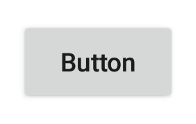
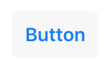

# Button

A push button. Can contain a text or an image.

Android | iOS
--- | ---
 | 

Extends [Widget](Widget.md)

## Properties

### alignment

Type: *string*, supported values: `left`, `right`, `center`, default: `center`

The horizontal alignment of the button text.

### image

Type: *[Image](../types.md#image)*

An image to be displayed on the button.

### text

Type: *string*

The button's label text.


## Events

### select
Fired when the button is pressed.


## Example
```js
// Create a push button that counts up on selection

var count = 0;

new tabris.Button({
  left: 10, top: 10,
  text: 'Button'
}).on('select', function() {
  this.text = 'Pressed ' + (++count) + ' times';
}).appendTo(tabris.ui.contentView);
```
## See also

- [Simple Button snippet](https://github.com/eclipsesource/tabris-js/tree/v2.0.0-beta2/snippets/button.js)
