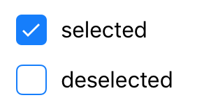

---
---
# CheckBox

Extends [Widget](Widget.md)

A check box widget.

Import this type with "`const {CheckBox} = require('tabris');`"

Android | iOS
--- | ---
 | 

## Properties

### checked

Type: *boolean*, default: `false`

The checked state of the check box.

### text

Type: *string*

The label text of the check box.

### textColor

Type: *[Color](../types.md#color)*

The color of the text.


## Events

### checkedChanged

Fired when the check box is checked or unchecked.

#### Event Parameters 

- **target**: *this*
    The widget the event was fired on.

- **value**: *boolean*
    The new value of the `checked` property.


### select

Fired when the check box is checked or unchecked by the user.

#### Event Parameters 

- **target**: *this*
    The widget the event was fired on.

- **checked**: *boolean*
    The new value of *[checked](#checked)*.


### textChanged

Fired when the [*text*](#text) property has changed.

#### Event Parameters 

- **target**: *this*
    The widget the event was fired on.

- **value**: *string*
    The new value of [*text*](#text).


### textColorChanged

Fired when the [*textColor*](#textColor) property has changed.

#### Event Parameters 

- **target**: *this*
    The widget the event was fired on.

- **value**: *[Color](../types.md#color)*
    The new value of [*textColor*](#textColor).


## Example

```js
const {CheckBox, ui} = require('tabris');

// Create a check box with a checked handler

new CheckBox({
  left: 10, top: 10,
  checked: true,
  text: 'checked'
}).on('checkedChanged', event => event.target.text = event.value ? 'checked' : 'unchecked')
  .appendTo(ui.contentView);
```
## See also

- [Simple Checkbox snippet](https://github.com/eclipsesource/tabris-js/tree/v2.0.0-rc2-dev.20170710+0912/snippets/checkbox.js)
