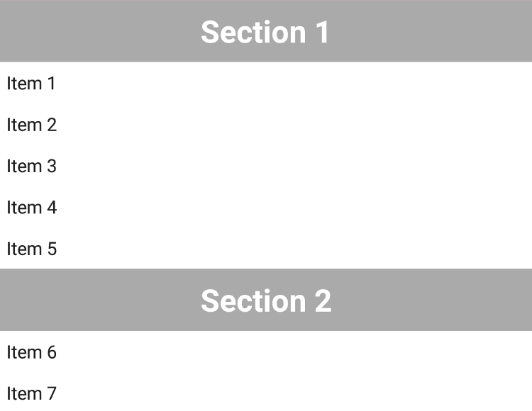
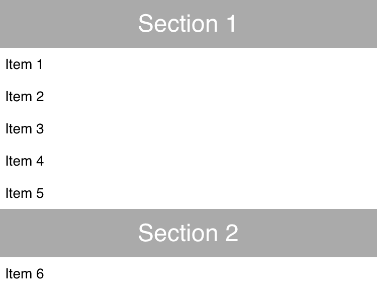

---
---
# CollectionView

A scrollable list that displays data items in cells, one per row. Cells are created on demand and filled with widgets in the *initializeCell* callback.

Android | iOS
--- | ---
 | 

Extends [Widget](Widget.md)

## Methods

### insert(items)

**Parameters:** 

- items: *any[]*

Inserts the given items into this view. Items are added at the end. This operation will modify the *items* property.

### insert(items, index)

**Parameters:** 

- items: *any[]*
- index: *number*, the position to insert the items at. If a negative index is given, it is interpreted as relative to the end. If the given index is greater than the item count, new items will be appended at the end. 

Inserts the given items into this view at the given index. This operation will modify the *items* property.

### refresh()

Triggers a refresh of all visible items. This will issue *change:item* events on the corresponding cells.

### refresh(index)

**Parameters:** 

- index: *number*, the index of the item that was changed.

Triggers a refresh of the item with the given index. If the item is scrolled into view, an *change:item* event will be issued on the corresponding cell.

### remove(index)

**Parameters:** 

- index: *number*, the index of the item to remove. If this is negative, it is interpreted as relative to the end.

Removes the item at the given index from this view. This operation will modify the *items* property.

### remove(index, count)

**Parameters:** 

- index: *number*, the index of the first item to remove. If this is negative, it is interpreted as relative to the end.
- count: *number*, the number of items to remove.

Removes *count* items beginning with the given index from this view. This operation will modify the *items* property.

### reveal(index)

**Parameters:** 

- index: *number*, the index of the item to reveal. If this is negative, it is interpreted as relative to the end

Scrolls the item with the given index into view.


## Properties

### cellType

Type: *string|((item: any) => string)*

The name of the cell type to use for a given item. This name will be passed to the `initializeCell` and `itemHeight` functions. Cells will be reused only by items that require the same cell type. If set to a function, this function will be called for every item, providing the item as a parameter, and must return a name for the cell type to use for the given item.

### columnCount

Type: *number*, default: `1`

The number of columns to display in the collection view. If set to a value `n > 1`, each row will contain `n` items. The available space will be equally distributed between columns.

### firstVisibleIndex

**read-only**<br/>
Type: *number*

The first item that is currently visible on screen.

### initializeCell

Type: *(cell: Cell, cellType: string) => void*

A callback used to initialize a collection cell by attaching widget and *change:item* listener. Cells are created by the framework and recycled on scrolling.<br/>This property can only be set on widget creation. Once set, it cannot be changed anymore.

### itemHeight

Type: *number|((item: any, cellType: string) => number)*

The height of a collection cell. If set to a function, this function will be called for every item, providing the item and the cell type as parameters, and must return the item height for the given item.

### items

Type: *any[]*

An array of data items to be displayed by the collection view. For dynamic content, use the methods `insert` and `remove` instead of setting this property directly.

### lastVisibleIndex

**read-only**<br/>
Type: *number*

The last item that is currently visible on screen.

### refreshEnabled

Type: *boolean*, default: `false`

Enables the user to trigger a refresh by using the pull-to-refresh gesture.

### refreshIndicator

Type: *boolean*, default: `false`

Whether the refresh indicator is currently visible. Will be set to `true` when a *refresh* event is triggered. Reset it to `false` when the refresh is finished.

### refreshMessage

Type: *string*, default: `""`

The message text displayed together with the refresh indicator. Currently not supported on Android.


## Events

### refresh
Fired when the user requested a refresh. An event listener should reset the *refreshIndicator* property when refresh is finished.


### scroll
Fired while the collection view is scrolling.

#### Event Parameters 
- **target**: *this*
    The widget the event was fired on.

- **deltaX**: *number*
    Currently always 0.

- **deltaY**: *number*
    The delta of the scroll position. Positive when scrolling up and negative when scrolling down.


### select
Fired when a collection item is selected.

#### Event Parameters 
- **target**: *this*
    The widget the event was fired on.

- **index**: *number*
    The index of the selected item.

- **item**: *any*
    The item that was selected.


## Example
```js
// Create a collection view, initialize its cells and fill it with items

var IMAGE_PATH = 'images/';

var people = [
  ['Holger', 'Staudacher', 'holger.jpg'],
  ['Ian', 'Bull', 'ian.jpg'],
  ['Jochen', 'Krause', 'jochen.jpg'],
  ['Jordi', 'Böhme López', 'jordi.jpg'],
  ['Markus', 'Knauer', 'markus.jpg'],
  ['Moritz', 'Post', 'moritz.jpg'],
  ['Ralf', 'Sternberg', 'ralf.jpg'],
  ['Tim', 'Buschtöns', 'tim.jpg']
].map(function(element) {
  return {firstName: element[0], lastName: element[1], image: IMAGE_PATH + element[2]};
});

new tabris.CollectionView({
  left: 0, top: 0, right: 0, bottom: 0,
  items: people,
  itemHeight: 256,
  initializeCell: function(cell) {
    var imageView = new tabris.ImageView({
      top: 16, centerX: 0, width: 200, height: 200
    }).appendTo(cell);
    var nameTextView = new tabris.TextView({
      left: 30, top: [imageView, 16], right: 30,
      alignment: 'center'
    }).appendTo(cell);
    cell.on('change:item', function({value: person}) {
      imageView.image = person.image;
      nameTextView.text = person.firstName;
    });
  }
}).on('select', function({item}) {
  console.log('selected', item.firstName);
}).appendTo(tabris.ui.contentView);
```
## See also

- [CollectionView example](https://github.com/eclipsesource/tabris-js/tree/v2.0.0-beta2/snippets/collectionview.js)
