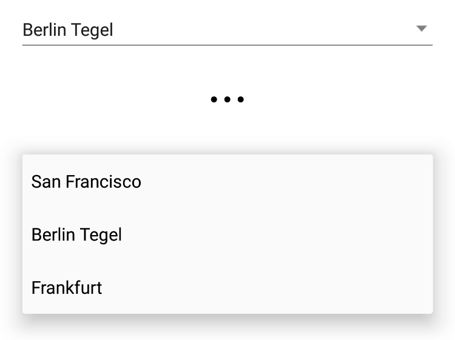
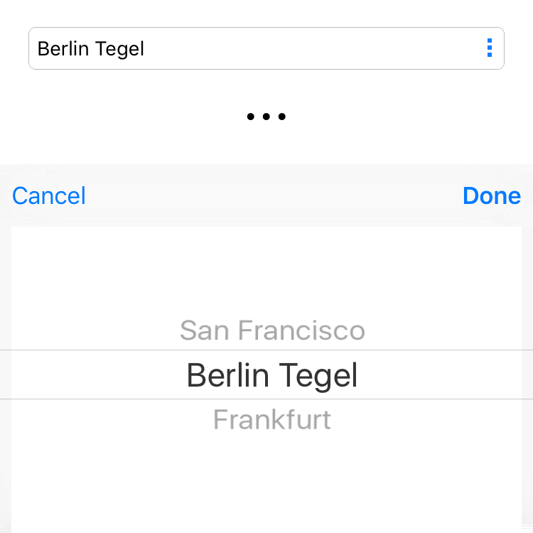

---
---
# Picker

A widget with a drop-down list of items to choose from.

Android | iOS
--- | ---
 | 

Extends [Widget](Widget.md)

## Properties

### borderColor

Type: *[Color](../types.md#color)*

The color of the border of the Picker. On iOS this is a rectangular border around the Picker, on Android it is a single line below the Picker.

### fillColor

Type: *[Color](../types.md#color)*

The color of the background of the Picker - applies only to iOS.

### itemText

Type: *(item: any) => string*

A function that returns the string to display for a given data item. Defaults to mapping items to their default string representation.

### items

Type: *any[]*

An array of data items to be displayed by the picker. If the items aren't strings, the `itemText` property must be set to a function to extract item texts.

### selection

Type: *any*

The currently selected data item.

### selectionIndex

Type: *number*

The index of the currently selected item.


## Events

### change:selection

Fired when the selection property changes.

#### Event Parameters 

- **target**: *this*
    The widget the event was fired on.

- **value**: *any*
    The new value of the `selection` property.


### change:selectionIndex

Fired when the selectionIndex property changes.

#### Event Parameters 

- **target**: *this*
    The widget the event was fired on.

- **value**: *number*
    The new value of the `selectionIndex` property.


### select

Fired when an item was selected by the user.

#### Event Parameters 

- **target**: *this*
    The widget the event was fired on.

- **index**: *number*
    Contains the index of the selected item.

- **selection**: *any*
    The new value of *[selection](#selection)*.


## Example

```js
// Create a picker widget to select a string from a list

var airports = [
  {
    id: 'SFO',
    name: 'San Francisco'
  },
  {
    id: 'TXL',
    name: 'Berlin Tegel'
  },
  {
    id: 'FRA',
    name: 'Frankfurt'
  }
];

new tabris.Picker({
  left: 20, top: 20, right: 20,
  items: airports,
  itemText: function(airport) {
    return airport.name;
  },
  selection: airports[1]
}).on('change:selection', function({value: airport}) {
  console.log('Selected ' + airport.id);
}).appendTo(tabris.ui.contentView);
```
## See also

- [Simple Picker snippet](https://github.com/eclipsesource/tabris-js/tree/v2.0.0-beta2/snippets/picker.js)
