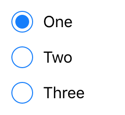

---
---
# RadioButton

A radio button. Selecting a radio button de-selects all its siblings (i.e. all radio buttons within the same parent).

Android | iOS
--- | ---
 | 

Extends [Widget](Widget.md)

## Properties

### checked

Type: *boolean*, default: `false`

The checked state of the radio button.

### text

Type: *string*

The label text of the radio button.

### textColor

Type: *[Color](../types.md#color)*

The color of the text.


## Events

### change:checked

Fired when the [*checked*](#checked) property changes.

#### Event Parameters 

- **target**: *this*
    The widget the event was fired on.

- **value**: *boolean*
    The new value of [*checked*](#checked).


### change:text

Fired when the [*text*](#text) property changes.

#### Event Parameters 

- **target**: *this*
    The widget the event was fired on.

- **value**: *string*
    The new value of [*text*](#text).


### change:textColor

Fired when the [*textColor*](#textColor) property changes.

#### Event Parameters 

- **target**: *this*
    The widget the event was fired on.

- **value**: *[Color](../types.md#color)*
    The new value of [*textColor*](#textColor).


### checkedChanged

Fired when the checked property changes.

#### Event Parameters 

- **target**: *this*
    The widget the event was fired on.

- **value**: *boolean*
    The new value of the `checked` property.


### select

Fired when the radio button is selected or deselected by the user.

#### Event Parameters 

- **target**: *this*
    The widget the event was fired on.

- **checked**: *boolean*
    The new value of *[checked](#checked)*.


## Example

```js
const {RadioButton, ui} = require('tabris');

// Create radio buttons with checked handlers

['One', 'Two', 'Three'].forEach((title) => {
  new RadioButton({
    left: 10, top: 'prev() 10',
    text: title
  }).on('checkedChanged', ({target, value: checked}) => {
    if (checked) {
      console.log(target.text + ' checked');
    }
  }).appendTo(ui.contentView);
});
```
## See also

- [Simple RadioButton snippet](https://github.com/eclipsesource/tabris-js/tree/v2.0.0-rc2/snippets/radiobutton.js)
