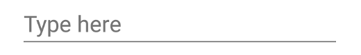
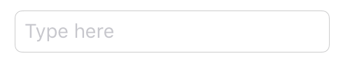

# TextInput

A widget that allows to enter text.

Android | iOS
--- | ---
 | 

Extends [Widget](Widget.md)

## Properties

### alignment

Type: *string*, supported values: `left`, `right`, `center`, default: `left`

The horizontal alignment of the text.

### autoCapitalize

Type: *boolean*, default: `false`

Automatically switch to capital letters after every key pressed.

### autoCorrect

Type: *boolean*, default: `false`

Enables the spell checker and auto-correction feature.

### borderColor

Type: *[Color](../types.md#color)*

The color of the border of the TextInput. On iOS this is a rectangular border around the TextInput, on Android it is a single line below the TextInput.

### editable

Type: *boolean*, default: `true`

Whether the text can be edited or not.

### fillColor

Type: *[Color](../types.md#color)*

The color of the background of the TextInput - applies only to iOS.

### focused

Type: *boolean*, default: `false`

Reflects whether this widget has the keyboard focus. Setting this property to `true` will focus the widget and open the virtual keyboard, setting it to `false` will remove the focus and hide the virtual keyboard.

### keepFocus

Type: *boolean*, default: `false`

When `true` the `TextInput` will keep its focus, even when tapped outside of the widget bounds.

### keyboard

Type: *string*, supported values: `ascii`, `decimal`, `email`, `number`, `numbersAndPunctuation`, `phone`, `url`, `default`, default: `default`

Selects the keyboard type to use for editing this widget. Has no effect when `type` is set to `multiline`.

### message

Type: *string*

A hint text that is displayed when the input field is empty. Does not apply on iOS when `type` is set to `multiline`.

### text

Type: *string*

The text in the input field.

### type

Type: *string*, supported values: `default`, `password`, `search`, `multiline`, default: `default`

The type of the text widget.<br/>This property can only be set on widget creation. Once set, it cannot be changed anymore.


## Events

### accept
Fired when a text input has been finished by pressing the keyboard's Enter key. The label of this key may vary depending on the platform and locale.

#### Event Parameters 
- **target**: *this*
    The widget the event was fired on.

- **text**: *string*
    The current value of *[text](#text)*.


### blur
Fired when the widget lost focus.


### change:text
Fired when the text property changes.

#### Event Parameters 
- **target**: *this*
    The widget the event was fired on.

- **value**: *string*
    The new value of the `text` property.


### focus
Fired when the widget gains focus.


### input
Fired when the text was changed by the user.

#### Event Parameters 
- **target**: *this*
    The widget the event was fired on.

- **text**: *string*
    The new value of *[text](#text)*.


## Example
```js
// Create a text input field with input finished listener

new tabris.TextInput({
  top: 20, left: '20%', right: '20%',
  message: 'Type here, then confirm'
}).on('accept', function({text}) {
  new tabris.TextView({
    top: 'prev() 20', left: '20%',
    text: text
  }).appendTo(tabris.ui.contentView);
}).appendTo(tabris.ui.contentView);
```
## See also

- [Simple TextInput snippet](https://github.com/eclipsesource/tabris-js/tree/v2.0.0-beta2/snippets/textinput.js)
- [Example with Text and other input controls](https://github.com/eclipsesource/tabris-js/tree/v2.0.0-beta2/examples/input/input.js)
