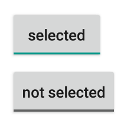
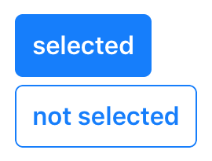

---
---
# ToggleButton

A push button that "snaps in", i.e. it is selected when pressed and deselected when pressed again.

Android | iOS
--- | ---
 | 

Extends [Widget](Widget.md)

## Properties

### alignment

Type: *string*, supported values: `left`, `right`, `center`, default: `center`

The horizontal alignment of the button text.

### checked

Type: *boolean*, default: `false`

The checked state of the toggle button.

### image

Type: *[Image](../types.md#image)*

An image to be displayed on the button.

### text

Type: *string*

The button's label text.


## Events

### change:checked

Fired when the checked property changes.

#### Event Parameters 

- **target**: *this*
    The widget the event was fired on.

- **value**: *boolean*
    The new value of the `checked` property.


### select

Fired when the toggle button is selected or deselected by the user.

#### Event Parameters 

- **target**: *this*
    The widget the event was fired on.

- **checked**: *boolean*
    The current value of *[checked](#checked)*.


## Example

```js
// Create a toggle button with a checked handler

new tabris.ToggleButton({
  left: 10, top: 10,
  text: 'checked',
  checked: true
}).on('change:checked', function(event) {
  event.target.text = event.value ? 'checked' : 'not checked';
}).appendTo(tabris.ui.contentView);
```
## See also

- [Simple ToggleButton snippet](https://github.com/eclipsesource/tabris-js/tree/v2.0.0-beta2/snippets/togglebutton.js)
