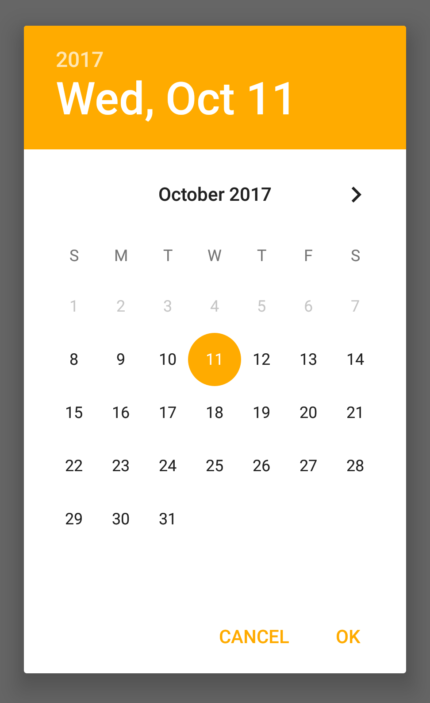
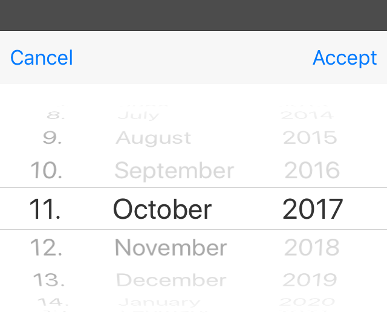

---
---
# DateDialog

Extends [Popup](Popup.md)

A `DateDialog` represents a native dialog pop-up allowing the user to pick a date. Properties can only be set before open() is called. The dialog is automatically disposed when closed.

Import this type with "`const {DateDialog} = require('tabris');`"

Android | iOS
--- | ---
 | 

## Properties

### date


Type: *Date*

The date to be displayed in the dialog. The current date is used when no date is provided.

### maxDate


Type: *Date*

Limits the selectable date range to the given future date. No limit is applied when not set.

### minDate


Type: *Date*

Limits the selectable date range to the given past date. No limit is applied when not set.


## Events

### close

Fired when the date dialog was closed.

#### Event Parameters 
- **target**: *this*
    The widget the event was fired on.

- **date**: *Date*
    The selected date. Can be `undefined` when no date was selected.


### dateChanged

Fired when the [*date*](#date) property has changed.

#### Event Parameters 
- **target**: *this*
    The widget the event was fired on.

- **value**: *Date*
    The new value of [*date*](#date).


### maxDateChanged

Fired when the [*maxDate*](#maxDate) property has changed.

#### Event Parameters 
- **target**: *this*
    The widget the event was fired on.

- **value**: *Date*
    The new value of [*maxDate*](#maxDate).


### minDateChanged

Fired when the [*minDate*](#minDate) property has changed.

#### Event Parameters 
- **target**: *this*
    The widget the event was fired on.

- **value**: *Date*
    The new value of [*minDate*](#minDate).


### select

Fired when a date was selected by the user.

#### Event Parameters 
- **target**: *this*
    The widget the event was fired on.

- **date**: *Date*
    The selected date. Only the date components reflect the users selection. The time component values are undefined.


## Example
```js
const {DateDialog, TextView, Button, ui} = require('tabris');

const FIVE_DAYS = 432000000;

new Button({
  left: 16, right: 16, top: 16,
  text: 'Show DateDialog'
}).on({select: showDateDialog})
  .appendTo(ui.contentView);

let selectionTextView = new TextView({
  left: 16, right: 16, top: ['prev()', 16],
  alignment: 'center'
}).appendTo(ui.contentView);

function showDateDialog() {
  let date = new Date();
  new DateDialog({
    date: date,
    minDate: new Date(date.getTime() - FIVE_DAYS),
    maxDate: new Date(date.getTime() + FIVE_DAYS)
  }).on({
    select: ({date}) => selectionTextView.text = date,
    close: () => console.log('DateDialog closed')
  }).open();
}
```
## See also

- [Simple DateDialog snippet](https://github.com/eclipsesource/tabris-js/tree/v2.3.0/snippets/datedialog.js)
