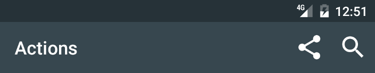
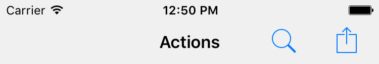

---
---
# Action

Extends [Widget](Widget.md)

An executable item that is integrated in the application's navigation menu. Add a listener on *select* to implement the action.

Import this type with "`const {Action} = require('tabris');`"

Android | iOS
--- | ---
 | 

## Properties

### image

Type: *[Image](../types.md#image)*

Icon image for the action.

### placementPriority

Type: *string*, supported values: `low`, `high`, `normal`, default: `normal`

Actions with higher placement priority will be placed at a more significant position in the UI, e.g. low priority actions could go into a menu instead of being included in a toolbar.

### title

Type: *string*

The text to be displayed for the action.

### win_symbol

Windows 10

Type: *string*

Allows to override the image of the Action with an MDL2 ("Metro Design Language 2") symbol. When the string does not exactly match [the name of an MDL2 symbol](https://msdn.microsoft.com/en-us/library/windows/apps/windows.ui.xaml.controls.symbol.aspx) the `image` property is used instead. Platforms other than windows ignore this property and always show the image.

## Events

### imageChanged

Fired when the [*image*](#image) property has changed.

#### Event Parameters 
- **target**: *this*
    The widget the event was fired on.

- **value**: *[Image](../types.md#image)*
    The new value of [*image*](#image).

### placementPriorityChanged

Fired when the [*placementPriority*](#placementPriority) property has changed.

#### Event Parameters 
- **target**: *this*
    The widget the event was fired on.

- **value**: *string*
    The new value of [*placementPriority*](#placementPriority).

### select

Fired when the action is invoked.
### titleChanged

Fired when the [*title*](#title) property has changed.

#### Event Parameters 
- **target**: *this*
    The widget the event was fired on.

- **value**: *string*
    The new value of [*title*](#title).

### win_symbolChanged

Fired when the [*win_symbol*](#win_symbol) property has changed.

#### Event Parameters 
- **target**: *this*
    The widget the event was fired on.

- **value**: *string*
    The new value of [*win_symbol*](#win_symbol).

## See also

- [Snippet for creating actions](https://github.com/eclipsesource/tabris-js/tree/v2.4.0/snippets/navigationview-action.js)
- [Actions - placement priorities](https://github.com/eclipsesource/tabris-js/tree/v2.4.0/snippets/navigationview-action-placementpriority.js)
