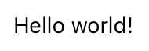

---
---
# TextView

Extends [Widget](Widget.md)

A widget to display a text. For images, use ImageView.

Import this type with "`const {TextView} = require('tabris');`"

Android | iOS
--- | ---
 | 

## Properties

### alignment


Type: *string*, supported values: `left`, `right`, `center`, default: `left`

The horizontal alignment of the text.

### lineSpacing


Type: *number*, default: `1.0`

The amount of space between each line of text. The `lineSpacing` property is a factor with a default value of `1.0`.

### markupEnabled


Type: *boolean*

Allows for a subset of HTML tags in the text. Supported tags are: `a`, `del`, `ins`, `b`, `i`, `strong`, `em`, `big`, `small`, `br`. All tags must be closed (e.g. use `<br/>` instead of `<br>`). Nesting tags is currently not supported.<br/>This property can only be set on widget creation. Once set, it cannot be changed anymore.

### maxLines


Type: *number\|null*, default: `null`

Limit the number of lines to be displayed to the given maximum. `null` disables this limit.

### selectable
<p class="platforms"><span class="android-tag" title="supported on Android">Android</span></p>

Type: *boolean*

Whether the text can be selected or not. Currently only support on Android.

### text


Type: *string*

The text to display.

### textColor


Type: *[Color](../types.md#color)*

The color of the text.


## Events

### alignmentChanged

Fired when the [*alignment*](#alignment) property has changed.

#### Event Parameters 
- **target**: *this*
    The widget the event was fired on.

- **value**: *string*
    The new value of [*alignment*](#alignment).


### lineSpacingChanged

Fired when the [*lineSpacing*](#lineSpacing) property has changed.

#### Event Parameters 
- **target**: *this*
    The widget the event was fired on.

- **value**: *number*
    The new value of [*lineSpacing*](#lineSpacing).


### maxLinesChanged

Fired when the [*maxLines*](#maxLines) property has changed.

#### Event Parameters 
- **target**: *this*
    The widget the event was fired on.

- **value**: *number\|null*
    The new value of [*maxLines*](#maxLines).


### selectableChanged

Fired when the [*selectable*](#selectable) property has changed.

#### Event Parameters 
- **target**: *this*
    The widget the event was fired on.

- **value**: *boolean*
    The new value of [*selectable*](#selectable).


### textChanged

Fired when the [*text*](#text) property has changed.

#### Event Parameters 
- **target**: *this*
    The widget the event was fired on.

- **value**: *string*
    The new value of [*text*](#text).


### textColorChanged

Fired when the [*textColor*](#textColor) property has changed.

#### Event Parameters 
- **target**: *this*
    The widget the event was fired on.

- **value**: *[Color](../types.md#color)*
    The new value of [*textColor*](#textColor).


## Example
```js
const {TextView, ui} = require('tabris');

// Create text views with different alignments

new TextView({
  left: 10, top: 10, right: 10,
  text: 'Left',
  alignment: 'left'
}).appendTo(ui.contentView);

new TextView({
  left: 10, top: 'prev() 10', right: 10,
  text: 'Center',
  alignment: 'center'
}).appendTo(ui.contentView);

new TextView({
  left: 10, top: 'prev() 10', right: 10,
  text: 'Right',
  alignment: 'right'
}).appendTo(ui.contentView);
```
## See also

- [Simple TextView snippet](https://github.com/eclipsesource/tabris-js/tree/v2.4.0/snippets/textview.js)
- [Snippet for TextView with markup](https://github.com/eclipsesource/tabris-js/tree/v2.4.0/snippets/textview-markupenabled.js)
