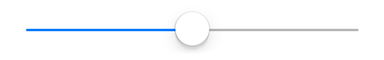

---
---
# Slider

Extends [Widget](Widget.md)

A widget representing a numeric value as an movable indicator on a horizontal line.

Import this type with "`const {Slider} = require('tabris');`"

Android | iOS
--- | ---
 | 

## Properties

### maximum


Type: *number*, default: `100`

The maximum value.

### minimum


Type: *number*, default: `0`

The minimum value.

### selection


Type: *number*, default: `0`

The actual value.

### tintColor


Type: *[Color](../types.md#color)*

The color used to display the current selection.


## Events

### maximumChanged

Fired when the [*maximum*](#maximum) property has changed.

#### Event Parameters 
- **target**: *this*
    The widget the event was fired on.

- **value**: *number*
    The new value of [*maximum*](#maximum).


### minimumChanged

Fired when the [*minimum*](#minimum) property has changed.

#### Event Parameters 
- **target**: *this*
    The widget the event was fired on.

- **value**: *number*
    The new value of [*minimum*](#minimum).


### select

Fired when the selection property is changed by the user.

#### Event Parameters 
- **target**: *this*
    The widget the event was fired on.

- **selection**: *number*
    The new value of *[selection](#selection)*.


### selectionChanged

Fired when the [*selection*](#selection) property has changed.

#### Event Parameters 
- **target**: *this*
    The widget the event was fired on.

- **value**: *number*
    The new value of [*selection*](#selection).


### tintColorChanged

Fired when the [*tintColor*](#tintColor) property has changed.

#### Event Parameters 
- **target**: *this*
    The widget the event was fired on.

- **value**: *[Color](../types.md#color)*
    The new value of [*tintColor*](#tintColor).


## Example
```js
const {Slider, TextView, ui} = require('tabris');

// Create a slider with a selection handler

let textView = new TextView({
  left: 10, right: 10, top: '30%',
  alignment: 'center',
  font: '22px sans-serif',
  text: '50'
}).appendTo(ui.contentView);

new Slider({
  left: 50, top: [textView, 20], right: 50,
  minimum: -50,
  selection: 50,
  maximum: 150
}).on('selectionChanged', ({value}) => textView.text = value)
  .appendTo(ui.contentView);
```
## See also

- [Simple Slider snippet](https://github.com/eclipsesource/tabris-js/tree/v2.5.0/snippets/slider.js)
