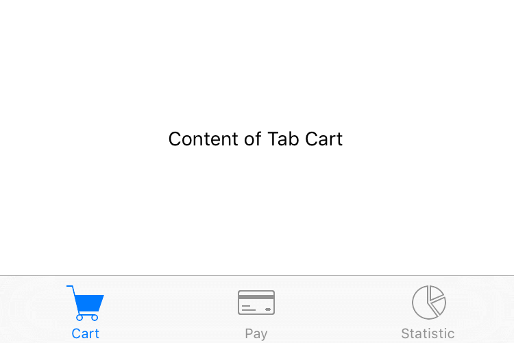

---
---
# TabFolder

Extends [Composite](Composite.md)

A widget that can switch between [tabs](Tab). Only children of type `Tab` are supported. Since the TabFolder does not compute its own size, the width and height must be defined by the respective layout properties (e.g. either `width` or `left` and `right` must be specified).

Import this type with "`const {TabFolder} = require('tabris');`"

Android | iOS
--- | ---
 | 

## Properties

### paging
<p class="platforms"><span class="ios-tag" title="supported on iOS">iOS</span><span class="android-tag" title="supported on Android">Android</span></p>

Type: *boolean*

Enables swiping through tabs. Always enabled on Windows.

### selection


Type: *[Tab](Tab.md)*

The currently selected tab.

### tabBarLocation


Type: *string*, supported values: `top`, `bottom`, `hidden`, `auto`, default: `auto`

The placement of the tab titles. When set to `"hidden"`, the tab bar will not be visible. When set to `"auto"`, the position is platform dependent.<br/>This property can only be set on widget creation. Once set, it cannot be changed anymore.

### tabMode
<p class="platforms"><span class="android-tag" title="supported on Android">Android</span></p>

Type: *string*, supported values: `fixed`, `scrollable`, default: `fixed`

Controls how the tabs make use of the available horizontal space. Setting the `tabMode` to `"fixed"` makes the tabs span the entire available space. In case of a very wide `TabFolder` the `"fixed"` mode centers the tabs. The mode `"scrollable"` left aligns the tabs and allows to scroll the tabs if there are more tabs than would fit in the available space. Available on Android only.<br/>This property can only be set on widget creation. Once set, it cannot be changed anymore.

### textColor
<p class="platforms"><span class="ios-tag" title="supported on iOS">iOS</span><span class="android-tag" title="supported on Android">Android</span></p>

Type: *[Color](../types.md#color)*

The color used for the text of the tab headers.

### win_tabBarTheme


Type: *string*, supported values: `light`, `dark`, `default`, default: `default`

Controls the color scheme used for the tabBar. When set to `"default"` the theme is inherited from the TabFolder. Available only on Windows.


## Events

### pagingChanged

Fired when the [*paging*](#paging) property has changed.

#### Event Parameters 
- **target**: *this*
    The widget the event was fired on.

- **value**: *boolean*
    The new value of [*paging*](#paging).


### scroll
<p class="platforms"><span class="ios-tag" title="supported on iOS">iOS</span><span class="android-tag" title="supported on Android">Android</span></p>
Fired when `paging` is enabled and a tab is scrolled. The `event` parameter contains position information relative to the currently selected `Tab`. Eg.: scrolling a 500px wide tab 10% to the left sets `offset` to `50`. Scrolling 10% to the right sets `offset` to `-50`.

#### Event Parameters 
- **target**: *this*
    The widget the event was fired on.

- **offset**: *number*
    Number of pixels the current tab has scrolled horizontally.

- **selection**: *[Tab](Tab.md)*
    The current value of the `selection` property.


### select

Fired when the selection property changes by user interaction.

#### Event Parameters 
- **target**: *this*
    The widget the event was fired on.

- **selection**: *[Tab](Tab.md)*
    The new value of *selection*.


### selectionChanged

Fired when the [*selection*](#selection) property has changed.

#### Event Parameters 
- **target**: *this*
    The widget the event was fired on.

- **value**: *[Tab](Tab.md)*
    The new value of [*selection*](#selection).


### textColorChanged

Fired when the [*textColor*](#textColor) property has changed.

#### Event Parameters 
- **target**: *this*
    The widget the event was fired on.

- **value**: *[Color](../types.md#color)*
    The new value of [*textColor*](#textColor).


### win_tabBarThemeChanged

Fired when the [*win_tabBarTheme*](#win_tabBarTheme) property has changed.

#### Event Parameters 
- **target**: *this*
    The widget the event was fired on.

- **value**: *string*
    The new value of [*win_tabBarTheme*](#win_tabBarTheme).


## Example
```js
const {Tab, TabFolder, TextView, ui} = require('tabris');

// Create a swipe enabled tab folder with 3 tabs

let tabFolder = new TabFolder({
  left: 0, top: 0, right: 0, bottom: 0,
  paging: true // enables swiping. To still be able to open the developer console in iOS, swipe from the bottom right.
}).appendTo(ui.contentView);

createTab('Cart', 'resources/cart.png', 'resources/cart-filled.png');
createTab('Pay', 'resources/card.png', 'resources/card-filled.png');
createTab('Statistic', 'resources/chart.png', 'resources/chart-filled.png');

tabFolder.on('selectionChanged', ({value: tab}) => console.log(`selection changed to ${tab.title}`));

function createTab(title, image, seletedImage) {
  let tab = new Tab({
    title: title, // converted to upper-case on Android
    image: {src: image, scale: 2},
    selectedImage: {src: seletedImage, scale: 2}
  }).on({
    appear: ({target}) => console.log(`${target.title} appeared`),
    disappear: ({target}) => console.log(`${target.title} disappeared`)
  }).appendTo(tabFolder);
  new TextView({
    centerX: 0, centerY: 0,
    text: 'Content of Tab ' + title
  }).appendTo(tab);
}
```
## See also

- [Snippet with a TabFolder and Tabs](https://github.com/eclipsesource/tabris-js/tree/v2.5.0/snippets/tabfolder.js)
