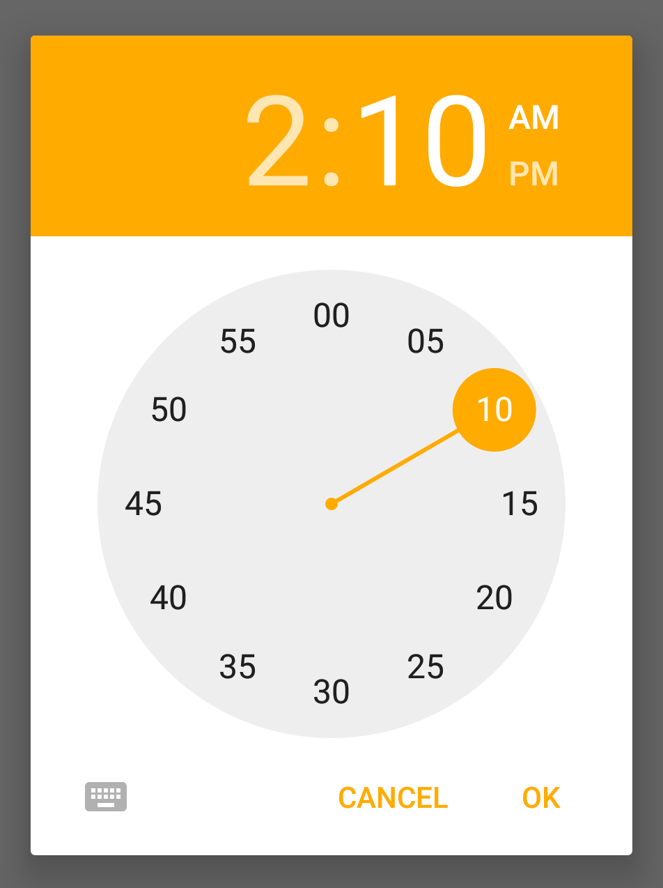
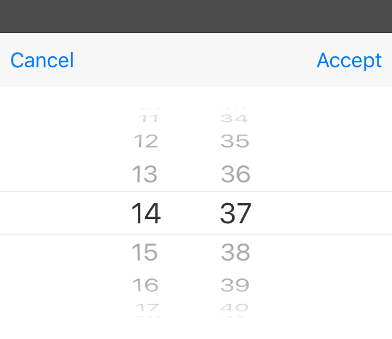

---
---
# TimeDialog

Extends [Popup](Popup.md)

A `TimeDialog` represents a native dialog pop-up allowing the user to pick a time of day. Properties can only be set before open() is called. The dialog is automatically disposed when closed.

Import this type with "`const {TimeDialog} = require('tabris');`"

Android | iOS
--- | ---
 | 

## Properties

### date


Type: *Date*

The time to be displayed in the dialog. The current date is used when no date is provided.


## Events

### close

Fired when the time dialog was closed.

#### Event Parameters 
- **target**: *this*
    The widget the event was fired on.

- **date**: *Date*
    The selected time. Can be `undefined` when no date was selected.


### dateChanged

Fired when the [*date*](#date) property has changed.

#### Event Parameters 
- **target**: *this*
    The widget the event was fired on.

- **value**: *Date*
    The new value of [*date*](#date).


### select

Fired when a time was selected by the user.

#### Event Parameters 
- **target**: *this*
    The widget the event was fired on.

- **date**: *Date*
    The selected time. Only the time components reflect the users selection. The date component values are undefined.


## Example
```js
const {TimeDialog, TextView, Button, ui} = require('tabris');

new Button({
  left: 16, right: 16, top: 16,
  text: 'Show TimeDialog'
}).on({select: showTimeDialog})
  .appendTo(ui.contentView);

let selectionTextView = new TextView({
  left: 16, right: 16, top: ['prev()', 16],
  alignment: 'center'
}).appendTo(ui.contentView);

function showTimeDialog() {
  return new TimeDialog({
    date: new Date(),
  }).on({
    select: ({date}) => selectionTextView.text = date.toString(),
    close: () => console.log('TimeDialog closed')
  }).open();
}
```
## See also

- [Simple TimeDialog snippet](https://github.com/eclipsesource/tabris-js/tree/v2.6.1/snippets/timedialog.js)
