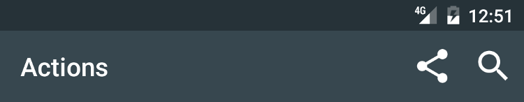
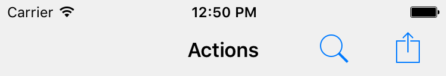

---
---
# Widget "Action"

Extends [Widget](Widget.md)

An executable item that is integrated in the application's navigation menu. Add a listener on *select* to implement the action.

You can import this type like this:
```js
import {Action} from 'tabris';
```
Or reference it directly form anywhere as "`tabris.Action`".
Android | iOS
--- | ---
 | 

## Methods


## Properties

### image


Type: *[Image](../types.md#image)*

Icon image for the action.

### placementPriority


Type: *string*, supported values: `low`, `high`, `normal`, default: `normal`

Actions with higher placement priority will be placed at a more significant position in the UI, e.g. low priority actions could go into a menu instead of being included in a toolbar.

### title


Type: *string*

The text to be displayed for the action.

In JSX the text content of the *Action* element is mapped to this property. Therefore `<Action>Hello World</Action>` would be the same as `<Action title='Hello World' />`.


## Events

### imageChanged

Fired when the [*image*](#image) property has changed.

#### Event Parameters 
- **target**: *this*
    The widget the event was fired on.

- **value**: *[Image](../types.md#image)*
    The new value of [*image*](#image).


### placementPriorityChanged

Fired when the [*placementPriority*](#placementPriority) property has changed.

#### Event Parameters 
- **target**: *this*
    The widget the event was fired on.

- **value**: *string*
    The new value of [*placementPriority*](#placementPriority).


### select

Fired when the action is invoked.
### titleChanged

Fired when the [*title*](#title) property has changed.

#### Event Parameters 
- **target**: *this*
    The widget the event was fired on.

- **value**: *string*
    The new value of [*title*](#title).


## See also

- [Snippet for creating actions](https://github.com/eclipsesource/tabris-js/tree/v3.0.0-beta1/snippets/navigationview-action.js)
- [Actions - placement priorities](https://github.com/eclipsesource/tabris-js/tree/v3.0.0-beta1/snippets/navigationview-action-placementpriority.js)
