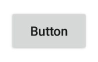
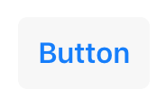

---
---
# Widget "Button"

Extends [Widget](Widget.md)

A push button. Can contain a text or an image.

You can import this type like this:
```js
import {Button} from 'tabris';
```
Or reference it directly form anywhere as "`tabris.Button`".
Android | iOS
--- | ---
 | 

## Properties

### alignment


Type: *string*, supported values: `left`, `right`, `center`, default: `center`

The horizontal alignment of the button text.

### font


Type: *[Font](../types.md#font)*

The font used for the button text.

### image


Type: *[Image](../types.md#image)*

An image to be displayed on the button.

### text


Type: *string*

The button's label text.

In JSX the text content of the *Button* element is mapped to this property. Therefore `<Button>Hello World</Button>` would be the same as `<Button text='Hello World' />`.

### textColor


Type: *[Color](../types.md#color)*

The color of the text.


## Events

### alignmentChanged

Fired when the [*alignment*](#alignment) property has changed.

#### Event Parameters 
- **target**: *this*
    The widget the event was fired on.

- **value**: *string*
    The new value of [*alignment*](#alignment).


### fontChanged

Fired when the [*font*](#font) property has changed.

#### Event Parameters 
- **target**: *this*
    The widget the event was fired on.

- **value**: *[Font](../types.md#font)*
    The new value of [*font*](#font).


### imageChanged

Fired when the [*image*](#image) property has changed.

#### Event Parameters 
- **target**: *this*
    The widget the event was fired on.

- **value**: *[Image](../types.md#image)*
    The new value of [*image*](#image).


### select

Fired when the button is pressed.
### textChanged

Fired when the [*text*](#text) property has changed.

#### Event Parameters 
- **target**: *this*
    The widget the event was fired on.

- **value**: *string*
    The new value of [*text*](#text).


### textColorChanged

Fired when the [*textColor*](#textColor) property has changed.

#### Event Parameters 
- **target**: *this*
    The widget the event was fired on.

- **value**: *[Color](../types.md#color)*
    The new value of [*textColor*](#textColor).


## Example
```js
import {Button, ui} from 'tabris';

// Create a push button that counts up on selection

let count = 0;

new Button({
  left: 10, top: 10,
  text: 'Button'
}).on('select', ({target}) => target.text = 'Pressed ' + (++count) + ' times')
  .appendTo(ui.contentView);
```
## See also

- [Simple Button snippet](https://github.com/eclipsesource/tabris-js/tree/v3.0.0-beta1/snippets/button.js)
