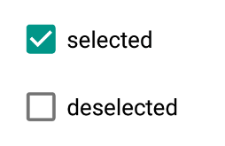

---
---
# Widget "CheckBox"

Extends [Widget](Widget.md)

A check box widget.

You can import this type like this:
```js
import {CheckBox} from 'tabris';
```
Or reference it directly form anywhere as "`tabris.CheckBox`".
Android | iOS
--- | ---
 | 

## Properties

### checked


Type: *boolean*, default: `false`

The checked state of the check box.

### checkedTintColor


Type: *[Color](../types.md#color)*

The color of the selectable area in checked state. Will fall back to `tintColor` if not set.

### font


Type: *[Font](../types.md#font)*

The font used for the text.

### text


Type: *string*

The label text of the check box.

In JSX the text content of the *CheckBox* element is mapped to this property. Therefore `<CheckBox>Hello World</CheckBox>` would be the same as `<CheckBox text='Hello World' />`.

### textColor


Type: *[Color](../types.md#color)*

The color of the text.

### tintColor


Type: *[Color](../types.md#color)*

The color of the selectable area.


## Events

### checkedChanged

Fired when the [*checked*](#checked) property has changed.

#### Event Parameters 
- **target**: *this*
    The widget the event was fired on.

- **value**: *boolean*
    The new value of [*checked*](#checked).


### checkedTintColorChanged

Fired when the [*checkedTintColor*](#checkedTintColor) property has changed.

#### Event Parameters 
- **target**: *this*
    The widget the event was fired on.

- **value**: *[Color](../types.md#color)*
    The new value of [*checkedTintColor*](#checkedTintColor).


### fontChanged

Fired when the [*font*](#font) property has changed.

#### Event Parameters 
- **target**: *this*
    The widget the event was fired on.

- **value**: *[Font](../types.md#font)*
    The new value of [*font*](#font).


### select

Fired when the check box is checked or unchecked by the user.

#### Event Parameters 
- **target**: *this*
    The widget the event was fired on.

- **checked**: *boolean*
    The new value of *[checked](#checked)*.


### textChanged

Fired when the [*text*](#text) property has changed.

#### Event Parameters 
- **target**: *this*
    The widget the event was fired on.

- **value**: *string*
    The new value of [*text*](#text).


### textColorChanged

Fired when the [*textColor*](#textColor) property has changed.

#### Event Parameters 
- **target**: *this*
    The widget the event was fired on.

- **value**: *[Color](../types.md#color)*
    The new value of [*textColor*](#textColor).


### tintColorChanged

Fired when the [*tintColor*](#tintColor) property has changed.

#### Event Parameters 
- **target**: *this*
    The widget the event was fired on.

- **value**: *[Color](../types.md#color)*
    The new value of [*tintColor*](#tintColor).


## Example
```js
import {CheckBox, ui} from 'tabris';

// Create a check box with a checked handler

new CheckBox({
  left: 10, top: 10,
  checked: true,
  text: 'checked'
}).on('checkedChanged', event => event.target.text = event.value ? 'checked' : 'unchecked')
  .appendTo(ui.contentView);
```
## See also

- [Simple Checkbox snippet](https://github.com/eclipsesource/tabris-js/tree/v3.0.0-beta1/snippets/checkbox.js)
