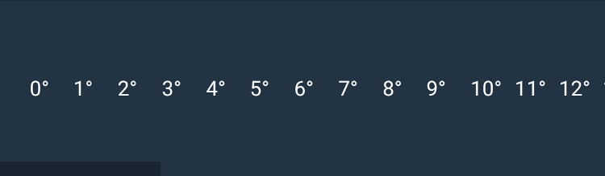
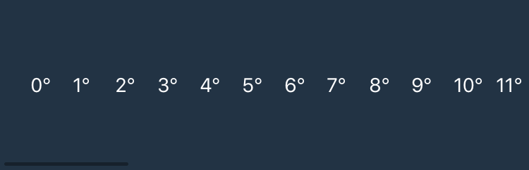

---
---
# Widget "ScrollView"

Extends [Composite](Composite.md)

A composite that allows its content to overflow either vertically (default) or horizontally. Since the ScrollView does not compute its own size, the width and height must be defined by the respective layout properties (e.g. either `width` or `left` and `right` must be specified).

You can import this type like this:
```js
import {ScrollView} from 'tabris';
```
Or reference it directly form anywhere as "`tabris.ScrollView`".
Android | iOS
--- | ---
 | 

## Methods

### scrollToX(offset, options)


**Parameters:** 

- offset: *number*
  - the offset to scroll to in dip.
- options: *{animate?: boolean}* [**Optional**]
  - an additional object to control the animation. Set to `{animate: false}` to scroll without an animation.

**Returns:** *this*

Scrolls to the given horizontal offset. Give `{animate: false}` as the second parameter to suppress the animation.

### scrollToY(offset, options)


**Parameters:** 

- offset: *number*
  - the offset to scroll to in dip.
- options: *{animate?: boolean}* [**Optional**]
  - an additional object to control the animation. Set to `{animate: false}` to scroll without an animation.

**Returns:** *this*

Scrolls to the given vertical offset. Give `{animate: false}` as the second parameter to suppress the animation.


## Properties

### direction


Type: *string*, supported values: `vertical`, `horizontal`, default: `vertical`

Specifies the scrolling direction of the scroll composite.<br/>This property can only be set on widget creation. Once set, it cannot be changed anymore.

### offsetX


**read-only**<br/>
Type: *number*

The horizontal scrolling position in dip.

### offsetY


**read-only**<br/>
Type: *number*

The vertical scrolling position in dip.

### scrollbarVisible


Type: *boolean*, default: `true`

Allows to show or hide scroll bar for current direction.


## Events

### offsetXChanged

Fired when the [*offsetX*](#offsetX) property has changed.

#### Event Parameters 
- **target**: *this*
    The widget the event was fired on.

- **value**: *number*
    The new value of [*offsetX*](#offsetX).


### offsetYChanged

Fired when the [*offsetY*](#offsetY) property has changed.

#### Event Parameters 
- **target**: *this*
    The widget the event was fired on.

- **value**: *number*
    The new value of [*offsetY*](#offsetY).


### scrollbarVisibleChanged

Fired when the [*scrollbarVisible*](#scrollbarVisible) property has changed.

#### Event Parameters 
- **target**: *this*
    The widget the event was fired on.

- **value**: *boolean*
    The new value of [*scrollbarVisible*](#scrollbarVisible).


### scrollX

Fired while scrolling horizontally.

#### Event Parameters 
- **target**: *this*
    The widget the event was fired on.

- **offset**: *number*
    Indicates the current horizontal scrolling position.


### scrollY

Fired while scrolling vertically.

#### Event Parameters 
- **target**: *this*
    The widget the event was fired on.

- **offset**: *number*
    Indicates the current vertical scrolling position.


## Example
```js
import {Button, ScrollView, TextView, ui} from 'tabris';

// Create a horizontal scroll view and populate it with text views

let scrollView = new ScrollView({
  left: 0, right: 0, top: '40%', bottom: '40%',
  direction: 'horizontal',
  background: '#234'
}).appendTo(ui.contentView);

for (let i = 0; i <= 50; i++) {
  new TextView({
    left: i * 30 + 20, centerY: 0, width: 30,
    textColor: 'white',
    text: i + '°'
  }).appendTo(scrollView);
}

new Button({
  left: 16, bottom: 16,
  text: 'scroll'
}).on('select', () => scrollView.scrollToX(310))
  .appendTo(ui.contentView);
```
## See also

- [Simple ScrollView snippet](https://github.com/eclipsesource/tabris-js/tree/v3.0.0-beta1/snippets/scrollview.js)
- [Example using a ScrollView](https://github.com/eclipsesource/tabris-js/tree/v3.0.0-beta1/examples/parallax/parallax.js)
