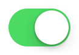

---
---
# Widget "Switch"

Extends [Widget](Widget.md)

A switch widget that can be toggled.

You can import this type like this:
```js
import {Switch} from 'tabris';
```
Or reference it directly form anywhere as "`tabris.Switch`".
Android | iOS
--- | ---
 | 

## Properties

### checked


Type: *boolean*, default: `false`

The checked state of the switch.

### thumbOffColor


Type: *[Color](../types.md#color)*

The color of the movable thumb, when switched *off*.

### thumbOnColor


Type: *[Color](../types.md#color)*

The color of the movable thumb, when switched *on*.

### trackOffColor


Type: *[Color](../types.md#color)*

The color of the track that holds the thumb, when switched *off*.

### trackOnColor


Type: *[Color](../types.md#color)*

The color of the track that holds the thumb, when switched *on*.


## Events

### checkedChanged

Fired when the [*checked*](#checked) property has changed.

#### Event Parameters 
- **target**: *this*
    The widget the event was fired on.

- **value**: *boolean*
    The new value of [*checked*](#checked).


### select

Fired when the switch is toggled by the user.

#### Event Parameters 
- **target**: *this*
    The widget the event was fired on.

- **checked**: *boolean*
    The current value of *[checked](#checked)*.


### thumbOffColorChanged

Fired when the [*thumbOffColor*](#thumbOffColor) property has changed.

#### Event Parameters 
- **target**: *this*
    The widget the event was fired on.

- **value**: *[Color](../types.md#color)*
    The new value of [*thumbOffColor*](#thumbOffColor).


### thumbOnColorChanged

Fired when the [*thumbOnColor*](#thumbOnColor) property has changed.

#### Event Parameters 
- **target**: *this*
    The widget the event was fired on.

- **value**: *[Color](../types.md#color)*
    The new value of [*thumbOnColor*](#thumbOnColor).


### trackOffColorChanged

Fired when the [*trackOffColor*](#trackOffColor) property has changed.

#### Event Parameters 
- **target**: *this*
    The widget the event was fired on.

- **value**: *[Color](../types.md#color)*
    The new value of [*trackOffColor*](#trackOffColor).


### trackOnColorChanged

Fired when the [*trackOnColor*](#trackOnColor) property has changed.

#### Event Parameters 
- **target**: *this*
    The widget the event was fired on.

- **value**: *[Color](../types.md#color)*
    The new value of [*trackOnColor*](#trackOnColor).


## Example
```js
import {Button, Switch, TextView, ui} from 'tabris';

// Create a switch with a checked handler

let MARGIN = 16;

new Switch({
  left: MARGIN, top: MARGIN,
  id: 'switch',
  checked: true
}).on('checkedChanged', ({value: checked}) => {
  ui.contentView.find('#stateView').first().text = checked ? 'State: checked' : 'State: unchecked';
}).appendTo(ui.contentView);

new TextView({
  left: ['#switch', MARGIN], baseline: '#switch',
  id: 'stateView',
  text: 'State: checked'
}).appendTo(ui.contentView);

new Button({
  left: MARGIN, top: ['#switch', MARGIN],
  text: 'Toggle Switch'
}).on('select', () => {
  let switcher = ui.contentView.find('#switch').first();
  switcher.checked = !switcher.checked;
}).appendTo(ui.contentView);
```