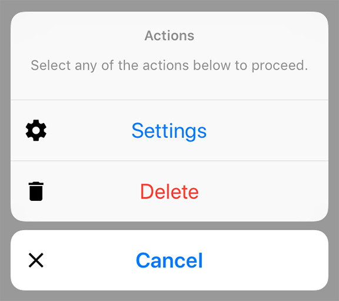

---
---
# Class "ActionSheet"

<span style="white-space:nowrap;">[`Object`](https://developer.mozilla.org/en-US/docs/Web/JavaScript/Reference/Global_Objects/Object)</span> > <span style="white-space:nowrap;">[`NativeObject`](NativeObject.md)</span> > <span style="white-space:nowrap;">[`Popup`](Popup.md)</span> > <span style="white-space:nowrap;">[`ActionSheet`](ActionSheet.md)</span>

A pop up dialog that offers a selection. Is automatically disposed when closed.


<div class="tabris-image"><figure><div></div><figcaption>Android</figcaption></figure><figure><div></div><figcaption>iOS</figcaption></figure></div>

Constructor | *public*
Singleton | *No*
Namespace |`tabris`
Direct subclasses | *None*
JSX support | Element: `<ActionSheet/>`<br/>Child elements: [`<ActionSheetItem/>`](#actions)<br/>Text content: *Sets [message](#message) property*<br/>

## Example
```js
import {ActionSheet} from 'tabris';

new ActionSheet({
  title: 'ActionSheet',
  actions: [{title: 'Save'}, {title: 'Delete', style: 'destructive'}]
}).onSelect(({index}) => console.log(`Selected ${index}`))
  .open();
```

## Constructor

### new ActionSheet(properties?)

Parameter|Type|Optional|Description
-|-|-|-
properties | <span style="white-space:nowrap;">`Properties<ActionSheet>`</span> | Yes | Sets all key-value pairs in the properties object as widget properties.

## Static Methods

### open(actionSheet)


Makes the given action sheet visible. Meant to be used with inline-JSX. In TypeScript it also casts the given JSX element from `any` to an actual ActionSheet.


Parameter|Type|Optional|Description
-|-|-|-
actionSheet | <span style="white-space:nowrap;">[`ActionSheet`](ActionSheet.md)</span> | No | The action sheet to open


Returns <span style="white-space:nowrap;">[`ActionSheet`](ActionSheet.md)</span>


## Properties

### actions


An array of objects describing the actions to be displayed. Each action must have a title and it can also have an image. Actions with the style `cancel` or `destructive` are displayed in a special way.

Note: On iPad, an action with style `cancel` will not be shown in the ActionSheet as per [Apple's design approach](https://developer.apple.com/documentation/uikit/windows_and_screens/getting_the_user_s_attention_with_alerts_and_action_sheets). If such button is added tapping outside of ActionSheet is equivalent to pressing the `cancel` action on iPad. In case of tapping outside an appropriate event will be sent by the native side as if such button was pressed.

Type | <span style="white-space:nowrap;">`{title: string, image?: ImageValue, style?: 'default'` \| `'cancel'` \| `'destructive'}[]`</span>
Settable | *Yes*
JSX content type | `ActionSheetItem`


When using ActionSheet as an JSX element its child elements are mapped to this property. Therefore
```jsx
<ActionSheet>{actions}</ActionSheet>
```
 has the same effect as:
```jsx
<ActionSheet actions={actions} /> 
```
The `ActionSheetItem` element needs to be imported from the `tabris` module separately and has the same attributes as the property type.

### message


A descriptive message for the available actions.

Type | <span style="white-space:nowrap;">[`string`](https://developer.mozilla.org/en-US/docs/Web/JavaScript/Data_structures#String_type)</span>
Settable | *Yes*
JSX content type | `string`


When using ActionSheet as an JSX element the element content is mapped to this property. Therefore
```jsx
<ActionSheet>Hello World</ActionSheet>
```
 has the same effect as:
```jsx
<ActionSheet message='Hello World' />
```


### title


The title of the action sheet.

Type | <span style="white-space:nowrap;">[`string`](https://developer.mozilla.org/en-US/docs/Web/JavaScript/Data_structures#String_type)</span>
Settable | *Yes*


## Events

### close

Fired when the action sheet was closed.

Parameter|Type|Description
-|-|-
action | <span style="white-space:nowrap;">`{title: string, image: ImageValue, style: 'default'` \| `'cancel'` \| `'destructive'}` \| [`null`](https://developer.mozilla.org/en-US/docs/Web/JavaScript/Data_structures#Null_type)</span> | A copy of the selected action as an instance of ActionSheetItem. If no action was selected the value is `null`.
index | <span style="white-space:nowrap;">[`number`](https://developer.mozilla.org/en-US/docs/Web/JavaScript/Data_structures#Number_type) \| [`null`](https://developer.mozilla.org/en-US/docs/Web/JavaScript/Data_structures#Null_type)</span> | The index of the selected action. If no action was selected the value is `null`.

### select

Fired when an action was selected. Note: on iOS, tapping outside of an ActionSheet will also fire a `select` event. Its parameter will be an index of a button with type `cancel`. This happens despite the fact that no button has been pressed.

Parameter|Type|Description
-|-|-
action | <span style="white-space:nowrap;">`{title: string, image: ImageValue, style: 'default'` \| `'cancel'` \| `'destructive'}`</span> | A copy of the selected action as an instance of ActionSheetItem.
index | <span style="white-space:nowrap;">[`number`](https://developer.mozilla.org/en-US/docs/Web/JavaScript/Data_structures#Number_type)</span> | The index of the selected action.

## Change Events

### titleChanged

Fired when the [*title*](#title) property has changed.

Parameter|Type|Description
-|-|-
value | <span style="white-space:nowrap;">[`string`](https://developer.mozilla.org/en-US/docs/Web/JavaScript/Data_structures#String_type)</span> | The new value of [*title*](#title).

### messageChanged

Fired when the [*message*](#message) property has changed.

Parameter|Type|Description
-|-|-
value | <span style="white-space:nowrap;">[`string`](https://developer.mozilla.org/en-US/docs/Web/JavaScript/Data_structures#String_type)</span> | The new value of [*message*](#message).

### actionsChanged

Fired when the [*actions*](#actions) property has changed.

Parameter|Type|Description
-|-|-
value | <span style="white-space:nowrap;">`{title: string, image?: ImageValue, style?: 'default'` \| `'cancel'` \| `'destructive'}[]`</span> | The new value of [*actions*](#actions).

