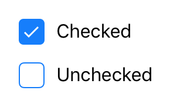

---
---
# Class "CheckBox"

<span style="white-space:nowrap;">[`Object`](https://developer.mozilla.org/en-US/docs/Web/JavaScript/Reference/Global_Objects/Object)</span> > <span style="white-space:nowrap;">[`NativeObject`](NativeObject.md)</span> > <span style="white-space:nowrap;">[`Widget`](Widget.md)</span> > <span style="white-space:nowrap;">[`CheckBox`](CheckBox.md)</span>

A check box widget.


<div class="tabris-image"><figure><div></div><figcaption>Android</figcaption></figure><figure><div></div><figcaption>iOS</figcaption></figure></div>

Constructor | *public*
Singleton | *No*
Namespace |`tabris`
Direct subclasses | *None*
JSX support | Element: `<CheckBox/>`<br/>Parent element: [`<Composite/>`](Composite.md) *and any widget extending* <span style="white-space:nowrap;">[`Composite`](Composite.md)</span><br/>Child elements: *None*<br/>Text content: *Sets [text](#text) property*<br/>

## Example
```js
import {CheckBox, contentView} from 'tabris';

new CheckBox({text: 'Checkbox'})
  .onSelect(event => console.log(`Checkbox checked: ${event.checked}`))
  .appendTo(contentView);
```

See also:

- [Simple Checkbox snippet](https://github.com/eclipsesource/tabris-js/tree/v3.0.0-beta2-dev.20190311+1537/snippets/checkbox.js)

## Constructor

### new CheckBox(properties?)

Parameter|Type|Optional|Description
-|-|-|-
properties | <span style="white-space:nowrap;">`Properties<CheckBox>`</span> | Yes | Sets all key-value pairs in the properties object as widget properties.

## Properties

### checked


The checked state of the check box.

Type | <span style="white-space:nowrap;">[`boolean`](https://developer.mozilla.org/en-US/docs/Web/JavaScript/Data_structures#Boolean_type)</span>
Default | `false`
Settable | *Yes*


### checkedTintColor


The color of the selectable area in checked state. Will fall back to `tintColor` if not set.

Type | <span style="white-space:nowrap;">[`ColorValue`](../types.md#colorvalue)</span>
Settable | *Yes*


### font


The font used for the text.

Type | <span style="white-space:nowrap;">[`FontValue`](../types.md#fontvalue)</span>
Settable | *Yes*


### text


The label text of the check box.

Type | <span style="white-space:nowrap;">[`string`](https://developer.mozilla.org/en-US/docs/Web/JavaScript/Data_structures#String_type)</span>
Settable | *Yes*
JSX content type | `string`


When using CheckBox as an JSX element the element content is mapped to this property. Therefore
```jsx
<CheckBox>Hello World</CheckBox>
```
 has the same effect as:
```jsx
<CheckBox text='Hello World' />
```


### textColor


The color of the text.

Type | <span style="white-space:nowrap;">[`ColorValue`](../types.md#colorvalue)</span>
Settable | *Yes*


### tintColor


The color of the selectable area.

Type | <span style="white-space:nowrap;">[`ColorValue`](../types.md#colorvalue)</span>
Settable | *Yes*


## Events

### select

Fired when the check box is checked or unchecked by the user.

Parameter|Type|Description
-|-|-
checked | <span style="white-space:nowrap;">[`boolean`](https://developer.mozilla.org/en-US/docs/Web/JavaScript/Data_structures#Boolean_type)</span> | The new value of *[checked](#checked)*.

## Change Events

### checkedChanged

Fired when the [*checked*](#checked) property has changed.

Parameter|Type|Description
-|-|-
value | <span style="white-space:nowrap;">[`boolean`](https://developer.mozilla.org/en-US/docs/Web/JavaScript/Data_structures#Boolean_type)</span> | The new value of [*checked*](#checked).

### textChanged

Fired when the [*text*](#text) property has changed.

Parameter|Type|Description
-|-|-
value | <span style="white-space:nowrap;">[`string`](https://developer.mozilla.org/en-US/docs/Web/JavaScript/Data_structures#String_type)</span> | The new value of [*text*](#text).

### textColorChanged

Fired when the [*textColor*](#textColor) property has changed.

Parameter|Type|Description
-|-|-
value | <span style="white-space:nowrap;">[`ColorValue`](../types.md#colorvalue)</span> | The new value of [*textColor*](#textColor).

### tintColorChanged

Fired when the [*tintColor*](#tintColor) property has changed.

Parameter|Type|Description
-|-|-
value | <span style="white-space:nowrap;">[`ColorValue`](../types.md#colorvalue)</span> | The new value of [*tintColor*](#tintColor).

### checkedTintColorChanged

Fired when the [*checkedTintColor*](#checkedTintColor) property has changed.

Parameter|Type|Description
-|-|-
value | <span style="white-space:nowrap;">[`ColorValue`](../types.md#colorvalue)</span> | The new value of [*checkedTintColor*](#checkedTintColor).

### fontChanged

Fired when the [*font*](#font) property has changed.

Parameter|Type|Description
-|-|-
value | <span style="white-space:nowrap;">[`FontValue`](../types.md#fontvalue)</span> | The new value of [*font*](#font).

