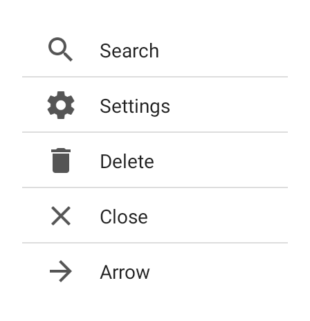

---
---
# Class "CollectionView"

<span style="white-space:nowrap;">[`Object`](https://developer.mozilla.org/en-US/docs/Web/JavaScript/Reference/Global_Objects/Object)</span> > <span style="white-space:nowrap;">[`NativeObject`](NativeObject.md)</span> > <span style="white-space:nowrap;">[`Widget`](Widget.md)</span> > <span style="white-space:nowrap;">[`CollectionView`](CollectionView.md)</span>

A scrollable list that displays data items in cells, one per row. Cells are created on demand by the *createCell* callback and reused on scrolling.


<div class="tabris-image"><figure><div></div><figcaption>Android</figcaption></figure><figure><div></div><figcaption>iOS</figcaption></figure></div>

Constructor | *public*
Singleton | *No*
Namespace |`tabris`
Direct subclasses | *None*
JSX support | Element: `<CollectionView/>`<br/>Parent element: [`<Composite/>`](Composite.md) *and any widget extending* <span style="white-space:nowrap;">[`Composite`](Composite.md)</span><br/>Child elements: *None*<br/>Text content: *Not supported*<br/>

## Example
```js
import {CollectionView, contentView} from 'tabris';

const items = ['Apple', 'Banana', 'Cherry'];

new CollectionView({
  left: 0, top: 0, right: 0, bottom: 0,
  itemCount: items.length,
  createCell: () => new TextView(),
  updateCell: (view, index) =>  {
    view.text = items[index];
  }
}).appendTo(contentView);
```

See also:

- [CollectionView example](https://github.com/eclipsesource/tabris-js/tree/v3.0.0-beta2-dev.20190311+1537/snippets/collectionview.js)

## Constructor

### new CollectionView(properties?)

Parameter|Type|Optional|Description
-|-|-|-
properties | <span style="white-space:nowrap;">`Properties<CollectionView> & Partial<Pick<CollectionView, 'cellHeight'` \| `'cellType'` \| `'createCell'>>`</span> | Yes | Sets all key-value pairs in the properties object as widget properties.

## Methods

### insert(index, count?)


Inserts one or more items at the given index. When no *count* is specified, a single item will be added at the given *index*. New cells may be created if needed. The `updateCell` callback will only be called for those new items that become immediately visible. Note that inserting new items changes the index of all subsequent items. This operation will update the `itemCount` property.


Parameter|Type|Optional|Description
-|-|-|-
index | <span style="white-space:nowrap;">[`number`](https://developer.mozilla.org/en-US/docs/Web/JavaScript/Data_structures#Number_type)</span> | No | 
count | <span style="white-space:nowrap;">[`number`](https://developer.mozilla.org/en-US/docs/Web/JavaScript/Data_structures#Number_type)</span> | Yes | The position to insert the items at. A negative index is interpreted as relative to the end. If the given index is greater than the item count, new items will be appended at the end.


Returns <span style="white-space:nowrap;">[`void`](https://www.typescriptlang.org/docs/handbook/basic-types.html#void)</span>

### load(itemCount)


Loads a new model with the given *itemCount*. This operation will update the `itemCount` property.


Parameter|Type|Optional|Description
-|-|-|-
itemCount | <span style="white-space:nowrap;">[`number`](https://developer.mozilla.org/en-US/docs/Web/JavaScript/Data_structures#Number_type)</span> | No | The number of items in the model to load.


Returns <span style="white-space:nowrap;">[`void`](https://www.typescriptlang.org/docs/handbook/basic-types.html#void)</span>

### refresh(index?)


Triggers an update of the item at the given *index* by calling the `updateCell` callback of the corresponding. If no *index* is given, all visible items will be updated.


Parameter|Type|Optional|Description
-|-|-|-
index | <span style="white-space:nowrap;">[`number`](https://developer.mozilla.org/en-US/docs/Web/JavaScript/Data_structures#Number_type)</span> | Yes | The index of the item that was changed.


Returns <span style="white-space:nowrap;">[`void`](https://www.typescriptlang.org/docs/handbook/basic-types.html#void)</span>

### remove(index, count?)


Removes one or more items beginning with the given index. When no *count* is given, only the item at *index* will be removed. Note that this changes the index of all subsequent items, however. This operation will update the `itemCount` property.


Parameter|Type|Optional|Description
-|-|-|-
index | <span style="white-space:nowrap;">[`number`](https://developer.mozilla.org/en-US/docs/Web/JavaScript/Data_structures#Number_type)</span> | No | The index of the first item to remove. A negative value is interpreted as relative to the end.
count | <span style="white-space:nowrap;">[`number`](https://developer.mozilla.org/en-US/docs/Web/JavaScript/Data_structures#Number_type)</span> | Yes | The number of items to remove.


Returns <span style="white-space:nowrap;">[`void`](https://www.typescriptlang.org/docs/handbook/basic-types.html#void)</span>

### reveal(index)


Scrolls the item with the given index into view.


Parameter|Type|Optional|Description
-|-|-|-
index | <span style="white-space:nowrap;">[`number`](https://developer.mozilla.org/en-US/docs/Web/JavaScript/Data_structures#Number_type)</span> | No | The index of the item to reveal. If this is negative, it is interpreted as relative to the end


Returns <span style="white-space:nowrap;">[`void`](https://www.typescriptlang.org/docs/handbook/basic-types.html#void)</span>

### set(properties)


Sets all key-value pairs in the properties object as widget properties.


Parameter|Type|Optional|Description
-|-|-|-
properties | <span style="white-space:nowrap;">`Properties<this> & Partial<Pick<this, 'cellHeight'` \| `'cellType'` \| `'createCell'>>`</span> | No | 


Returns <span style="white-space:nowrap;">[`this`](#)</span>


## Properties

### cellHeight


The height of a collection cell. If set to `"auto"`, the cell height will be calculated individually for each cell. If set to a function, this function will be called for every item, providing the item index and the cell type as parameters, and must return the cell height for the given item.

Type | <span style="white-space:nowrap;">[`number`](https://developer.mozilla.org/en-US/docs/Web/JavaScript/Data_structures#Number_type) \| `"auto"` \| `((index: number, cellType: string) => number` \| `"auto")`</span>
Default | `auto`
Settable | *Yes*


### cellType


The name of the cell type to use for the item at the given index. This name will be passed to the `createCell` and `cellHeight` callbacks. Cells will be reused only for those items that map to the same cell type. If set to a function, this function will be called for every item, providing the item index as a parameter, and must return a unique name for the cell type to use for the given item.

Type | <span style="white-space:nowrap;">[`string`](https://developer.mozilla.org/en-US/docs/Web/JavaScript/Data_structures#String_type) \| `((index: number) => string)` \| [`null`](https://developer.mozilla.org/en-US/docs/Web/JavaScript/Data_structures#Null_type)</span>
Settable | *Yes*


### columnCount


The number of columns to display in the collection view. If set to a value `n > 1`, each row will contain `n` items. The available space will be equally distributed between columns.

Type | <span style="white-space:nowrap;">[`number`](https://developer.mozilla.org/en-US/docs/Web/JavaScript/Data_structures#Number_type)</span>
Default | `1`
Settable | *Yes*


### createCell


A callback used to create a new reusable cell widget for a given type. This callback will be called by the framework and the created cell will be reused for different items. The created widget should be populated in the `updateCell` function.

Type | <span style="white-space:nowrap;">`(cellType: string) => Widget`</span>
Settable | *Yes*


### firstVisibleIndex


The index of the first item that is currently visible on screen.

Type | <span style="white-space:nowrap;">[`number`](https://developer.mozilla.org/en-US/docs/Web/JavaScript/Data_structures#Number_type)</span>
Settable | *No*


### itemCount


The number of items to display. To add or remove items later, use the methods `insert()` and `remove()` instead of setting the `itemCount`. To display a new list of items, use the `load()` method.

Type | <span style="white-space:nowrap;">[`number`](https://developer.mozilla.org/en-US/docs/Web/JavaScript/Data_structures#Number_type)</span>
Settable | *Yes*


### lastVisibleIndex


The index of the last item that is currently visible on screen.

Type | <span style="white-space:nowrap;">[`number`](https://developer.mozilla.org/en-US/docs/Web/JavaScript/Data_structures#Number_type)</span>
Settable | *No*


### refreshEnabled


Enables the user to trigger a refresh by using the pull-to-refresh gesture.

Type | <span style="white-space:nowrap;">[`boolean`](https://developer.mozilla.org/en-US/docs/Web/JavaScript/Data_structures#Boolean_type)</span>
Default | `false`
Settable | *Yes*


### refreshIndicator


Whether the refresh indicator is currently visible. Will be set to `true` when a *refresh* event is triggered. Reset it to `false` when the refresh is finished.

Type | <span style="white-space:nowrap;">[`boolean`](https://developer.mozilla.org/en-US/docs/Web/JavaScript/Data_structures#Boolean_type)</span>
Default | `false`
Settable | *Yes*


### refreshMessage
<p class="platforms"><span class='ios-tag' title='supported on iOS'>iOS</span></p>

The message text displayed together with the refresh indicator. Currently not supported on Android.

Type | <span style="white-space:nowrap;">[`string`](https://developer.mozilla.org/en-US/docs/Web/JavaScript/Data_structures#String_type)</span>
Default | `'""'`
Settable | *Yes*


### updateCell


A callback used to update a given cell widget to display the item with the given index. This callback will be called by the framework.

Type | <span style="white-space:nowrap;">`(cell: Widget, index: number) => void`</span>
Settable | *Yes*


## Events

### select

Fired when a cell is selected.

Parameter|Type|Description
-|-|-
index | <span style="white-space:nowrap;">[`number`](https://developer.mozilla.org/en-US/docs/Web/JavaScript/Data_structures#Number_type)</span> | The index of the selected item.

### refresh

Fired when the user requested a refresh. An event listener should reset the *refreshIndicator* property when refresh is finished.

### scroll

Fired while the collection view is scrolling.

Parameter|Type|Description
-|-|-
deltaX | <span style="white-space:nowrap;">[`number`](https://developer.mozilla.org/en-US/docs/Web/JavaScript/Data_structures#Number_type)</span> | Currently always 0.
deltaY | <span style="white-space:nowrap;">[`number`](https://developer.mozilla.org/en-US/docs/Web/JavaScript/Data_structures#Number_type)</span> | The delta of the scroll position. Positive when scrolling up and negative when scrolling down.

## Change Events

### cellHeightChanged

Fired when the [*cellHeight*](#cellHeight) property has changed.

Parameter|Type|Description
-|-|-
value | <span style="white-space:nowrap;">[`number`](https://developer.mozilla.org/en-US/docs/Web/JavaScript/Data_structures#Number_type) \| `"auto"` \| `((index: number, cellType: string) => number` \| `"auto")`</span> | The new value of [*cellHeight*](#cellHeight).

### itemCountChanged

Fired when the [*itemCount*](#itemCount) property has changed.

Parameter|Type|Description
-|-|-
value | <span style="white-space:nowrap;">[`number`](https://developer.mozilla.org/en-US/docs/Web/JavaScript/Data_structures#Number_type)</span> | The new value of [*itemCount*](#itemCount).

### createCellChanged

Fired when the [*createCell*](#createCell) property has changed.

Parameter|Type|Description
-|-|-
value | <span style="white-space:nowrap;">`(cellType: string) => Widget`</span> | The new value of [*createCell*](#createCell).

### updateCellChanged

Fired when the [*updateCell*](#updateCell) property has changed.

Parameter|Type|Description
-|-|-
value | <span style="white-space:nowrap;">`(cell: Widget, index: number) => void`</span> | The new value of [*updateCell*](#updateCell).

### cellTypeChanged

Fired when the [*cellType*](#cellType) property has changed.

Parameter|Type|Description
-|-|-
value | <span style="white-space:nowrap;">[`string`](https://developer.mozilla.org/en-US/docs/Web/JavaScript/Data_structures#String_type) \| `((index: number) => string)` \| [`null`](https://developer.mozilla.org/en-US/docs/Web/JavaScript/Data_structures#Null_type)</span> | The new value of [*cellType*](#cellType).

### refreshEnabledChanged

Fired when the [*refreshEnabled*](#refreshEnabled) property has changed.

Parameter|Type|Description
-|-|-
value | <span style="white-space:nowrap;">[`boolean`](https://developer.mozilla.org/en-US/docs/Web/JavaScript/Data_structures#Boolean_type)</span> | The new value of [*refreshEnabled*](#refreshEnabled).

### refreshIndicatorChanged

Fired when the [*refreshIndicator*](#refreshIndicator) property has changed.

Parameter|Type|Description
-|-|-
value | <span style="white-space:nowrap;">[`boolean`](https://developer.mozilla.org/en-US/docs/Web/JavaScript/Data_structures#Boolean_type)</span> | The new value of [*refreshIndicator*](#refreshIndicator).

### refreshMessageChanged

Fired when the [*refreshMessage*](#refreshMessage) property has changed.

Parameter|Type|Description
-|-|-
value | <span style="white-space:nowrap;">[`string`](https://developer.mozilla.org/en-US/docs/Web/JavaScript/Data_structures#String_type)</span> | The new value of [*refreshMessage*](#refreshMessage).

### firstVisibleIndexChanged

Fired when the [*firstVisibleIndex*](#firstVisibleIndex) property has changed.

Parameter|Type|Description
-|-|-
value | <span style="white-space:nowrap;">[`number`](https://developer.mozilla.org/en-US/docs/Web/JavaScript/Data_structures#Number_type)</span> | The new value of [*firstVisibleIndex*](#firstVisibleIndex).

### lastVisibleIndexChanged

Fired when the [*lastVisibleIndex*](#lastVisibleIndex) property has changed.

Parameter|Type|Description
-|-|-
value | <span style="white-space:nowrap;">[`number`](https://developer.mozilla.org/en-US/docs/Web/JavaScript/Data_structures#Number_type)</span> | The new value of [*lastVisibleIndex*](#lastVisibleIndex).

### columnCountChanged

Fired when the [*columnCount*](#columnCount) property has changed.

Parameter|Type|Description
-|-|-
value | <span style="white-space:nowrap;">[`number`](https://developer.mozilla.org/en-US/docs/Web/JavaScript/Data_structures#Number_type)</span> | The new value of [*columnCount*](#columnCount).

