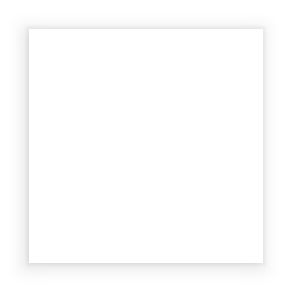

---
---
# Class "Composite"

<span style="white-space:nowrap;">[`Object`](https://developer.mozilla.org/en-US/docs/Web/JavaScript/Reference/Global_Objects/Object)</span> > <span style="white-space:nowrap;">[`NativeObject`](NativeObject.md)</span> > <span style="white-space:nowrap;">[`Widget`](Widget.md)</span> > <span style="white-space:nowrap;">[`Composite`](Composite.md)</span>

An empty widget that can contain other widgets.


<div class="tabris-image"><figure><div></div><figcaption>Android</figcaption></figure><figure><div></div><figcaption>iOS</figcaption></figure></div>

TypeScript type | `Composite<ChildType extends Widget = Widget> extends Widget`
Constructor | *public*
Singleton | *No*
Namespace |`tabris`
Direct subclasses | <span style="white-space:nowrap;">[`Canvas`](Canvas.md)</span>, <span style="white-space:nowrap;">[`ContentView`](ContentView.md)</span>, <span style="white-space:nowrap;">[`NavigationView`](NavigationView.md)</span>, <span style="white-space:nowrap;">[`Page`](Page.md)</span>, <span style="white-space:nowrap;">[`RefreshComposite`](RefreshComposite.md)</span>, <span style="white-space:nowrap;">[`ScrollView`](ScrollView.md)</span>, <span style="white-space:nowrap;">[`StackComposite`](StackComposite.md)</span>, <span style="white-space:nowrap;">[`Tab`](Tab.md)</span>, <span style="white-space:nowrap;">[`TabFolder`](TabFolder.md)</span>
JSX support | Element: `<Composite/>`<br/>Parent element: [`<Composite/>`](Composite.md) *and any widget extending* <span style="white-space:nowrap;">[`Composite`](Composite.md)</span><br/>Child elements: *Widgets*<br/>Text content: *Not supported*<br/>

## Example
```js
import {Composite, contentView} from 'tabris';

new Composite({left: 0, top: 0, width: 128, height: 256})
  .appendTo(contentView);
```

## Constructor

### new Composite(properties?)

Parameter|Type|Optional|Description
-|-|-|-
properties | <span style="white-space:nowrap;">`Properties<Composite>`</span> | Yes | Sets all key-value pairs in the properties object as widget properties.

## Methods

### append(...widgets)


Adds the given widgets to the composite.


Parameter|Type|Optional|Description
-|-|-|-
...widgets | <span style="white-space:nowrap;">`Widget[]`</span> | No | 


Returns <span style="white-space:nowrap;">[`this`](#)</span>

### append(widgets)


Adds all widgets in the given array to the composite.


Parameter|Type|Optional|Description
-|-|-|-
widgets | <span style="white-space:nowrap;">`Widget[]`</span> | No | 


Returns <span style="white-space:nowrap;">[`this`](#)</span>

### append(widgets)


Adds all widgets in the given collection to the composite.


Parameter|Type|Optional|Description
-|-|-|-
widgets | <span style="white-space:nowrap;">[`WidgetCollection`](WidgetCollection.md)</span> | No | 


Returns <span style="white-space:nowrap;">[`this`](#)</span>

### apply(properties)


Applies the given properties to all descendants that match the associated selector(s).

If you wish to always exclude specific "internal" children from this, overwrite the `children` method on their parent. See `children` for details.


Parameter|Type|Optional|Description
-|-|-|-
properties | <span style="white-space:nowrap;">[`object`](https://developer.mozilla.org/en-US/docs/Web/JavaScript/Reference/Global_Objects/Object)</span> | No | An object in the format `{Selector: {property: value, property: value, ... }, Selector: ...}`


Returns <span style="white-space:nowrap;">[`this`](#)</span>

### children(selector?)


Returns a (possibly empty) collection of all children of this widget that match the given selector.

When writing custom UI components it may be useful to overwrite this method to prevent access to the internal children by external code. Doing so also affects `find` and `apply`, on this widget as well as on all parents, thereby preventing accidental clashes of widget id or class values. See also `_children`, `_find` and `_apply`.


Parameter|Type|Optional|Description
-|-|-|-
selector | <span style="white-space:nowrap;">`Selector<ChildType>`</span> | Yes | A selector expression or a predicate function to filter the results.


Returns <span style="white-space:nowrap;">[`WidgetCollection`](WidgetCollection.md)</span>

### children(constructor)


Returns a collection containing all children of all widgets in this collection that are instances of the given class.


Parameter|Type|Optional|Description
-|-|-|-
constructor | <span style="white-space:nowrap;">`{ new (...args: any[]): U }`</span> | No | A class to filter the results.


Returns <span style="white-space:nowrap;">`WidgetCollection<U>`</span>

### find(selector?)


Returns a collection containing all descendants of all widgets in this collection that match the given selector.

If you wish to always exclude specific "internal" children from the result, overwrite the `children` method on their parent. See `children` for details.


Parameter|Type|Optional|Description
-|-|-|-
selector | <span style="white-space:nowrap;">`Selector<ChildType>`</span> | Yes | A selector expression or a predicate function to filter the results.


Returns <span style="white-space:nowrap;">[`WidgetCollection`](WidgetCollection.md)</span>

### find(constructor)


Returns a collection containing all descendants of all widgets in this collection that match the given selector.

If you wish to always exclude  specific "internal" children from the result, overwrite the `children` method on their parent. See `children` for details.


Parameter|Type|Optional|Description
-|-|-|-
constructor | <span style="white-space:nowrap;">`{ new (...args: any[]): U }`</span> | No | A class to filter the results.


Returns <span style="white-space:nowrap;">`WidgetCollection<U>`</span>

## Protected Methods

These methods are accessible only in classes extending *Composite*.

### _apply(properties)


Identical to the `apply` method, but intended to be used by subclasses in case the `children` method was overwritten . See `children` for details.


Parameter|Type|Optional|Description
-|-|-|-
properties | <span style="white-space:nowrap;">[`object`](https://developer.mozilla.org/en-US/docs/Web/JavaScript/Reference/Global_Objects/Object)</span> | No | An object in the format `{Selector: {property: value, property: value, ... }, Selector: ...}`


Returns <span style="white-space:nowrap;">[`this`](#)</span>

### _children(selector?)


Identical to the `children` method, but intended to be used by subclasses in case the `children` method was overwritten. See `children` for details.


Parameter|Type|Optional|Description
-|-|-|-
selector | <span style="white-space:nowrap;">`Selector<ChildType>`</span> | Yes | A selector expression or a predicate function to filter the results.


Returns <span style="white-space:nowrap;">[`WidgetCollection`](WidgetCollection.md)</span>

### _children(constructor)


Identical to the `children` method, but intended to be used by subclasses in case the `children` method was overwritten. See `children` for details.


Parameter|Type|Optional|Description
-|-|-|-
constructor | <span style="white-space:nowrap;">`{ new (...args: any[]): U }`</span> | No | A class to filter the results.


Returns <span style="white-space:nowrap;">`WidgetCollection<U>`</span>

### _find(selector?)


Identical to the `find` method, but intended to be used by subclasses in case the `children` method was overwritten. See `children` for details.


Parameter|Type|Optional|Description
-|-|-|-
selector | <span style="white-space:nowrap;">`Selector<ChildType>`</span> | Yes | A selector expression or a predicate function to filter the results.


Returns <span style="white-space:nowrap;">[`WidgetCollection`](WidgetCollection.md)</span>

### _find(constructor)


Identical to the `find` method, but intended to be used by subclasses in case the `children` method was overwritten. See `children` for details.


Parameter|Type|Optional|Description
-|-|-|-
constructor | <span style="white-space:nowrap;">`{ new (...args: any[]): U }`</span> | No | A class to filter the results.


Returns <span style="white-space:nowrap;">`WidgetCollection<U>`</span>


## Properties

### layout


The layout manager responsible for interpreting the [`layoutData`](./Widget.md#layoutData) of the child widgets of this Composite.

Type | <span style="white-space:nowrap;">[`Layout`](Layout.md) \| [`null`](https://developer.mozilla.org/en-US/docs/Web/JavaScript/Data_structures#Null_type)</span>
Default | `Layout`
Settable | *On creation*


This property can only be set via constructor or JSX. Once set, it cannot change anymore.

### padding


Additional space to add inside the widgets bounds. A shortcut to setting/getting the `padding` property of `layout`.

Type | <span style="white-space:nowrap;">[`BoxDimensions`](../types.md#boxdimensions) \| [`number`](https://developer.mozilla.org/en-US/docs/Web/JavaScript/Data_structures#Number_type) \| [`null`](https://developer.mozilla.org/en-US/docs/Web/JavaScript/Data_structures#Null_type)</span>
Settable | *On creation*


This property can only be set via constructor or JSX. Once set, it cannot change anymore.


## Events

### addChild

Fired when a child is added to this widget.

Parameter|Type|Description
-|-|-
child | <span style="white-space:nowrap;">[`Widget`](Widget.md)</span> | The widget that is added as a child.
index | <span style="white-space:nowrap;">[`number`](https://developer.mozilla.org/en-US/docs/Web/JavaScript/Data_structures#Number_type)</span> | Denotes the position in the children list at which the child widget is added.

### removeChild

Fired when a child is removed from this widget.

Parameter|Type|Description
-|-|-
child | <span style="white-space:nowrap;">[`Widget`](Widget.md)</span> | The widget that is removed.
index | <span style="white-space:nowrap;">[`number`](https://developer.mozilla.org/en-US/docs/Web/JavaScript/Data_structures#Number_type)</span> | The property `index` denotes the removed child widget's position in the children list.`

