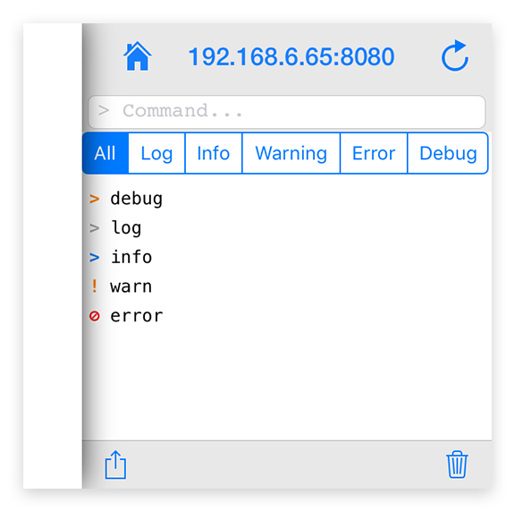

---
---
# Global object "console"

<span style="white-space:nowrap;">[`Object`](https://developer.mozilla.org/en-US/docs/Web/JavaScript/Reference/Global_Objects/Object)</span> > <span style="white-space:nowrap;">[`Console`](Console.md)</span>

The console object provides access to the debugging console


<div class="tabris-image"><figure><div></div><figcaption>Android</figcaption></figure><figure><div></div><figcaption>iOS</figcaption></figure></div>

Constructor | *private*
Singleton | `console`
Namespace |`global`
Direct subclasses | *None*
JSX support | *No*


## Example
```js
console.log("message");
console.error("error");
console.trace();
console.dirxml({});
```

## Methods

### assert(expression, ...objects)


Outputs an error message to the console if the first argument is false.


Parameter|Type|Optional|Description
-|-|-|-
expression | <span style="white-space:nowrap;">[`boolean`](https://developer.mozilla.org/en-US/docs/Web/JavaScript/Data_structures#Boolean_type)</span> | No | Any boolean expression. If the assertion is false, the error message is written to the console.
...objects | <span style="white-space:nowrap;">`any[]`</span> | No | A list of JavaScript objects to output. The string representations of each of these objects are appended together in the order listed and output.


Returns <span style="white-space:nowrap;">[`void`](https://www.typescriptlang.org/docs/handbook/basic-types.html#void)</span>

### assert(expression, message?, ...substitutions)


Outputs an error message to the console if the first argument is false.


Parameter|Type|Optional|Description
-|-|-|-
expression | <span style="white-space:nowrap;">[`boolean`](https://developer.mozilla.org/en-US/docs/Web/JavaScript/Data_structures#Boolean_type)</span> | No | Any boolean expression. If the assertion is false, the error message is written to the console.
message | <span style="white-space:nowrap;">[`string`](https://developer.mozilla.org/en-US/docs/Web/JavaScript/Data_structures#String_type)</span> | Yes | A JavaScript string containing zero or more substitution strings.
...substitutions | <span style="white-space:nowrap;">`any[]`</span> | No | JavaScript objects with which to replace substitution strings within message


Returns <span style="white-space:nowrap;">[`void`](https://www.typescriptlang.org/docs/handbook/basic-types.html#void)</span>

### count(label?)


Logs the number of times that this particular call to count() has been called.


Parameter|Type|Optional|Description
-|-|-|-
label | <span style="white-space:nowrap;">[`string`](https://developer.mozilla.org/en-US/docs/Web/JavaScript/Data_structures#String_type)</span> | Yes | If supplied, count() outputs the number of times it has been called with that label.


Returns <span style="white-space:nowrap;">[`void`](https://www.typescriptlang.org/docs/handbook/basic-types.html#void)</span>

### countReset(label?)


Resets the counter.


Parameter|Type|Optional|Description
-|-|-|-
label | <span style="white-space:nowrap;">[`string`](https://developer.mozilla.org/en-US/docs/Web/JavaScript/Data_structures#String_type)</span> | Yes | If label supplied, this function resets the count associated with that particular label.


Returns <span style="white-space:nowrap;">[`void`](https://www.typescriptlang.org/docs/handbook/basic-types.html#void)</span>

### debug(...objects)


Outputs a debug message to the console.


Parameter|Type|Optional|Description
-|-|-|-
...objects | <span style="white-space:nowrap;">`any[]`</span> | No | A list of JavaScript objects to output. The string representations of each of these objects are appended together in the order listed and output.


Returns <span style="white-space:nowrap;">[`void`](https://www.typescriptlang.org/docs/handbook/basic-types.html#void)</span>

### debug(message?, ...substitutions)


Outputs a debug message to the console.


Parameter|Type|Optional|Description
-|-|-|-
message | <span style="white-space:nowrap;">[`string`](https://developer.mozilla.org/en-US/docs/Web/JavaScript/Data_structures#String_type)</span> | Yes | A JavaScript string containing zero or more substitution strings.
...substitutions | <span style="white-space:nowrap;">`any[]`</span> | No | JavaScript objects with which to replace substitution strings within message


Returns <span style="white-space:nowrap;">[`void`](https://www.typescriptlang.org/docs/handbook/basic-types.html#void)</span>

### dirxml(object)


XML tree representation of a given object, if available. Supported types include all widgets and `localStorage`. 

*The output is NOT JSX, it is a human-readable summary that displays XML-conforming string representations of some select property values.


Parameter|Type|Optional|Description
-|-|-|-
object | <span style="white-space:nowrap;">[`any`](https://www.typescriptlang.org/docs/handbook/basic-types.html#any)</span> | No | A JavaScript object


Returns <span style="white-space:nowrap;">[`void`](https://www.typescriptlang.org/docs/handbook/basic-types.html#void)</span>

### error(...objects)


Outputs an error message to the console.


Parameter|Type|Optional|Description
-|-|-|-
...objects | <span style="white-space:nowrap;">`any[]`</span> | No | A list of JavaScript objects to output. The string representations of each of these objects are appended together in the order listed and output.


Returns <span style="white-space:nowrap;">[`void`](https://www.typescriptlang.org/docs/handbook/basic-types.html#void)</span>

### error(message?, ...substitutions)


Outputs an error message to the console.


Parameter|Type|Optional|Description
-|-|-|-
message | <span style="white-space:nowrap;">[`string`](https://developer.mozilla.org/en-US/docs/Web/JavaScript/Data_structures#String_type)</span> | Yes | A JavaScript string containing zero or more substitution strings.
...substitutions | <span style="white-space:nowrap;">`any[]`</span> | No | JavaScript objects with which to replace substitution strings within message


Returns <span style="white-space:nowrap;">[`void`](https://www.typescriptlang.org/docs/handbook/basic-types.html#void)</span>

### group(...objects)


Creates a new inline group in the console output. This indents following console messages by an additional spaces, until console.groupEnd() is called.


Parameter|Type|Optional|Description
-|-|-|-
...objects | <span style="white-space:nowrap;">`any[]`</span> | No | A list of JavaScript objects to output. The string representations of each of these objects are appended together in the order listed and output.


Returns <span style="white-space:nowrap;">[`void`](https://www.typescriptlang.org/docs/handbook/basic-types.html#void)</span>

### group(message?, ...substitutions)


Creates a new inline group in the console output. This indents following console messages by an additional spaces, until console.groupEnd() is called.


Parameter|Type|Optional|Description
-|-|-|-
message | <span style="white-space:nowrap;">[`string`](https://developer.mozilla.org/en-US/docs/Web/JavaScript/Data_structures#String_type)</span> | Yes | A JavaScript string containing zero or more substitution strings.
...substitutions | <span style="white-space:nowrap;">`any[]`</span> | No | JavaScript objects with which to replace substitution strings within message


Returns <span style="white-space:nowrap;">[`void`](https://www.typescriptlang.org/docs/handbook/basic-types.html#void)</span>

### groupEnd()


Exits the current inline group in the console.

Returns <span style="white-space:nowrap;">[`void`](https://www.typescriptlang.org/docs/handbook/basic-types.html#void)</span>

### groupEnd()


Exits the current inline group in the console.

Returns <span style="white-space:nowrap;">[`void`](https://www.typescriptlang.org/docs/handbook/basic-types.html#void)</span>

### info(...objects)


Outputs an info message to the console.


Parameter|Type|Optional|Description
-|-|-|-
...objects | <span style="white-space:nowrap;">`any[]`</span> | No | A list of JavaScript objects to output. The string representations of each of these objects are appended together in the order listed and output.


Returns <span style="white-space:nowrap;">[`void`](https://www.typescriptlang.org/docs/handbook/basic-types.html#void)</span>

### info(message?, ...substitutions)


Outputs an info message to the console.


Parameter|Type|Optional|Description
-|-|-|-
message | <span style="white-space:nowrap;">[`string`](https://developer.mozilla.org/en-US/docs/Web/JavaScript/Data_structures#String_type)</span> | Yes | A JavaScript string containing zero or more substitution strings.
...substitutions | <span style="white-space:nowrap;">`any[]`</span> | No | JavaScript objects with which to replace substitution strings within message


Returns <span style="white-space:nowrap;">[`void`](https://www.typescriptlang.org/docs/handbook/basic-types.html#void)</span>

### log(...objects)


Outputs a message to the console.


Parameter|Type|Optional|Description
-|-|-|-
...objects | <span style="white-space:nowrap;">`any[]`</span> | No | A list of JavaScript objects to output. The string representations of each of these objects are appended together in the order listed and output.


Returns <span style="white-space:nowrap;">[`void`](https://www.typescriptlang.org/docs/handbook/basic-types.html#void)</span>

### log(message?, ...substitutions)


Outputs a message to the console.


Parameter|Type|Optional|Description
-|-|-|-
message | <span style="white-space:nowrap;">[`string`](https://developer.mozilla.org/en-US/docs/Web/JavaScript/Data_structures#String_type)</span> | Yes | A JavaScript string containing zero or more substitution strings.
...substitutions | <span style="white-space:nowrap;">`any[]`</span> | No | JavaScript objects with which to replace substitution strings within message


Returns <span style="white-space:nowrap;">[`void`](https://www.typescriptlang.org/docs/handbook/basic-types.html#void)</span>

### trace()


Prints a stack trace in a platform-independent format. Framework internals are omitted.

Source maps are supported when side-loading code via the tabris CLI.

Returns <span style="white-space:nowrap;">[`void`](https://www.typescriptlang.org/docs/handbook/basic-types.html#void)</span>

### warn(...objects)


Outputs a warning message to the console.


Parameter|Type|Optional|Description
-|-|-|-
...objects | <span style="white-space:nowrap;">`any[]`</span> | No | A list of JavaScript objects to output. The string representations of each of these objects are appended together in the order listed and output.


Returns <span style="white-space:nowrap;">[`void`](https://www.typescriptlang.org/docs/handbook/basic-types.html#void)</span>

### warn(message?, ...substitutions)


Outputs a warning message to the console.


Parameter|Type|Optional|Description
-|-|-|-
message | <span style="white-space:nowrap;">[`string`](https://developer.mozilla.org/en-US/docs/Web/JavaScript/Data_structures#String_type)</span> | Yes | A JavaScript string containing zero or more substitution strings.
...substitutions | <span style="white-space:nowrap;">`any[]`</span> | No | JavaScript objects with which to replace substitution strings within message


Returns <span style="white-space:nowrap;">[`void`](https://www.typescriptlang.org/docs/handbook/basic-types.html#void)</span>

