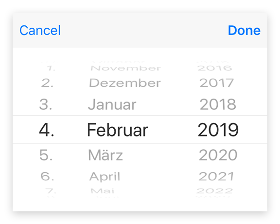

---
---
# Class "DateDialog"

<span style="white-space:nowrap;">[`Object`](https://developer.mozilla.org/en-US/docs/Web/JavaScript/Reference/Global_Objects/Object)</span> > <span style="white-space:nowrap;">[`NativeObject`](NativeObject.md)</span> > <span style="white-space:nowrap;">[`Popup`](Popup.md)</span> > <span style="white-space:nowrap;">[`DateDialog`](DateDialog.md)</span>

A `DateDialog` represents a native dialog pop-up allowing the user to pick a date. Properties can only be set before open() is called. The dialog is automatically disposed when closed.


<div class="tabris-image"><figure><div></div><figcaption>Android</figcaption></figure><figure><div></div><figcaption>iOS</figcaption></figure></div>

Constructor | *public*
Singleton | *No*
Namespace |`tabris`
Direct subclasses | *None*
JSX support | Element: `<DateDialog/>`<br/>Child elements: *None*<br/>Text content: *Not supported*<br/>

## Example
```js
import {DateDialog} from 'tabris';

new DateDialog()
  .onSelect(({date}) => console.log(`Selected ${date}`))
  .open();
```

See also:

- [Simple DateDialog snippet](https://github.com/eclipsesource/tabris-js/tree/v3.0.0-beta2-dev.20190311+1537/snippets/datedialog.js)

## Constructor

### new DateDialog(properties?)

Parameter|Type|Optional|Description
-|-|-|-
properties | <span style="white-space:nowrap;">`Properties<DateDialog>`</span> | Yes | Sets all key-value pairs in the properties object as widget properties.

## Properties

### date


The date to be displayed in the dialog. The current date is used when no date is provided.

Type | <span style="white-space:nowrap;">`Date`</span>
Settable | *Yes*


### maxDate


Limits the selectable date range to the given future date. No limit is applied when not set.

Type | <span style="white-space:nowrap;">`Date`</span>
Settable | *Yes*


### minDate


Limits the selectable date range to the given past date. No limit is applied when not set.

Type | <span style="white-space:nowrap;">`Date`</span>
Settable | *Yes*


## Events

### close

Fired when the date dialog was closed.

Parameter|Type|Description
-|-|-
date | <span style="white-space:nowrap;">`Date` \| [`null`](https://developer.mozilla.org/en-US/docs/Web/JavaScript/Data_structures#Null_type)</span> | The selected date. Can be `null` when no date was selected.

### select

Fired when a date was selected by the user.

Parameter|Type|Description
-|-|-
date | <span style="white-space:nowrap;">`Date`</span> | The selected date. Only the date components reflect the users selection. The time component values are undefined.

## Change Events

### dateChanged

Fired when the [*date*](#date) property has changed.

Parameter|Type|Description
-|-|-
value | <span style="white-space:nowrap;">`Date`</span> | The new value of [*date*](#date).

### minDateChanged

Fired when the [*minDate*](#minDate) property has changed.

Parameter|Type|Description
-|-|-
value | <span style="white-space:nowrap;">`Date`</span> | The new value of [*minDate*](#minDate).

### maxDateChanged

Fired when the [*maxDate*](#maxDate) property has changed.

Parameter|Type|Description
-|-|-
value | <span style="white-space:nowrap;">`Date`</span> | The new value of [*maxDate*](#maxDate).

