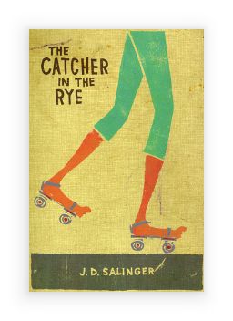

---
---
# Class "ImageView"

<span style="white-space:nowrap;">[`Object`](https://developer.mozilla.org/en-US/docs/Web/JavaScript/Reference/Global_Objects/Object)</span> > <span style="white-space:nowrap;">[`NativeObject`](NativeObject.md)</span> > <span style="white-space:nowrap;">[`Widget`](Widget.md)</span> > <span style="white-space:nowrap;">[`ImageView`](ImageView.md)</span>

A widget to display an image.


<div class="tabris-image"><figure><div></div><figcaption>Android</figcaption></figure><figure><div></div><figcaption>iOS</figcaption></figure></div>

Constructor | *public*
Singleton | *No*
Namespace |`tabris`
Direct subclasses | *None*
JSX support | Element: `<ImageView/>`<br/>Parent element: [`<Composite/>`](Composite.md) *and any widget extending* <span style="white-space:nowrap;">[`Composite`](Composite.md)</span><br/>Child elements: *None*<br/>Text content: *Not supported*<br/>

## Example
```js
import {ImageView, contentView} from 'tabris';

new ImageView({image: 'resources/image.png'})
  .appendTo(contentView);
```

## Constructor

### new ImageView(properties?)

Parameter|Type|Optional|Description
-|-|-|-
properties | <span style="white-space:nowrap;">`Properties<ImageView>`</span> | Yes | Sets all key-value pairs in the properties object as widget properties.

## Properties

### image


The image to display. Providing the `width` and `height` attributes on the image will resize it internally. When no dimensions are given the image will be loaded with its original size. Since the full size image might occupy a lot of memory, it's recommended to provide exact dimensions.

Type | <span style="white-space:nowrap;">[`ImageValue`](../types.md#imagevalue)</span>
Settable | *Yes*


### maxZoomLevel


The highest amount the image can be zoomed in to. Setting the `maxZoomLevel` to a level smaller than the current `zoomLevel` changes the `zoomLevel` to be the same as the new `maxZoomLevel`.

Type | <span style="white-space:nowrap;">[`number`](https://developer.mozilla.org/en-US/docs/Web/JavaScript/Data_structures#Number_type)</span>
Default | `3`
Settable | *Yes*


### minZoomLevel


The lowest amount the image can be zoomed out to. Setting the `minZoomLevel` to a level larger than the current `zoomLevel` changes the `zoomLevel` to be the same as the new `minZoomLevel`. 

Type | <span style="white-space:nowrap;">[`number`](https://developer.mozilla.org/en-US/docs/Web/JavaScript/Data_structures#Number_type)</span>
Default | `1`
Settable | *Yes*


### scaleMode


How to scale the image.

- `fit` will scale the image proportionally to fit into the view, possible leaving some empty space at the edges. That is, the image will be displayed as large as possible while being fully contained in the view.
- `fill` will scale the image proportionally to fill the entire view, possibly cutting off parts of the image. That is, the image will be displayed as small as possible while covering the entire view.
- `auto` will scale *down* the image to *fit* into the view if it is too large, but it won't scale up a smaller image.
- `stretch` will resize the image to the actual bounds of the image view.
- `none` will not resize the image at all. The image will be displayed in its original size.

Type | `'auto'` \| `'fit'` \| `'fill'` \| `'stretch'` \| `'none'`
Default | `'auto'`
Settable | *Yes*


### tintColor


A color to change the image appearance. All opaque parts of the image will be tinted with the given color. Set to `initial` to remove the effect.

Type | <span style="white-space:nowrap;">[`ColorValue`](../types.md#colorvalue)</span>
Settable | *Yes*


### zoomEnabled


Enables the pinch-to-zoom gesture on the `ImageView` and makes the properties `zoomLevel`, `minZoomLevel` and `maxZoomLevel` available. Setting `zoomEnabled` to `false` also resets the `zoomLevel`, `minZoomLevel`, `maxZoomLevel` to their respective defaults.

Type | <span style="white-space:nowrap;">[`boolean`](https://developer.mozilla.org/en-US/docs/Web/JavaScript/Data_structures#Boolean_type)</span>
Settable | *Yes*


### zoomLevel


The amount that the image is zoomed in or out. The default position without any zooming has the value 1.0.

Type | <span style="white-space:nowrap;">[`number`](https://developer.mozilla.org/en-US/docs/Web/JavaScript/Data_structures#Number_type)</span>
Default | `1`
Settable | *Yes*


## Events

### load

Fired when the image loading has finished.

Parameter|Type|Description
-|-|-
error | <span style="white-space:nowrap;">[`boolean`](https://developer.mozilla.org/en-US/docs/Web/JavaScript/Data_structures#Boolean_type)</span> | Contains the final status of the loading process

### zoom

Fired when the user zooms the image in or out. The `zoom` event indicates a change to the `zoomLevel` property.

Parameter|Type|Description
-|-|-
zoomLevel | <span style="white-space:nowrap;">[`number`](https://developer.mozilla.org/en-US/docs/Web/JavaScript/Data_structures#Number_type)</span> | The new value of *[zoomLevel](#zoomLevel)*.

## Change Events

### imageChanged

Fired when the [*image*](#image) property has changed.

Parameter|Type|Description
-|-|-
value | <span style="white-space:nowrap;">[`ImageValue`](../types.md#imagevalue)</span> | The new value of [*image*](#image).

### scaleModeChanged

Fired when the [*scaleMode*](#scaleMode) property has changed.

Parameter|Type|Description
-|-|-
value | <span style="white-space:nowrap;">[`string`](https://developer.mozilla.org/en-US/docs/Web/JavaScript/Data_structures#String_type)</span> | The new value of [*scaleMode*](#scaleMode).

### tintColorChanged

Fired when the [*tintColor*](#tintColor) property has changed.

Parameter|Type|Description
-|-|-
value | <span style="white-space:nowrap;">[`ColorValue`](../types.md#colorvalue)</span> | The new value of [*tintColor*](#tintColor).

### zoomEnabledChanged

Fired when the [*zoomEnabled*](#zoomEnabled) property has changed.

Parameter|Type|Description
-|-|-
value | <span style="white-space:nowrap;">[`boolean`](https://developer.mozilla.org/en-US/docs/Web/JavaScript/Data_structures#Boolean_type)</span> | The new value of [*zoomEnabled*](#zoomEnabled).

### zoomLevelChanged

Fired when the [*zoomLevel*](#zoomLevel) property has changed.

Parameter|Type|Description
-|-|-
value | <span style="white-space:nowrap;">[`number`](https://developer.mozilla.org/en-US/docs/Web/JavaScript/Data_structures#Number_type)</span> | The new value of [*zoomLevel*](#zoomLevel).

### minZoomLevelChanged

Fired when the [*minZoomLevel*](#minZoomLevel) property has changed.

Parameter|Type|Description
-|-|-
value | <span style="white-space:nowrap;">[`number`](https://developer.mozilla.org/en-US/docs/Web/JavaScript/Data_structures#Number_type)</span> | The new value of [*minZoomLevel*](#minZoomLevel).

### maxZoomLevelChanged

Fired when the [*maxZoomLevel*](#maxZoomLevel) property has changed.

Parameter|Type|Description
-|-|-
value | <span style="white-space:nowrap;">[`number`](https://developer.mozilla.org/en-US/docs/Web/JavaScript/Data_structures#Number_type)</span> | The new value of [*maxZoomLevel*](#maxZoomLevel).

