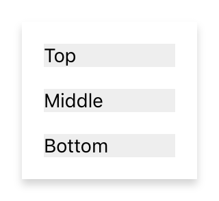

---
---
# Class "StackComposite"

<span style="white-space:nowrap;">[`Object`](https://developer.mozilla.org/en-US/docs/Web/JavaScript/Reference/Global_Objects/Object)</span> > <span style="white-space:nowrap;">[`NativeObject`](NativeObject.md)</span> > <span style="white-space:nowrap;">[`Widget`](Widget.md)</span> > <span style="white-space:nowrap;">[`Composite`](Composite.md)</span> > <span style="white-space:nowrap;">[`StackComposite`](StackComposite.md)</span>

A composite with the `layout` property initialized with a `StackComposite`. All children are automatically arranged in one vertical stack, starting from the top. The `layoutData` on the children is currently ignored.


<div class="tabris-image"><figure><div></div><figcaption>Android</figcaption></figure><figure><div></div><figcaption>iOS</figcaption></figure></div>

Constructor | *public*
Singleton | *No*
Namespace |`tabris`
Direct subclasses | *None*
JSX support | Element: `<StackComposite/>`<br/>Parent element: [`<Composite/>`](Composite.md) *and any widget extending* <span style="white-space:nowrap;">[`Composite`](Composite.md)</span><br/>Child elements: *Widgets*<br/>Text content: *Not supported*<br/>

## Example
```js
import {StackComposite, contentView} from 'tabris';

const stackComposite = new StackComposite({
  layoutData: 'fill',
  spacing: 16
}).appendTo(contentView);

stackComposite.append(
   new TextView({text: 'top'}),
   new TextView({text: 'center'}),
   new TextView({text: 'bottom'})
);
```

## Constructor

### new StackComposite(properties?)

Parameter|Type|Optional|Description
-|-|-|-
properties | <span style="white-space:nowrap;">`Properties<StackComposite>`</span> | Yes | Sets all key-value pairs in the properties object as widget properties.

## Properties

### alignment


Determines the horizontal placement of the children. For the `stretchX` value to work correctly the `StackComposite` needs to be given a width either by setting `width` or by setting `left` and `right`.

Type | <span style="white-space:nowrap;">`'left'` \| `'centerX'` \| `'stretchX'` \| `'right'`</span>
Default | `'left'`
Settable | *On creation*


This property can only be set via constructor or JSX. Once set, it cannot change anymore.

### layout


The stack layout manager responsible for interpreting the [`layoutData`](./Widget.md#layoutData) of the child widgets of this Composite.

Type | <span style="white-space:nowrap;">[`StackLayout`](StackLayout.md)</span>
Default | `StackLayout`
Settable | *On creation*


This property can only be set via constructor or JSX. Once set, it cannot change anymore.

### spacing


Additional space to add between the children in device independent pixel.

Type | <span style="white-space:nowrap;">[`number`](https://developer.mozilla.org/en-US/docs/Web/JavaScript/Data_structures#Number_type)</span>
Default | `16`
Settable | *On creation*


This property can only be set via constructor or JSX. Once set, it cannot change anymore.

