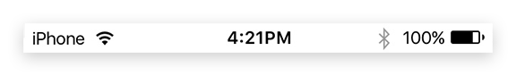

---
---
# Object "statusBar"

<span style="white-space:nowrap;">[`Object`](https://developer.mozilla.org/en-US/docs/Web/JavaScript/Reference/Global_Objects/Object)</span> > <span style="white-space:nowrap;">[`NativeObject`](NativeObject.md)</span> > <span style="white-space:nowrap;">[`StatusBar`](StatusBar.md)</span>

The status bar is the area where notifications, status icons and device time are displayed. The singleton instance can be accessed via `statusBar`.


<div class="tabris-image"><figure><div></div><figcaption>Android</figcaption></figure><figure><div></div><figcaption>iOS</figcaption></figure></div>

Constructor | *private*
Singleton | `statusBar`
Namespace |`tabris`
Direct subclasses | *None*
JSX support | *No*


## Example
```js
import {statusBar} from 'tabris';

statusBar.background = 'red';
statusBar.displayMode = 'float';
```

See also:

- [Snippet demonstrating various properties on the `StatusBar`](https://github.com/eclipsesource/tabris-js/tree/v3.0.0-beta2-dev.20190311+1537/snippets/statusbar.js)

## Properties

### background


Background color of the status bar. Should be used in conjunction with the `theme` property to keep the status bar icons legible.

Type | <span style="white-space:nowrap;">[`ColorValue`](../types.md#colorvalue)</span>
Settable | *Yes*


### displayMode


Controls how the status bar is positioned relative to the `contentView`. The value `default` places the content below the status bar. The `hide` option lets the status bar disappear, making more room for the content. The `float` option lets the content flow underneath the status bar.

Type | `'default'` \| `'hide'` \| `'float'`
Default | `'default'`
Settable | *Yes*


### height


The height of the status bar in device independent pixel. Can be used in conjunction with the `displayMode` `'float'` to offset the content as to not have it covered by the status bar.

Type | <span style="white-space:nowrap;">[`number`](https://developer.mozilla.org/en-US/docs/Web/JavaScript/Data_structures#Number_type)</span>
Settable | *No*


This property can only be set via constructor or JSX. Once set, it cannot change anymore.

### theme


Defines the shade used on the status bar. A `dark` theme sets the foreground icons to be of a light color, whereas `light` sets the icons to a dark color. The theme should be set in conjunction with the `background` property for contrast. The value `default` selects the default theme that depends on the device and on the app. Available on iOS and Android 6+.

Type | `'default'` \| `'light'` \| `'dark'`
Default | `'default'`
Settable | *Yes*


## Events

### tap

<p class="platforms"><span class='ios-tag' title='supported on iOS'>iOS</span></p>Fired when status bar is tapped.

Parameter|Type|Description
-|-|-
touches | <span style="white-space:nowrap;">`{x: number, y: number}[]`</span> | Touch coordinates relative to the origin coordinates of the widget.

## Change Events

### themeChanged

Fired when the [*theme*](#theme) property has changed.

Parameter|Type|Description
-|-|-
value | <span style="white-space:nowrap;">[`string`](https://developer.mozilla.org/en-US/docs/Web/JavaScript/Data_structures#String_type)</span> | The new value of [*theme*](#theme).

### displayModeChanged

Fired when the [*displayMode*](#displayMode) property has changed.

Parameter|Type|Description
-|-|-
value | <span style="white-space:nowrap;">[`string`](https://developer.mozilla.org/en-US/docs/Web/JavaScript/Data_structures#String_type)</span> | The new value of [*displayMode*](#displayMode).

### backgroundChanged

Fired when the [*background*](#background) property has changed.

Parameter|Type|Description
-|-|-
value | <span style="white-space:nowrap;">[`ColorValue`](../types.md#colorvalue)</span> | The new value of [*background*](#background).

