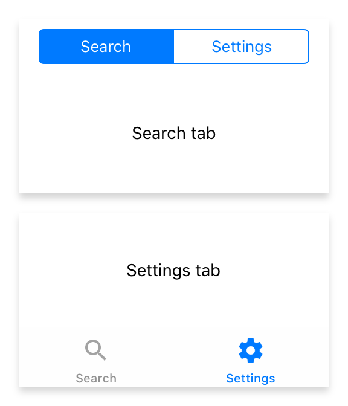

---
---
# Class "Tab"

<span style="white-space:nowrap;">[`Object`](https://developer.mozilla.org/en-US/docs/Web/JavaScript/Reference/Global_Objects/Object)</span> > <span style="white-space:nowrap;">[`NativeObject`](NativeObject.md)</span> > <span style="white-space:nowrap;">[`Widget`](Widget.md)</span> > <span style="white-space:nowrap;">[`Composite`](Composite.md)</span> > <span style="white-space:nowrap;">[`Tab`](Tab.md)</span>

A container representing a single tab of a TabFolder widget.


<div class="tabris-image"><figure><div></div><figcaption>Android</figcaption></figure><figure><div></div><figcaption>iOS</figcaption></figure></div>

Constructor | *public*
Singleton | *No*
Namespace |`tabris`
Direct subclasses | *None*
JSX support | Element: `<Tab/>`<br/>Parent element: [`<TabFolder/>`](TabFolder.md)<br/>Child elements: *Widgets*<br/>Text content: *Not supported*<br/>

## Example
```js
import {Tab, TabFolder, contentView} from 'tabris';

new TabFolder({left: 0, top: 0, right: 0, bottom: 0})
  .append(new Tab({title: 'Albums'}))
  .append(new Tab({title: 'Artists'}))
  .onSelect(({selection}) => console.log(`Tab changed to ${selection}`))
  .appendTo(contentView);
```

See also:

- [Snippet with a TabFolder and Tabs](https://github.com/eclipsesource/tabris-js/tree/v3.0.0-beta2-dev.20190311+1537/snippets/tabfolder.js)

## Constructor

### new Tab(properties?)

Parameter|Type|Optional|Description
-|-|-|-
properties | <span style="white-space:nowrap;">`Properties<Tab>`</span> | Yes | Sets all key-value pairs in the properties object as widget properties.

## Methods

### insertBefore(widget)


Inserts this widget directly before the given `Tab`.


Parameter|Type|Optional|Description
-|-|-|-
widget | <span style="white-space:nowrap;">[`Tab`](Tab.md)</span> | No | 


Returns <span style="white-space:nowrap;">[`this`](#)</span>


## Properties

### badge
<p class="platforms"><span class='ios-tag' title='supported on iOS'>iOS</span></p>

A badge to attach to the tab.

Type | <span style="white-space:nowrap;">[`string`](https://developer.mozilla.org/en-US/docs/Web/JavaScript/Data_structures#String_type)</span>
Settable | *Yes*


### badgeColor
<p class="platforms"><span class='ios-tag' title='supported on iOS'>iOS</span></p>

The color used for the `badge` indicator.

Type | <span style="white-space:nowrap;">[`ColorValue`](../types.md#colorvalue)</span>
Settable | *Yes*


### image


An image to be displayed on the tab.  Will not be shown on iOS if the `TabFolder`'s `tabBarLocation` is set to `top`

Type | <span style="white-space:nowrap;">[`ImageValue`](../types.md#imagevalue)</span>
Settable | *Yes*


### selectedImage


An image to be displayed on the currently active tab.

Type | <span style="white-space:nowrap;">[`ImageValue`](../types.md#imagevalue)</span>
Settable | *Yes*


### title


The title to be displayed on the tab.

Type | <span style="white-space:nowrap;">[`string`](https://developer.mozilla.org/en-US/docs/Web/JavaScript/Data_structures#String_type)</span>
Settable | *Yes*


## Events

### appear

Fired when the tab will become visible, i.e. the selection of its TabFolder.

### disappear

Fired when the tab is no longer visible, i.e. it no longer is the selection of its TabFolder.

## Change Events

### titleChanged

Fired when the [*title*](#title) property has changed.

Parameter|Type|Description
-|-|-
value | <span style="white-space:nowrap;">[`string`](https://developer.mozilla.org/en-US/docs/Web/JavaScript/Data_structures#String_type)</span> | The new value of [*title*](#title).

### imageChanged

Fired when the [*image*](#image) property has changed.

Parameter|Type|Description
-|-|-
value | <span style="white-space:nowrap;">[`ImageValue`](../types.md#imagevalue)</span> | The new value of [*image*](#image).

### selectedImageChanged

Fired when the [*selectedImage*](#selectedImage) property has changed.

Parameter|Type|Description
-|-|-
value | <span style="white-space:nowrap;">[`ImageValue`](../types.md#imagevalue)</span> | The new value of [*selectedImage*](#selectedImage).

### badgeChanged

Fired when the [*badge*](#badge) property has changed.

Parameter|Type|Description
-|-|-
value | <span style="white-space:nowrap;">[`string`](https://developer.mozilla.org/en-US/docs/Web/JavaScript/Data_structures#String_type)</span> | The new value of [*badge*](#badge).

### badgeColorChanged

Fired when the [*badgeColor*](#badgeColor) property has changed.

Parameter|Type|Description
-|-|-
value | <span style="white-space:nowrap;">[`ColorValue`](../types.md#colorvalue)</span> | The new value of [*badgeColor*](#badgeColor).

