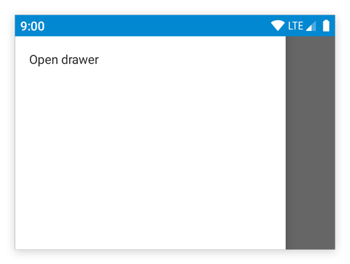

---
---
# Object "drawer"

<span style="white-space:nowrap;">[`Object`](https://developer.mozilla.org/en-US/docs/Web/JavaScript/Reference/Global_Objects/Object)</span> > <span style="white-space:nowrap;">[`NativeObject`](NativeObject.md)</span> > <span style="white-space:nowrap;">[`Widget`](Widget.md)</span> > <span style="white-space:nowrap;">[`Composite`](Composite.md)</span> > <span style="white-space:nowrap;">[`ContentView`](ContentView.md)</span> > <span style="white-space:nowrap;">[`Drawer`](Drawer.md)</span>

A drawer that can be swiped in from the left edge of the screen. There's only a single instance that can be accessed via `tabris.drawer`. The drawer is locked by default. To use it in an application, set the property `enabled` to `true`. The drawer can contain any kind of widgets.


<div class="tabris-image"><figure><div></div><figcaption>Android</figcaption></figure><figure><div></div><figcaption>iOS</figcaption></figure></div>

Constructor | *private*
Singleton | `drawer`
Namespace |`tabris`
Direct subclasses | *None*
JSX support | *No*


## Example
```js
import {TextView, drawer} from 'tabris';

drawer
  .set({enabled: true})
  .append(new TextView({text: 'Drawer content'}));
```

See also:

- [Demo JavaScript/JSX Snippet: Simple example of using a `Drawer`](https://playground.tabris.com/?gitref=v3.0.0&snippet=drawer.jsx)
- [Demo TypeScript/JSX Snippet: Using a `Drawer` for app navigation](https://playground.tabris.com/?gitref=v3.0.0&snippet=drawer-pages.tsx)

## Methods

### close()


Closes the drawer.

Returns <span style="white-space:nowrap;">[`this`](#)</span>

### open()


Opens the drawer. It may be useful to call this method on first startup, so that users notice the drawer and its contents.

Returns <span style="white-space:nowrap;">[`this`](#)</span>


## Properties

### enabled


Controls whether the drawer can be opened and closed. When set to `false`, the drawer cannot be opened and calls to `drawer.open()` will be ignored.

Type | <span style="white-space:nowrap;">[`boolean`](https://developer.mozilla.org/en-US/docs/Web/JavaScript/Data_structures#Boolean_type)</span>
Default | `false`
Settable | *Yes*
Change events | *Yes*


## Events

### open

Fired when the drawer is opened and has reached its resting position.

### close

Fired when the drawer is closed and has reached its resting position.

## Change Events

### enabledChanged

Fired when the [*enabled*](#enabled) property has changed.

Parameter|Type|Description
-|-|-
value | <span style="white-space:nowrap;">[`boolean`](https://developer.mozilla.org/en-US/docs/Web/JavaScript/Data_structures#Boolean_type)</span> | The new value of [*enabled*](#enabled).

