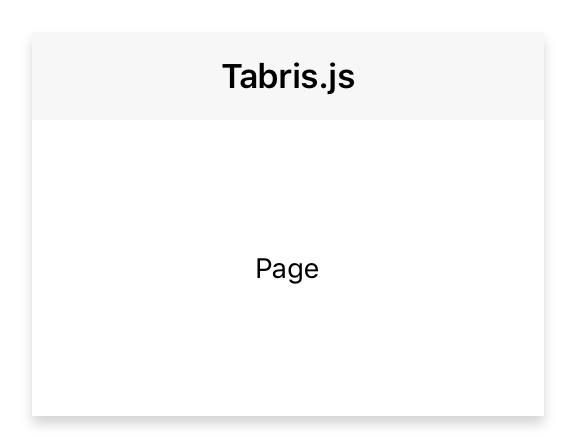

---
---
# Class "Page"

<span style="white-space:nowrap;">[`Object`](https://developer.mozilla.org/en-US/docs/Web/JavaScript/Reference/Global_Objects/Object)</span> > <span style="white-space:nowrap;">[`NativeObject`](NativeObject.md)</span> > <span style="white-space:nowrap;">[`Widget`](Widget.md)</span> > <span style="white-space:nowrap;">[`Composite`](Composite.md)</span> > <span style="white-space:nowrap;">[`Page`](Page.md)</span>

A container representing a single page of a NavigationView widget.


<div class="tabris-image"><figure><div></div><figcaption>Android</figcaption></figure><figure><div></div><figcaption>iOS</figcaption></figure></div>

Constructor | *public*
Singleton | *No*
Namespace |`tabris`
Direct subclasses | *None*
JSX support | Element: `<Page/>`<br/>Parent element: [`<NavigationView/>`](NavigationView.md)<br/>Child elements: *Widgets*<br/>Text content: *Not supported*<br/>

## Example
```js
import {NavigationView, Page, contentView} from 'tabris';

new NavigationView({layoutData: 'stretch'})
  .append(new Page({title: 'Albums'}))
  .appendTo(contentView);
```

See also:

- [Demo JavaScript/JSX Snippet: Creating a stack of pages](https://playground.tabris.com/?gitref=v3.0.0&snippet=navigationview-page-stacked.jsx)

## Constructor

### new Page(properties?)

Parameter|Type|Optional|Description
-|-|-|-
properties | <span style="white-space:nowrap;">`Properties<Page>`</span> | Yes | Sets all key-value pairs in the properties object as widget properties.

## Methods

### insertBefore(widget)


Inserts this widget directly before the given `Page`.


Parameter|Type|Optional|Description
-|-|-|-
widget | <span style="white-space:nowrap;">[`Page`](Page.md)</span> | No | 


Returns <span style="white-space:nowrap;">[`this`](#)</span>


## Properties

### autoDispose


Defines whether this page will be automatically disposed when popped from the NavigationView, e.g. using native back navigation.

Type | <span style="white-space:nowrap;">[`boolean`](https://developer.mozilla.org/en-US/docs/Web/JavaScript/Data_structures#Boolean_type)</span>
Default | `true`
Settable | *Yes*
Change events | *Yes*


### image


An image to be displayed in the navigation bar

Type | <span style="white-space:nowrap;">[`ImageValue`](../types.md#imagevalue)</span>
Settable | *Yes*
Change events | *Yes*


### title


The page title to be displayed in the navigation bar.

Type | <span style="white-space:nowrap;">[`string`](https://developer.mozilla.org/en-US/docs/Web/JavaScript/Data_structures#String_type)</span>
Settable | *Yes*
Change events | *Yes*


## Events

### appear

Fired when the page is about to become visible, i.e. it has become the active page.

### disappear

Fired when the page is no longer visible, i.e. another page has become the active page.

## Change Events

### imageChanged

Fired when the [*image*](#image) property has changed.

Parameter|Type|Description
-|-|-
value | <span style="white-space:nowrap;">[`ImageValue`](../types.md#imagevalue)</span> | The new value of [*image*](#image).

### titleChanged

Fired when the [*title*](#title) property has changed.

Parameter|Type|Description
-|-|-
value | <span style="white-space:nowrap;">[`string`](https://developer.mozilla.org/en-US/docs/Web/JavaScript/Data_structures#String_type)</span> | The new value of [*title*](#title).

### autoDisposeChanged

Fired when the [*autoDispose*](#autodispose) property has changed.

Parameter|Type|Description
-|-|-
value | <span style="white-space:nowrap;">[`boolean`](https://developer.mozilla.org/en-US/docs/Web/JavaScript/Data_structures#Boolean_type)</span> | The new value of [*autoDispose*](#autodispose).

