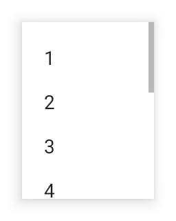

---
---
# Class "ScrollView"

<span style="white-space:nowrap;">[`Object`](https://developer.mozilla.org/en-US/docs/Web/JavaScript/Reference/Global_Objects/Object)</span> > <span style="white-space:nowrap;">[`NativeObject`](NativeObject.md)</span> > <span style="white-space:nowrap;">[`Widget`](Widget.md)</span> > <span style="white-space:nowrap;">[`Composite`](Composite.md)</span> > <span style="white-space:nowrap;">[`ScrollView`](ScrollView.md)</span>

A composite that allows its content to overflow either vertically (default) or horizontally. Since the ScrollView does not compute its own size, the width and height must be defined by the respective layout properties (e.g. either `width` or `left` and `right` must be specified).


<div class="tabris-image"><figure><div></div><figcaption>Android</figcaption></figure><figure><div></div><figcaption>iOS</figcaption></figure></div>

Constructor | *public*
Singleton | *No*
Namespace |`tabris`
Direct subclasses | *None*
JSX support | Element: `<ScrollView/>`<br/>Parent element: [`<Composite/>`](Composite.md) *and any widget extending* <span style="white-space:nowrap;">[`Composite`](Composite.md)</span><br/>Child elements: *Widgets*<br/>Text content: *Not supported*<br/>

## Example
```js
import {ScrollView, TextView, contentView} from 'tabris';

const scrollView = new ScrollView({layoutData: 'stretch'})
  .appendTo(contentView);

new Textview({text: 'Scrollable content'}
  .appendTo(scrollView));
```

See also:

- [Demo JavaScript/JSX Snippet: Creating a simple `ScrollView`](https://playground.tabris.com/?gitref=v3.0.0&snippet=scrollview.jsx)
- [Demo JavaScript/JSX Snippet: How to implement parallax scrolling with a `ScrollView`](https://playground.tabris.com/?gitref=v3.0.0&snippet=scrollview-parallax.jsx)

## Constructor

### new ScrollView(properties?)

Parameter|Type|Optional|Description
-|-|-|-
properties | <span style="white-space:nowrap;">`Properties<ScrollView>`</span> | Yes | Sets all key-value pairs in the properties object as widget properties.

## Methods

### scrollToX(offset, options?)


Scrolls to the given horizontal offset. Give `{animate: false}` as the second parameter to suppress the animation.


Parameter|Type|Optional|Description
-|-|-|-
offset | <span style="white-space:nowrap;">[`number`](https://developer.mozilla.org/en-US/docs/Web/JavaScript/Data_structures#Number_type)</span> | No | The offset to scroll to in dip.
options | <span style="white-space:nowrap;">`{animate?: boolean}`</span> | Yes | An additional object to control the animation. Set to `{animate: false}` to scroll without an animation.


Returns <span style="white-space:nowrap;">[`this`](#)</span>

### scrollToY(offset, options?)


Scrolls to the given vertical offset. Give `{animate: false}` as the second parameter to suppress the animation.


Parameter|Type|Optional|Description
-|-|-|-
offset | <span style="white-space:nowrap;">[`number`](https://developer.mozilla.org/en-US/docs/Web/JavaScript/Data_structures#Number_type)</span> | No | The offset to scroll to in dip.
options | <span style="white-space:nowrap;">`{animate?: boolean}`</span> | Yes | An additional object to control the animation. Set to `{animate: false}` to scroll without an animation.


Returns <span style="white-space:nowrap;">[`this`](#)</span>


## Properties

### direction


Specifies the scrolling direction of the scroll composite.

Type | `'vertical'` \| `'horizontal'`
Default | `'vertical'`
Settable | *On creation*
Change events | *No*


This property can only be set via constructor or JSX. Once set, it cannot change anymore.

### offsetX


The horizontal scrolling position in dip.

Type | <span style="white-space:nowrap;">[`number`](https://developer.mozilla.org/en-US/docs/Web/JavaScript/Data_structures#Number_type)</span>
Settable | *No*
Change events | *Yes*


### offsetY


The vertical scrolling position in dip.

Type | <span style="white-space:nowrap;">[`number`](https://developer.mozilla.org/en-US/docs/Web/JavaScript/Data_structures#Number_type)</span>
Settable | *No*
Change events | *Yes*


### scrollXState


The scroll state of the `ScrollView` in horizontal direction. The following states are supported:

* `rest` - no scrolling
* `drag` the user moves the `ScrollView` content with his finger
* `scroll` the user has flinged the content with his finger or the `ScrollView` is scrolling programmatically

Type | `'rest'` \| `'drag'` \| `'scroll'`
Default | `'rest'`
Settable | *No*
Change events | *Yes*


### scrollYState


The scroll state of the `ScrollView` in vertical direction. The following states are supported:

* `rest` - no scrolling
* `drag` the user moves the `ScrollView` content with his finger
* `scroll` the user has flinged the `ScrollView` content with his finger or the `ScrollView` is scrolling programmatically

Type | `'rest'` \| `'drag'` \| `'scroll'`
Default | `'rest'`
Settable | *No*
Change events | *Yes*


### scrollbarVisible


Allows to show or hide scroll bar for current direction.

Type | <span style="white-space:nowrap;">[`boolean`](https://developer.mozilla.org/en-US/docs/Web/JavaScript/Data_structures#Boolean_type)</span>
Default | `true`
Settable | *Yes*
Change events | *Yes*


## Events

### scrollX

Fired while scrolling horizontally.

Parameter|Type|Description
-|-|-
offset | <span style="white-space:nowrap;">[`number`](https://developer.mozilla.org/en-US/docs/Web/JavaScript/Data_structures#Number_type)</span> | Indicates the current horizontal scrolling position.

### scrollY

Fired while scrolling vertically.

Parameter|Type|Description
-|-|-
offset | <span style="white-space:nowrap;">[`number`](https://developer.mozilla.org/en-US/docs/Web/JavaScript/Data_structures#Number_type)</span> | Indicates the current vertical scrolling position.

## Change Events

### offsetXChanged

Fired when the [*offsetX*](#offsetx) property has changed.

Parameter|Type|Description
-|-|-
value | <span style="white-space:nowrap;">[`number`](https://developer.mozilla.org/en-US/docs/Web/JavaScript/Data_structures#Number_type)</span> | The new value of [*offsetX*](#offsetx).

### offsetYChanged

Fired when the [*offsetY*](#offsety) property has changed.

Parameter|Type|Description
-|-|-
value | <span style="white-space:nowrap;">[`number`](https://developer.mozilla.org/en-US/docs/Web/JavaScript/Data_structures#Number_type)</span> | The new value of [*offsetY*](#offsety).

### scrollbarVisibleChanged

Fired when the [*scrollbarVisible*](#scrollbarvisible) property has changed.

Parameter|Type|Description
-|-|-
value | <span style="white-space:nowrap;">[`boolean`](https://developer.mozilla.org/en-US/docs/Web/JavaScript/Data_structures#Boolean_type)</span> | The new value of [*scrollbarVisible*](#scrollbarvisible).

### scrollXStateChanged

Fired when the [*scrollXState*](#scrollxstate) property has changed.

Parameter|Type|Description
-|-|-
value | <span style="white-space:nowrap;">[`string`](https://developer.mozilla.org/en-US/docs/Web/JavaScript/Data_structures#String_type)</span> | The new value of [*scrollXState*](#scrollxstate).

### scrollYStateChanged

Fired when the [*scrollYState*](#scrollystate) property has changed.

Parameter|Type|Description
-|-|-
value | <span style="white-space:nowrap;">[`string`](https://developer.mozilla.org/en-US/docs/Web/JavaScript/Data_structures#String_type)</span> | The new value of [*scrollYState*](#scrollystate).

