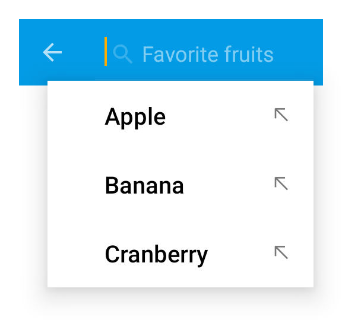

---
---
# Class "SearchAction"

<span style="white-space:nowrap;">[`Object`](https://developer.mozilla.org/en-US/docs/Web/JavaScript/Reference/Global_Objects/Object)</span> > <span style="white-space:nowrap;">[`NativeObject`](NativeObject.md)</span> > <span style="white-space:nowrap;">[`Widget`](Widget.md)</span> > <span style="white-space:nowrap;">[`Action`](Action.md)</span> > <span style="white-space:nowrap;">[`SearchAction`](SearchAction.md)</span>

An action that displays a search text field with dynamic proposals when selected. Add a listener on *select* to implement the action. On *input*, you may set a list of *proposals*.


<div class="tabris-image"><figure><div></div><figcaption>Android</figcaption></figure><figure><div></div><figcaption>iOS</figcaption></figure></div>

Constructor | *public*
Singleton | *No*
Namespace |`tabris`
Direct subclasses | *None*
JSX support | Element: `<SearchAction/>`<br/>Parent element: [`<Composite/>`](Composite.md) *and any widget extending* <span style="white-space:nowrap;">[`Composite`](Composite.md)</span><br/>Child elements: *None*<br/>Text content: *Not supported*<br/>

## Example
```js
import {SearchAction, NavigationView, contentView} from 'tabris';

const items = ['apple', 'banana', 'cherry'];

const navigationView = new NavigationView({layoutData: 'stretch'})
  .appendTo(contentView);

new SearchAction({title: 'Search', image: 'resources/search.png'})
  .onInput(event => items.filter(proposal => proposal.indexOf(event.query) !== -1))
  .onAccept(event => console.log(`Showing content for ${event.text}`))
  .appendTo(navigationView);
```

See also:
  
[<span class='language jsx'>JSX</span> Creating a `SearchAction`](https://playground.tabris.com/?gitref=v3.0.0&snippet=navigationview-searchaction.jsx)

## Constructor

### new SearchAction(properties?)

Parameter|Type|Optional|Description
-|-|-|-
properties | <span style="white-space:nowrap;">`Properties<SearchAction>`</span> | Yes | Sets all key-value pairs in the properties object as widget properties.

## Methods

### open()


Invokes the search action, i.e. displays the UI to perform a search.

Returns <span style="white-space:nowrap;">[`void`](https://www.typescriptlang.org/docs/handbook/basic-types.html#void)</span>


## Properties

### message


A hint text that is displayed when the search input is empty.

Type | <span style="white-space:nowrap;">[`string`](https://developer.mozilla.org/en-US/docs/Web/JavaScript/Data_structures#String_type)</span>
Settable | *Yes*
Change events | *Yes*


### proposals


The list of proposals to display.

Type | <span style="white-space:nowrap;">[`string[]`](https://developer.mozilla.org/en-US/docs/Web/JavaScript/Data_structures#String_type)</span>
Default | `[]`
Settable | *Yes*
Change events | *Yes*


### text


The text in the search input field.

Type | <span style="white-space:nowrap;">[`string`](https://developer.mozilla.org/en-US/docs/Web/JavaScript/Data_structures#String_type)</span>
Settable | *Yes*
Change events | *Yes*


## Events

### input

Fired when the user inputs text.

Parameter|Type|Description
-|-|-
text | <span style="white-space:nowrap;">[`string`](https://developer.mozilla.org/en-US/docs/Web/JavaScript/Data_structures#String_type)</span> | The new value of *[text](#text)*.

### accept

Fired when a text input has been submitted by pressing the keyboard's search key.

Parameter|Type|Description
-|-|-
text | <span style="white-space:nowrap;">[`string`](https://developer.mozilla.org/en-US/docs/Web/JavaScript/Data_structures#String_type)</span> | The current value of *[text](#text)*.

## Change Events

### proposalsChanged

Fired when the [*proposals*](#proposals) property has changed.

Parameter|Type|Description
-|-|-
value | <span style="white-space:nowrap;">[`string[]`](https://developer.mozilla.org/en-US/docs/Web/JavaScript/Data_structures#String_type)</span> | The new value of [*proposals*](#proposals).

### textChanged

Fired when the [*text*](#text) property has changed.

Parameter|Type|Description
-|-|-
value | <span style="white-space:nowrap;">[`string`](https://developer.mozilla.org/en-US/docs/Web/JavaScript/Data_structures#String_type)</span> | The new value of [*text*](#text).

### messageChanged

Fired when the [*message*](#message) property has changed.

Parameter|Type|Description
-|-|-
value | <span style="white-space:nowrap;">[`string`](https://developer.mozilla.org/en-US/docs/Web/JavaScript/Data_structures#String_type)</span> | The new value of [*message*](#message).

