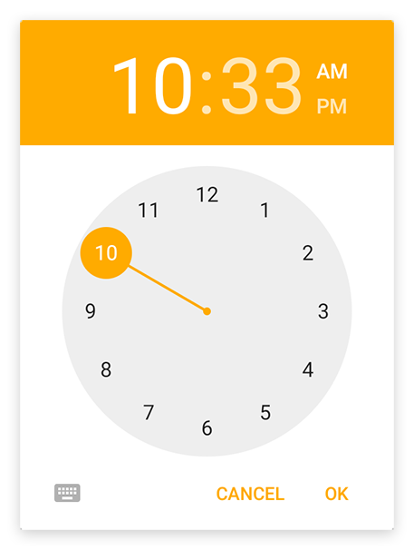
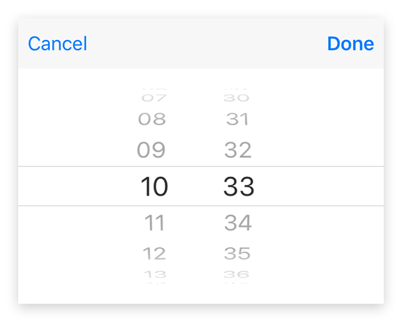

---
---
# Class "TimeDialog"

<span style="white-space:nowrap;">[`Object`](https://developer.mozilla.org/en-US/docs/Web/JavaScript/Reference/Global_Objects/Object)</span> > <span style="white-space:nowrap;">[`NativeObject`](NativeObject.md)</span> > <span style="white-space:nowrap;">[`Popup`](Popup.md)</span> > <span style="white-space:nowrap;">[`TimeDialog`](TimeDialog.md)</span>

A `TimeDialog` represents a native dialog pop-up allowing the user to pick a time of day. Properties can only be set before open() is called. The dialog is automatically disposed when closed.


<div class="tabris-image"><figure><div></div><figcaption>Android</figcaption></figure><figure><div></div><figcaption>iOS</figcaption></figure></div>

Constructor | *public*
Singleton | *No*
Namespace |`tabris`
Direct subclasses | *None*
JSX support | Element: `<TimeDialog/>`<br/>Child elements: *None*<br/>Text content: *Not supported*<br/>

## Example
```js
import {TimeDialog} from 'tabris';

new TimeDialog()
  .onSelect(({date}) => console.log(`Selected ${date}`))
  .open();
```

See also:

- [Demo TypeScript/JSX Snippet: Creating a simple `TimeDialog`](https://playground.tabris.com/?gitref=v3.0.0&snippet=timedialog.tsx)

## Constructor

### new TimeDialog(properties?)

Parameter|Type|Optional|Description
-|-|-|-
properties | <span style="white-space:nowrap;">`Properties<TimeDialog>`</span> | Yes | Sets all key-value pairs in the properties object as widget properties.

## Static Methods

### open(timeDialog)


Makes the given time dialog visible. Meant to be used with inline-JSX. In TypeScript it also casts the given JSX element from `any` to an actual TimeDialog.


Parameter|Type|Optional|Description
-|-|-|-
timeDialog | <span style="white-space:nowrap;">[`TimeDialog`](TimeDialog.md)</span> | No | The time dialog to open


Returns <span style="white-space:nowrap;">[`TimeDialog`](TimeDialog.md)</span>

### open(date?)


Creates and opens a time dialog.


Parameter|Type|Optional|Description
-|-|-|-
date | <span style="white-space:nowrap;">`Date`</span> | Yes | The time to be displayed in the dialog. The current time is used when no date object is provided.


Returns <span style="white-space:nowrap;">[`TimeDialog`](TimeDialog.md)</span>


## Properties

### date


The time to be displayed in the dialog. The current time is used when no date object is provided.

Type | <span style="white-space:nowrap;">`Date`</span>
Settable | *Yes*
Change events | *Yes*


## Events

### close

Fired when the time dialog was closed.

Parameter|Type|Description
-|-|-
date | <span style="white-space:nowrap;">`Date` \| [`null`](https://developer.mozilla.org/en-US/docs/Web/JavaScript/Data_structures#Null_type)</span> | The selected time. Can be `null` when no date was selected.

### select

Fired when a time was selected by the user.

Parameter|Type|Description
-|-|-
date | <span style="white-space:nowrap;">`Date`</span> | The selected time. Only the time components reflect the users selection. The date component values are undefined.

## Change Events

### dateChanged

Fired when the [*date*](#date) property has changed.

Parameter|Type|Description
-|-|-
value | <span style="white-space:nowrap;">`Date`</span> | The new value of [*date*](#date).

