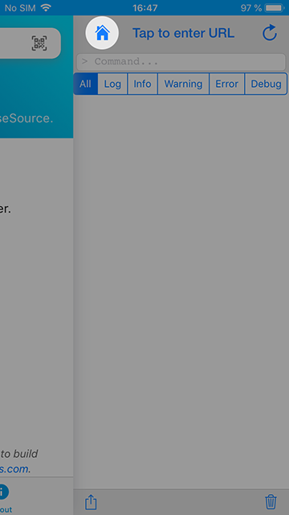

---
---
# The Tabris.js Developer App

The *Tabris.js* Developer App is the easiest way to see some Tabris.js examples and to start developing mobile apps without having to perform an app build.
It is available for free in the app stores – just follow the links below or search for "Tabris.js" in the store on your mobile device. (The app "Tabris.js 2" is for legacy Tabris.js 2.x projects only, "Tabris.js" is always the current version.)

## Try the Examples

The Tabris.js examples are a collection of small apps that demonstrate the power and flexibility of the framework.
You can find the source code in the Tabris.js [GitHub repository](https://github.com/eclipsesource/tabris-js/tree/master/examples).

Just tap an example and it will run within the Developer App.
To get back to the examples selection, use the *Home* symbol in the [Developer Console](#the-developer-console).
On Android, you can also press the system's back button to go back.

## The Developer Console

While running Tabris.js scripts in the Developer App, you can open a developer console by sliding from the right edge of the screen to the left.
On iPads you may have to start sliding from the edge itself with two fingers. You can also use a four-finger double tap instead.

In the developer console you'll see messages and errors logged by the running script.
You can also enter JavaScript expressions that will be evaluated in the context of your script, for example `tabris.device.platform`.

In the header, you'll find a *Reload* action that loads and starts the running script from scratch.
The *Home* action lets you go back to the Developer App.
You'll also find actions to filter the log and to share it (e.g. by email).
Finally, you can enter a different script URL directly in the header.

## Play with the Playground

To get started with Tabris.js development easily, try out the [Playground](https://tabrisjs.com/playground), our online code editor.
Here you'll find a collection of example scripts that you can modify and try on your mobile device immediately. Almost every Tabris.js feature is demonstrated by one of these.

To load the playground script in your Developer App, go to the "URL" tab on the home screen and scan the QR code on the playground page. When you edit the code in the playground you only need to reload via the developer console or scan the QR code again.

You can also add your own scripts to the list by pressing "save". Note that these are stored only on your machine and will be lost if you clear your browser user data. The snippets [are also available in the tabris git repository](https://github.com/eclipsesource/tabris-js/tree/master/snippets).

## Code Sideloading

Just like the playground scripts, you can also load an entire app that you're developing on your machine.
For this to work, your mobile device must be connected to the same network as your development machine.

After [setting up your Tabris.js project](getting-started.md), you can use the [Tabris CLI](https://www.npmjs.com/package/tabris-cli) to serve your app.
In your project directory, call:

    tabris serve

The CLI will start an HTTP server and print an URL and QR code. In the Developer App, go to the "URL" tab on the home screen and either scan the QR or enter the URL and tap "Connect". Keep the CLI running as long as you are testing the application.

> :point_right: You may notice a some delay while the Developer App downloads the sources to the mobile device. Once you've [built](#publishing-your-app) the app, this delay will be gone, because the sources are then bundled with the app.
