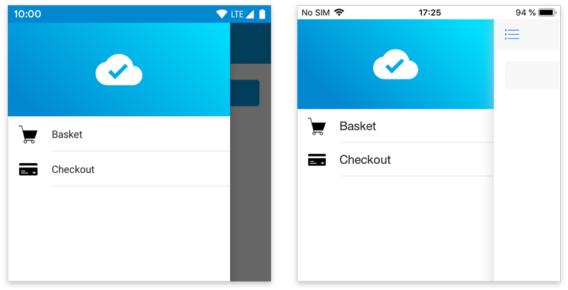
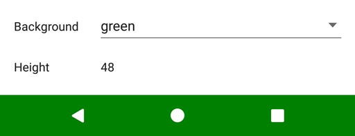

---
---
# UI Architecture

The UI of a Tabris.js app consists of platform-native elements that can be controlled by a cross-platform JavaScript API. Within the framework these elements are implemented in native code and provide a user experience that feels familiar on each OS.

## Type Hierarchy

In Tabris.js all objects that represent visual elements inherit from the [`NativeObject`](./api/NativeObject.md) class which provides very basic event and property handling functionality.

Important subclasses include:

```
tabris.NativeObject
 |- tabris.Tabris
 |- tabris.Widget
 |  |- tabris.Button
 |  |- tabris.Composite
 |  |  |- tabris.ContentView
 |  |     |- tabris.Drawer
 |  | - ... etc ...
 |- tabris.Popup
 |  |- tabris.AlertDialog
 |  |- tabris.Popover
 |  |- ... etc ...
 |- tabris.StatusBar
 |- tabris.NavigationBar
 | ... etc ...
```

These classes may be accessed directly via the global `tabris` object...

```js
 new tabris.AlertDialog();
```
...or explicitly imported:
 ```js
import {AlertDialog} from 'tabris';
new AlertDialog();
```
Or, [depending on your setup](./modules.md):
```js
const {AlertDialog} = require('tabris');
new AlertDialog();
```

## Object Hierarchy

The top-level parent for the application UI is represented by the global object `tabris`, which then holds various singleton instances representing different aspects of the UI:

```
tabris
|- tabris.contentView
|- tabris.drawer
|- tabris.statusBar
|- tabris.navigationBar
```

Like with classes these instances may be accessed directly via the global `tabris` object...

```js
tabris.contentView.append(widget);
```
...or explicitly imported:
```js
import {contentView} from 'tabris';
contentView.append(widget);
```
Or, [depending on your setup](./modules.md):
```js
const {contentView} = require('tabris');
contentView.append(widget);
```

# Widgets

Widgets can (with some exceptions) be freely [created](./widget-basics.md#hello-world), [arranged](./layout.md) and [composed](./widget-basics.md#composition) to form the main UI of your application. Every widget has needs parent to be visible (with the exception of `ContentView`, see below), but only widgets of the type `tabris.Composite` (or any of its subclasses) can have children. All widget types are (direct or indirect) subclasses of `tabris.Widget` and can be created by calling their constructor (if public), or using [JSX](./JSX.md) elements.

See also ["Widget Basics"](./widget-basics.md).

### ContentView

`tabris.ContentView` is a subclass of `tabris.Composite` and the only widget that is visible without a parent. It can not be instantiated or disposed directly. Instead, any instance is bound to another `tabris.NativeObject` instance:

ContentView instance | Description
---------------------|------------
`tabris.contentView` | Represents the main UI. Created by the framework on application start and bound to the global `tabris` object. Can never be disposed.
`tabris.drawer` | Represents the drawer (see below). Created by the framework on application start and bound to the global `tabris` object. Can never be disposed.
[`popover.contentView`](./api/Popover.md#contentview) | Created with and bound to [`Popover`](./api/Popover.md) instances. Disposed when the popover closes.
[`alertDialog.textInputs`](./api/AlertDialog.md#textinputs) | Created with and bound to [`AlertDialog`](./api/AlertDialog.md) instances. Disposed when the dialog closes. Only accepts instances of [`TextInput`](./api/TextInput.md) as children.

Newly created widgets can be added directly to a `ContentView` instance to make them visible immediately:

JSX:
```jsx
tabris.contentView.append(
  <SomeWidget />
);
```

JS:
```js
tabris.contentView.append(
  new SomeWidget()
);
```


### Drawer

`tabris.drawer` is a singleton instance of `tabris.Drawer`, extending `tabris.ContentView`. It's a widget container that can be slid in from the left edge of the screen, typically used for top-level navigation.

In Tabris.js, this drawer is disabled by default. To use it in an application, you have to enable it:

```js
tabris.drawer.enabled = true;
```



The drawer can be opened by a swipe from the left edge of the screen or by tapping the action on the left side of a `NavigationView` ( "hamburger button" or "[drawer action](./api/NavigationView.md#draweractionvisible)"). To open and close the drawer programmatically, you can use its `open()` and `close()` methods, respectively.

Just like `tabris.contentView` a drawer may contain any kind of widgets:

```jsx
tabris.drawer.append(
  <SomeWidget />
);
```

## Popups

Popups are floating on top of your main UI and are specialized for specific use cases. All popup types are direct subclasses of [`tabris.Popup`](./api/popup.md) and can be created by calling their constructor (if public), or using [JSX](./JSX.md) elements.

Unlike widgets they do not need a parent to be visible. Instead they are made visible by calling `open()` on the [instance](./api/popup.md#open) or the static open method provided directly on the class, e.g. `AlertDialog.open(...)`. The latter is meant to be used with inline-JSX, e.g.:

```jsx
const dialog = AlertDialog.open(
  <AlertDialog>
    Hello World!
  </AlertDialog>
);
```

Two popup types can also host widgets: [`Popover`](./api/Popover.md) via `popover.contentView` and [`AlertDialog`](./api/AlertDialog.md) via `alertDialog.texts`, though the latter only accepts `TextInput` widgets.

## StatusBar

`tabris.statusBar` is a singleton instance of `tabris.StatusBar`, extending `tabris.NativeObject`. It represents the small area - usually on the top of the screen - that displays notifications, status icons and time. The object can be used to control different aspects of the element's look and feel, such as background color and visibility.


## NavigationBar

`tabris.navigationBar` is a singleton instance of `tabris.NavigationBar`, extending `tabris.NativeObject`. It represents the area that contains the *Back*, *Home*, etc. buttons on Android. The object can be used to control that element's background color and visibility.


