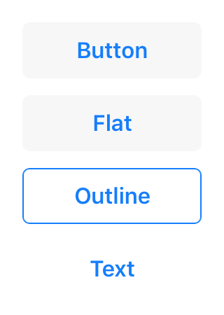

---
---
# Class "Button"

<span style="white-space:nowrap;">[`Object`](https://developer.mozilla.org/en-US/docs/Web/JavaScript/Reference/Global_Objects/Object)</span> > <span style="white-space:nowrap;">[`NativeObject`](NativeObject.md)</span> > <span style="white-space:nowrap;">[`Widget`](Widget.md)</span> > <span style="white-space:nowrap;">[`Button`](Button.md)</span>

A push button. Can contain a text or an image.


<div class="tabris-image"><figure><div></div><figcaption>Android</figcaption></figure><figure><div></div><figcaption>iOS</figcaption></figure></div>

Constructor | *public*
Singleton | *No*
Namespace |`tabris`
Direct subclasses | *None*
JSX support | Element: `<Button/>`<br/>Parent element: [`<Composite/>`](Composite.md) *and any widget extending* <span style="white-space:nowrap;">[`Composite`](Composite.md)</span><br/>Child elements: *None*<br/>Text content: *Sets [text](#text) property*<br/>

## Example
```js
import {Button, contentView} from 'tabris';

new Button({text: 'Save'})
  .onSelect(() => console.log('Button tapped'))
  .appendTo(contentView);
```

See also:
  
[<span class='language jsx'>JSX</span> Create a simple `Button`](https://playground.tabris.com/?gitref=v3.1.0&snippet=button.jsx)  
[<span class='language jsx'>JSX</span> Create buttons with different styles](https://playground.tabris.com/?gitref=v3.1.0&snippet=button-style.jsx)

## Constructor

### new Button(properties?)

Parameter|Type|Optional|Description
-|-|-|-
properties | <span style="white-space:nowrap;">`Properties<Button>`</span> | Yes | Sets all key-value pairs in the properties object as widget properties.

## Properties

### alignment


The horizontal alignment of the button text.

Type | `'left'` \| `'right'` \| `'centerX'`
Default | `'centerX'`
Settable | *Yes*
Change events | *Yes*


### font


The font used for the button text.

Type | <span style="white-space:nowrap;">[`FontValue`](../types.md#fontvalue)</span>
Settable | *Yes*
Change events | *Yes*


### image


An image to be displayed on the button.

Type | <span style="white-space:nowrap;">[`ImageValue`](../types.md#imagevalue)</span>
Settable | *Yes*
Change events | *Yes*


### imageTintColor


A color to change the `image` appearance. All opaque parts of the image will be tinted with the given color. Set to `initial` to remove the effect.

Type | <span style="white-space:nowrap;">[`ColorValue`](../types.md#colorvalue)</span>
Settable | *Yes*
Change events | *Yes*


### strokeColor


Controls the line width of a button with the `style` _outline_.

Type | <span style="white-space:nowrap;">[`ColorValue`](../types.md#colorvalue)</span>
Settable | *Yes*
Change events | *Yes*


### strokeWidth


Controls the line color of a button with the `style` _outline_.

Type | <span style="white-space:nowrap;">[`number`](https://developer.mozilla.org/en-US/docs/Web/JavaScript/Data_structures#Number_type)</span>
Settable | *Yes*
Change events | *Yes*


### style


The `style` controls the appearance of a `Button` and has to be provided in its constructor. The `default` style creates a platform specific button, which is flat on iOS and has an elevation and shadow on Android. In addition the following specific style values can be used:

- `elevate` A button with a platform specific background color, elevation and a surrounding drop shadow. Only supported on Android
- `flat` A button with no elevation and a platform specific background color
- `outline` A button with a transparent background and an outline stroke which can be controlled via the properties `strokeWidth` and `strokeColor`
- `text` A button with no background and only consisting of its text label.

Type | `'default'` \| `'elevate'` \| `'flat'` \| `'outline'` \| `'text'`
Default | `'default'`
Settable | *On creation*
Change events | *No*


This property can only be set via constructor or JSX. Once set, it cannot change anymore.

See also:
  
[<span class='language jsx'>JSX</span> button-style.jsx](https://playground.tabris.com/?gitref=v3.1.0&snippet=button-style.jsx)


### text


The button's label text.

Type | <span style="white-space:nowrap;">[`string`](https://developer.mozilla.org/en-US/docs/Web/JavaScript/Data_structures#String_type)</span>
Settable | *Yes*
Change events | *Yes*
JSX content type | `string`


When using Button as an JSX element the element content is mapped to this property. Therefore
```jsx
<Button>Hello World</Button>
```
 has the same effect as:
```jsx
<Button text='Hello World' />
```


### textColor


The color of the text.

Type | <span style="white-space:nowrap;">[`ColorValue`](../types.md#colorvalue)</span>
Settable | *Yes*
Change events | *Yes*


## Events

### select

Fired when the button is pressed.

## Change Events

### strokeColorChanged

Fired when the [*strokeColor*](#strokecolor) property has changed.

Parameter|Type|Description
-|-|-
value | <span style="white-space:nowrap;">[`ColorValue`](../types.md#colorvalue)</span> | The new value of [*strokeColor*](#strokecolor).

### strokeWidthChanged

Fired when the [*strokeWidth*](#strokewidth) property has changed.

Parameter|Type|Description
-|-|-
value | <span style="white-space:nowrap;">[`number`](https://developer.mozilla.org/en-US/docs/Web/JavaScript/Data_structures#Number_type)</span> | The new value of [*strokeWidth*](#strokewidth).

### alignmentChanged

Fired when the [*alignment*](#alignment) property has changed.

Parameter|Type|Description
-|-|-
value | <span style="white-space:nowrap;">[`string`](https://developer.mozilla.org/en-US/docs/Web/JavaScript/Data_structures#String_type)</span> | The new value of [*alignment*](#alignment).

### fontChanged

Fired when the [*font*](#font) property has changed.

Parameter|Type|Description
-|-|-
value | <span style="white-space:nowrap;">[`FontValue`](../types.md#fontvalue)</span> | The new value of [*font*](#font).

### imageChanged

Fired when the [*image*](#image) property has changed.

Parameter|Type|Description
-|-|-
value | <span style="white-space:nowrap;">[`ImageValue`](../types.md#imagevalue)</span> | The new value of [*image*](#image).

### imageTintColorChanged

Fired when the [*imageTintColor*](#imagetintcolor) property has changed.

Parameter|Type|Description
-|-|-
value | <span style="white-space:nowrap;">[`ColorValue`](../types.md#colorvalue)</span> | The new value of [*imageTintColor*](#imagetintcolor).

### textChanged

Fired when the [*text*](#text) property has changed.

Parameter|Type|Description
-|-|-
value | <span style="white-space:nowrap;">[`string`](https://developer.mozilla.org/en-US/docs/Web/JavaScript/Data_structures#String_type)</span> | The new value of [*text*](#text).

### textColorChanged

Fired when the [*textColor*](#textcolor) property has changed.

Parameter|Type|Description
-|-|-
value | <span style="white-space:nowrap;">[`ColorValue`](../types.md#colorvalue)</span> | The new value of [*textColor*](#textcolor).

