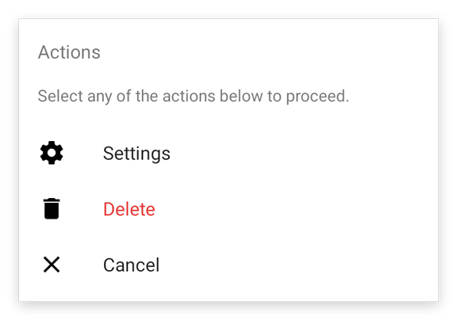
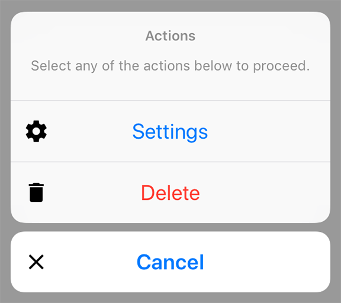

---
---
# Class "ActionSheet"

<a href="https://developer.mozilla.org/en-US/docs/Web/JavaScript/Reference/Global_Objects/Object" title="View &quot;Object&quot; on MDN">Object</a> > <a href="NativeObject.html" title="NativeObject Class Reference">NativeObject</a> > <a href="Popup.html" title="Popup Class Reference">Popup</a> > <a href="#" >ActionSheet</a>

A pop up dialog that offers a selection. Is automatically disposed when closed.


<div class="tabris-image"><figure><div></div><figcaption>Android</figcaption></figure><figure><div></div><figcaption>iOS</figcaption></figure></div>

Type: | <code style="white-space: nowrap">ActionSheet extends <a href="Popup.html" title="Popup Class Reference">Popup</a></code>
Constructor: | public
Singleton: | No
Namespace: |<a href="../modules.html#startup" >tabris</a>
Direct subclasses: | None
JSX Support: | Element: <code style="white-space: nowrap"><a href="#" >&lt;ActionSheet/&gt;</a></code><br/>Parent Elements: *Not supported*<br/>Child Elements: <code style="white-space: nowrap"><a href="ActionSheetItem.html" title="ActionSheetItem Class Reference">&lt;ActionSheetItem/&gt;</a></code><br/>Element content sets: [<code style="white-space: nowrap">message</code>](#message), [<code style="white-space: nowrap">actions</code>](#actions)

## Examples
### JavaScript


```js
import {ActionSheet} from 'tabris';

new ActionSheet({
  title: 'ActionSheet',
  actions: [{title: 'Save'}, {title: 'Delete', style: 'destructive'}]
}).onSelect(({index}) => console.log(`Selected ${index}`))
  .open();
```


See also:
  
[<span class='language jsx'>JSX</span> Creating a simple `ActionSheet`](https://github.com/eclipsesource/tabris-js/tree/v3.10.0/snippets/actionsheet.jsx) <span style="font-size: 75%;">[<a href="https://playground.tabris.com/?gitref=v3.10.0&snippet=actionsheet.jsx" style="color: cadetblue;">► Run in Playground</a>]</span>

## Constructor

### new ActionSheet(properties?)

Parameter|Type|Description
-|-|-
properties | <code style="white-space: nowrap"><a href="Widget.html#propertieswidget" title="Widget Class Type">Properties</a>&lt;<a href="#" >ActionSheet</a>&gt;</code> | Sets all key-value pairs in the properties object as widget properties. *Optional.*

## Static Methods

### open(actionSheet)


Makes the given action sheet visible. Meant to be used with inline-JSX. In TypeScript it also casts the given JSX element from `any` to an actual ActionSheet.


Parameter|Type|Description
-|-|-
actionSheet | <code style="white-space: nowrap"><a href="#" >ActionSheet</a></code> | The action sheet to open


Returns: <code style="white-space: nowrap"><a href="#" >ActionSheet</a></code>


## Properties

### actions


An array of objects describing the actions to be displayed. The entries may be instances of `ActionSheetItem` *or plain objects* with some or all of the same properties.

Type: |<code style="white-space: nowrap"><a href="ActionSheetItem.html" title="ActionSheetItem Class Reference">ActionSheetItem</a>[]</code>
Settable: | <a href="../widget-basics.html#widget-properties" >Yes</a>
Change Event: | [`actionsChanged`](#actionschanged)
JSX Content Type: | <code style="white-space: nowrap"><a href="ActionSheetItem.html" title="ActionSheetItem Class Reference">&lt;ActionSheetItem/&gt;</a></code>


When using ActionSheet as an JSX element <code style="white-space: nowrap"><a href="ActionSheetItem.html" title="ActionSheetItem Class Reference">&lt;ActionSheetItem/&gt;</a></code> child elements are mapped to this property.

### message


A descriptive message for the available actions.

Type: |<code style="white-space: nowrap"><a href="https://developer.mozilla.org/en-US/docs/Web/JavaScript/Data_structures#string_type" title="View &quot;string&quot; on MDN">string</a></code>
Settable: | <a href="../widget-basics.html#widget-properties" >Yes</a>
Change Event: | [`messageChanged`](#messagechanged)
JSX Content Type: | [Text](../declarative-ui.md#jsx-specifics)


When using ActionSheet as an JSX element the elements Text content is mapped to this property.

### title


The title of the action sheet.

Type: |<code style="white-space: nowrap"><a href="https://developer.mozilla.org/en-US/docs/Web/JavaScript/Data_structures#string_type" title="View &quot;string&quot; on MDN">string</a></code>
Settable: | <a href="../widget-basics.html#widget-properties" >Yes</a>
Change Event: | [`titleChanged`](#titlechanged)


## Events

### close

Fired when the action sheet was closed.

EventObject Type: <code style="white-space: nowrap">ActionSheetCloseEvent&lt;<a href="#" >ActionSheet</a>&gt;</code>

Property|Type|Description
-|-|-
action | <code style="white-space: nowrap"><a href="ActionSheetItem.html" title="ActionSheetItem Class Reference">ActionSheetItem</a> &#124; <a href="https://developer.mozilla.org/en-US/docs/Web/JavaScript/Data_structures#null_type" title="View &quot;null&quot; on MDN">null</a></code> | A copy of the selected action as an instance of ActionSheetItem. If no action was selected the value is `null`.
index | <code style="white-space: nowrap"><a href="https://developer.mozilla.org/en-US/docs/Web/JavaScript/Data_structures#number_type" title="View &quot;number&quot; on MDN">number</a> &#124; <a href="https://developer.mozilla.org/en-US/docs/Web/JavaScript/Data_structures#null_type" title="View &quot;null&quot; on MDN">null</a></code> | The index of the selected action. If no action was selected the value is `null`.

### select

Fired when an action was selected. Note: on iOS, tapping outside of an ActionSheet will also fire a `select` event. Its parameter will be an index of a button with type `cancel`. This happens despite the fact that no button has been pressed.

EventObject Type: <code style="white-space: nowrap">ActionSheetSelectEvent&lt;<a href="#" >ActionSheet</a>&gt;</code>

Property|Type|Description
-|-|-
action | <code style="white-space: nowrap"><a href="ActionSheetItem.html" title="ActionSheetItem Class Reference">ActionSheetItem</a></code> | A copy of the selected action as an instance of ActionSheetItem.
index | <code style="white-space: nowrap"><a href="https://developer.mozilla.org/en-US/docs/Web/JavaScript/Data_structures#number_type" title="View &quot;number&quot; on MDN">number</a></code> | The index of the selected action.

## Change Events

### titleChanged

Fired when the [title](#title) property has changed.

EventObject Type: <code style="white-space: nowrap"><a href="ChangeListeners.html#propertychangedeventtargettype-valuetype" title="ChangeListeners Class Type">PropertyChangedEvent</a>&lt;<a href="#" >ActionSheet</a>, <a href="https://developer.mozilla.org/en-US/docs/Web/JavaScript/Data_structures#string_type" title="View &quot;string&quot; on MDN">string</a>&gt;</code>

Property|Type|Description
-|-|-
value | <code style="white-space: nowrap"><a href="https://developer.mozilla.org/en-US/docs/Web/JavaScript/Data_structures#string_type" title="View &quot;string&quot; on MDN">string</a></code> | The new value of [title](#title).

### messageChanged

Fired when the [message](#message) property has changed.

EventObject Type: <code style="white-space: nowrap"><a href="ChangeListeners.html#propertychangedeventtargettype-valuetype" title="ChangeListeners Class Type">PropertyChangedEvent</a>&lt;<a href="#" >ActionSheet</a>, <a href="https://developer.mozilla.org/en-US/docs/Web/JavaScript/Data_structures#string_type" title="View &quot;string&quot; on MDN">string</a>&gt;</code>

Property|Type|Description
-|-|-
value | <code style="white-space: nowrap"><a href="https://developer.mozilla.org/en-US/docs/Web/JavaScript/Data_structures#string_type" title="View &quot;string&quot; on MDN">string</a></code> | The new value of [message](#message).

### actionsChanged

Fired when the [actions](#actions) property has changed.

EventObject Type: <code style="white-space: nowrap"><a href="ChangeListeners.html#propertychangedeventtargettype-valuetype" title="ChangeListeners Class Type">PropertyChangedEvent</a>&lt;<a href="#" >ActionSheet</a>, <a href="https://developer.mozilla.org/en-US/docs/Web/JavaScript/Reference/Global_Objects/Array" title="View &quot;Array&quot; on MDN">Array</a>&gt;</code>

Property|Type|Description
-|-|-
value | <code style="white-space: nowrap"><a href="ActionSheetItem.html" title="ActionSheetItem Class Reference">ActionSheetItem</a>[]</code> | The new value of [actions](#actions).


