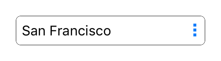

---
---
# Class "Picker"

<a href="https://developer.mozilla.org/en-US/docs/Web/JavaScript/Reference/Global_Objects/Object" title="View &quot;Object&quot; on MDN">Object</a> > <a href="NativeObject.html" title="NativeObject Class Reference">NativeObject</a> > <a href="Widget.html" title="Widget Class Reference">Widget</a> > <a href="#" >Picker</a>

A widget with a drop-down list of items to choose from.


<div class="tabris-image"><figure><div></div><figcaption>Android</figcaption></figure><figure><div></div><figcaption>iOS</figcaption></figure></div>

Type: | <code style="white-space: nowrap">Picker extends <a href="Widget.html" title="Widget Class Reference">Widget</a></code>
Constructor: | public
Singleton: | No
Namespace: |<a href="../modules.html#startup" >tabris</a>
Direct subclasses: | <code style="white-space: nowrap"><a href="ItemPicker.html" title="ItemPicker Class Reference">ItemPicker</a></code>
JSX Support: | Element: <code style="white-space: nowrap"><a href="#" >&lt;Picker/&gt;</a></code><br/>Parent Elements: <code style="white-space: nowrap"><a href="Canvas.html" title="Canvas Class Reference">&lt;Canvas/&gt;</a></code>, <code style="white-space: nowrap"><a href="Cell.html" title="Cell Class Reference">&lt;Cell/&gt;</a></code>, <code style="white-space: nowrap"><a href="Composite.html" title="Composite Class Reference">&lt;Composite/&gt;</a></code>, <code style="white-space: nowrap"><a href="Page.html" title="Page Class Reference">&lt;Page/&gt;</a></code>, <code style="white-space: nowrap"><a href="RefreshComposite.html" title="RefreshComposite Class Reference">&lt;RefreshComposite/&gt;</a></code>, <code style="white-space: nowrap"><a href="Row.html" title="Row Class Reference">&lt;Row/&gt;</a></code>, <code style="white-space: nowrap"><a href="ScrollView.html" title="ScrollView Class Reference">&lt;ScrollView/&gt;</a></code>, <code style="white-space: nowrap"><a href="Stack.html" title="Stack Class Reference">&lt;Stack/&gt;</a></code>, <code style="white-space: nowrap"><a href="Tab.html" title="Tab Class Reference">&lt;Tab/&gt;</a></code><br/>Child Elements: *Not Supported*<br/>

## Examples
### JavaScript


```js
import {contentView, Picker} from 'tabris';

const items = ['Apple', 'Banana', 'Cherry'];

new Picker({
  itemCount: items.length,
  itemText: index => items[index]
}).onSelect(event => console.log(`Selected ${items[event.index]}`))
  .appendTo(contentView);
```


See also:
  
[<span class='language jsx'>JSX</span> Creating a simple `Picker`](https://github.com/eclipsesource/tabris-js/tree/v3.10.0/snippets/picker.jsx) <span style="font-size: 75%;">[<a href="https://playground.tabris.com/?gitref=v3.10.0&snippet=picker.jsx" style="color: cadetblue;">► Run in Playground</a>]</span>  
[<span class='language jsx'>JSX</span> picker-style.jsx](https://github.com/eclipsesource/tabris-js/tree/v3.10.0/snippets/picker-style.jsx) <span style="font-size: 75%;">[<a href="https://playground.tabris.com/?gitref=v3.10.0&snippet=picker-style.jsx" style="color: cadetblue;">► Run in Playground</a>]</span>

## Constructor

### new Picker(properties?)

Parameter|Type|Description
-|-|-
properties | <code style="white-space: nowrap"><a href="Widget.html#propertieswidget" title="Widget Class Type">Properties</a>&lt;<a href="#" >Picker</a>&gt;</code> | Sets all key-value pairs in the properties object as widget properties. *Optional.*

## Properties

### borderColor


The color of the Picker border. This can be the surrounding line or the underline of the Picker depending on the `style` property.

Type: |<code style="white-space: nowrap"><a href="Color.html#colorvalue" title="Color Class Type">ColorValue</a></code>
Settable: | <a href="../widget-basics.html#widget-properties" >Yes</a>
Change Event: | [`borderColorChanged`](#bordercolorchanged)


### floatMessage
<p class="platforms"><span class='android-tag' title='supported on Android'>Android</span></p>

Whether the hint message should float above the Picker when focus is gained.

Type: |<code style="white-space: nowrap"><a href="https://developer.mozilla.org/en-US/docs/Web/JavaScript/Data_structures#boolean_type" title="View &quot;boolean&quot; on MDN">boolean</a></code>
Default: | <code style="white-space: nowrap"><a href="https://developer.mozilla.org/en-US/docs/Web/JavaScript/Data_structures#string_type" title="View &quot;string&quot; on MDN">true</a></code>
Settable: | <a href="../widget-basics.html#widget-properties" >Yes</a>
Change Event: | [`floatMessageChanged`](#floatmessagechanged)


### font


The font used for the text inside the Picker.

Type: |<code style="white-space: nowrap"><a href="Font.html#fontvalue" title="Font Class Type">FontValue</a></code>
Settable: | <a href="../widget-basics.html#widget-properties" >Yes</a>
Change Event: | [`fontChanged`](#fontchanged)


### itemCount


The number of items to display.

Type: |<code style="white-space: nowrap"><a href="https://developer.mozilla.org/en-US/docs/Web/JavaScript/Data_structures#number_type" title="View &quot;number&quot; on MDN">number</a></code>
Settable: | <a href="../widget-basics.html#widget-properties" >Yes</a>
Change Event: | [`itemCountChanged`](#itemcountchanged)


### itemText


A function that returns the string to display for a given index.

Type: |<code style="white-space: nowrap">(<a href="https://developer.mozilla.org/en-US/docs/Web/JavaScript/Data_structures#number_type" title="View &quot;number&quot; on MDN">index</a>) => <a href="https://developer.mozilla.org/en-US/docs/Web/JavaScript/Data_structures#string_type" title="View &quot;string&quot; on MDN">string</a></code>
Settable: | <a href="../widget-basics.html#widget-properties" >Yes</a>
Change Event: | [`itemTextChanged`](#itemtextchanged)


### message


A hint text that is displayed when the picker has no selection.

Type: |<code style="white-space: nowrap"><a href="https://developer.mozilla.org/en-US/docs/Web/JavaScript/Data_structures#string_type" title="View &quot;string&quot; on MDN">string</a></code>
Settable: | <a href="../widget-basics.html#widget-properties" >Yes</a>
Change Event: | [`messageChanged`](#messagechanged)


### selectionIndex


The index of the currently selected item.

Type: |<code style="white-space: nowrap"><a href="https://developer.mozilla.org/en-US/docs/Web/JavaScript/Data_structures#number_type" title="View &quot;number&quot; on MDN">number</a></code>
Settable: | <a href="../widget-basics.html#widget-properties" >Yes</a>
Change Event: | [`selectionIndexChanged`](#selectionindexchanged)


### style
<p class="platforms"><span class='android-tag' title='supported on Android'>Android</span></p>

The visual appearance of the `Picker` widget.

With the `style` _outline_, _fill_ or _underline_ the message hint will float above the `Picker` on Android. This behavior can be controlled with the property `floatMessage`. The `style` _none_ will remove any background visualization, allowing to create a custom background. 

Type: |<code style="white-space: nowrap"><a href="https://developer.mozilla.org/en-US/docs/Web/JavaScript/Data_structures#string_type" title="View &quot;string&quot; on MDN">'default'</a> &#124; <a href="https://developer.mozilla.org/en-US/docs/Web/JavaScript/Data_structures#string_type" title="View &quot;string&quot; on MDN">'outline'</a> &#124; <a href="https://developer.mozilla.org/en-US/docs/Web/JavaScript/Data_structures#string_type" title="View &quot;string&quot; on MDN">'fill'</a> &#124; <a href="https://developer.mozilla.org/en-US/docs/Web/JavaScript/Data_structures#string_type" title="View &quot;string&quot; on MDN">'underline'</a> &#124; <a href="https://developer.mozilla.org/en-US/docs/Web/JavaScript/Data_structures#string_type" title="View &quot;string&quot; on MDN">'none'</a></code>
Default: | <code style="white-space: nowrap"><a href="https://developer.mozilla.org/en-US/docs/Web/JavaScript/Data_structures#string_type" title="View &quot;string&quot; on MDN">'default'</a></code>
Settable: | <a href="../widget-basics.html#widget-properties" >By Constructor or JSX</a>
Change Event: | Not supported


This property can only be set via constructor or JSX. Once set, it cannot change anymore.


See also:
  
[<span class='language jsx'>JSX</span> picker-style.jsx](https://github.com/eclipsesource/tabris-js/tree/v3.10.0/snippets/picker-style.jsx) <span style="font-size: 75%;">[<a href="https://playground.tabris.com/?gitref=v3.10.0&snippet=picker-style.jsx" style="color: cadetblue;">► Run in Playground</a>]</span>


### textColor


The color of the text.

Type: |<code style="white-space: nowrap"><a href="Color.html#colorvalue" title="Color Class Type">ColorValue</a></code>
Settable: | <a href="../widget-basics.html#widget-properties" >Yes</a>
Change Event: | [`textColorChanged`](#textcolorchanged)


## Events

### select

Fired when an item was selected by the user.

EventObject Type: <code style="white-space: nowrap">PickerSelectEvent&lt;<a href="#" >Picker</a>&gt;</code>

Property|Type|Description
-|-|-
index | <code style="white-space: nowrap"><a href="https://developer.mozilla.org/en-US/docs/Web/JavaScript/Data_structures#number_type" title="View &quot;number&quot; on MDN">number</a></code> | Contains the index of the selected item.

## Change Events

### messageChanged

Fired when the [message](#message) property has changed.

EventObject Type: <code style="white-space: nowrap"><a href="ChangeListeners.html#propertychangedeventtargettype-valuetype" title="ChangeListeners Class Type">PropertyChangedEvent</a>&lt;<a href="#" >Picker</a>, <a href="https://developer.mozilla.org/en-US/docs/Web/JavaScript/Data_structures#string_type" title="View &quot;string&quot; on MDN">string</a>&gt;</code>

Property|Type|Description
-|-|-
value | <code style="white-space: nowrap"><a href="https://developer.mozilla.org/en-US/docs/Web/JavaScript/Data_structures#string_type" title="View &quot;string&quot; on MDN">string</a></code> | The new value of [message](#message).

### floatMessageChanged

Fired when the [floatMessage](#floatmessage) property has changed.

EventObject Type: <code style="white-space: nowrap"><a href="ChangeListeners.html#propertychangedeventtargettype-valuetype" title="ChangeListeners Class Type">PropertyChangedEvent</a>&lt;<a href="#" >Picker</a>, <a href="https://developer.mozilla.org/en-US/docs/Web/JavaScript/Data_structures#boolean_type" title="View &quot;boolean&quot; on MDN">boolean</a>&gt;</code>

Property|Type|Description
-|-|-
value | <code style="white-space: nowrap"><a href="https://developer.mozilla.org/en-US/docs/Web/JavaScript/Data_structures#boolean_type" title="View &quot;boolean&quot; on MDN">boolean</a></code> | The new value of [floatMessage](#floatmessage).

### itemCountChanged

Fired when the [itemCount](#itemcount) property has changed.

EventObject Type: <code style="white-space: nowrap"><a href="ChangeListeners.html#propertychangedeventtargettype-valuetype" title="ChangeListeners Class Type">PropertyChangedEvent</a>&lt;<a href="#" >Picker</a>, <a href="https://developer.mozilla.org/en-US/docs/Web/JavaScript/Data_structures#number_type" title="View &quot;number&quot; on MDN">number</a>&gt;</code>

Property|Type|Description
-|-|-
value | <code style="white-space: nowrap"><a href="https://developer.mozilla.org/en-US/docs/Web/JavaScript/Data_structures#number_type" title="View &quot;number&quot; on MDN">number</a></code> | The new value of [itemCount](#itemcount).

### itemTextChanged

Fired when the [itemText](#itemtext) property has changed.

EventObject Type: <code style="white-space: nowrap"><a href="ChangeListeners.html#propertychangedeventtargettype-valuetype" title="ChangeListeners Class Type">PropertyChangedEvent</a>&lt;<a href="#" >Picker</a>, <a href="https://developer.mozilla.org/en-US/docs/Web/JavaScript/Reference/Global_Objects/Function" title="View &quot;Function&quot; on MDN">Function</a>&gt;</code>

Property|Type|Description
-|-|-
value | <code style="white-space: nowrap">(<a href="https://developer.mozilla.org/en-US/docs/Web/JavaScript/Data_structures#number_type" title="View &quot;number&quot; on MDN">index</a>) => <a href="https://developer.mozilla.org/en-US/docs/Web/JavaScript/Data_structures#string_type" title="View &quot;string&quot; on MDN">string</a></code> | The new value of [itemText](#itemtext).

### selectionIndexChanged

Fired when the [selectionIndex](#selectionindex) property has changed.

EventObject Type: <code style="white-space: nowrap"><a href="ChangeListeners.html#propertychangedeventtargettype-valuetype" title="ChangeListeners Class Type">PropertyChangedEvent</a>&lt;<a href="#" >Picker</a>, <a href="https://developer.mozilla.org/en-US/docs/Web/JavaScript/Data_structures#number_type" title="View &quot;number&quot; on MDN">number</a>&gt;</code>

Property|Type|Description
-|-|-
value | <code style="white-space: nowrap"><a href="https://developer.mozilla.org/en-US/docs/Web/JavaScript/Data_structures#number_type" title="View &quot;number&quot; on MDN">number</a></code> | The new value of [selectionIndex](#selectionindex).

### borderColorChanged

Fired when the [borderColor](#bordercolor) property has changed.

EventObject Type: <code style="white-space: nowrap"><a href="ChangeListeners.html#propertychangedeventtargettype-valuetype" title="ChangeListeners Class Type">PropertyChangedEvent</a>&lt;<a href="#" >Picker</a>, <a href="Color.html#colorvalue" title="Color Class Type">ColorValue</a>&gt;</code>

Property|Type|Description
-|-|-
value | <code style="white-space: nowrap"><a href="Color.html#colorvalue" title="Color Class Type">ColorValue</a></code> | The new value of [borderColor](#bordercolor).

### textColorChanged

Fired when the [textColor](#textcolor) property has changed.

EventObject Type: <code style="white-space: nowrap"><a href="ChangeListeners.html#propertychangedeventtargettype-valuetype" title="ChangeListeners Class Type">PropertyChangedEvent</a>&lt;<a href="#" >Picker</a>, <a href="Color.html#colorvalue" title="Color Class Type">ColorValue</a>&gt;</code>

Property|Type|Description
-|-|-
value | <code style="white-space: nowrap"><a href="Color.html#colorvalue" title="Color Class Type">ColorValue</a></code> | The new value of [textColor](#textcolor).

### fontChanged

Fired when the [font](#font) property has changed.

EventObject Type: <code style="white-space: nowrap"><a href="ChangeListeners.html#propertychangedeventtargettype-valuetype" title="ChangeListeners Class Type">PropertyChangedEvent</a>&lt;<a href="#" >Picker</a>, <a href="Font.html#fontvalue" title="Font Class Type">FontValue</a>&gt;</code>

Property|Type|Description
-|-|-
value | <code style="white-space: nowrap"><a href="Font.html#fontvalue" title="Font Class Type">FontValue</a></code> | The new value of [font](#font).


