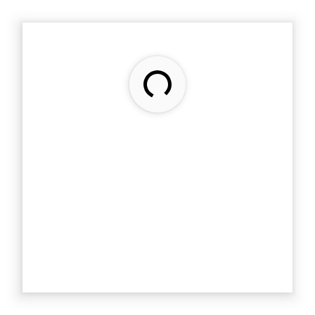

---
---
# Class "RefreshComposite"

<a href="https://developer.mozilla.org/en-US/docs/Web/JavaScript/Reference/Global_Objects/Object" title="View &quot;Object&quot; on MDN">Object</a> > <a href="NativeObject.html" title="NativeObject Class Reference">NativeObject</a> > <a href="Widget.html" title="Widget Class Reference">Widget</a> > <a href="Composite.html" title="Composite Class Reference">Composite</a> > <a href="#" >RefreshComposite</a>

A composite allowing to use a pull-to-refresh gesture to trigger and visualize a long running operation.


<div class="tabris-image"><figure><div></div><figcaption>Android</figcaption></figure><figure><div></div><figcaption>iOS</figcaption></figure></div>

Type: | <code style="white-space: nowrap">RefreshComposite extends <a href="Composite.html" title="Composite Class Reference">Composite</a></code>
Constructor: | public
Singleton: | No
Namespace: |<a href="../modules.html#startup" >tabris</a>
Direct subclasses: | None
JSX Support: | Element: <code style="white-space: nowrap"><a href="#" >&lt;RefreshComposite/&gt;</a></code><br/>Parent Elements: <code style="white-space: nowrap"><a href="Canvas.html" title="Canvas Class Reference">&lt;Canvas/&gt;</a></code>, <code style="white-space: nowrap"><a href="Cell.html" title="Cell Class Reference">&lt;Cell/&gt;</a></code>, <code style="white-space: nowrap"><a href="Composite.html" title="Composite Class Reference">&lt;Composite/&gt;</a></code>, <code style="white-space: nowrap"><a href="Page.html" title="Page Class Reference">&lt;Page/&gt;</a></code>, <code style="white-space: nowrap"><a href="#" >&lt;RefreshComposite/&gt;</a></code>, <code style="white-space: nowrap"><a href="Row.html" title="Row Class Reference">&lt;Row/&gt;</a></code>, <code style="white-space: nowrap"><a href="ScrollView.html" title="ScrollView Class Reference">&lt;ScrollView/&gt;</a></code>, <code style="white-space: nowrap"><a href="Stack.html" title="Stack Class Reference">&lt;Stack/&gt;</a></code>, <code style="white-space: nowrap"><a href="Tab.html" title="Tab Class Reference">&lt;Tab/&gt;</a></code><br/>Child Elements: *Any standalone widget element*<br/>

## Examples
### JavaScript


```js
import {RefreshComposite, contentView} from 'tabris';

new RefreshComposite({layoutData: 'stretch'})
  .onRefresh(() => console.log('Refreshing...'))
  .appendTo(contentView);
```


See also:
  
[<span class='language jsx'>JSX</span> Creating a simple `RefreshComposite`](https://github.com/eclipsesource/tabris-js/tree/v3.10.0/snippets/refreshcomposite.jsx) <span style="font-size: 75%;">[<a href="https://playground.tabris.com/?gitref=v3.10.0&snippet=refreshcomposite.jsx" style="color: cadetblue;">► Run in Playground</a>]</span>

## Constructor

### new RefreshComposite(properties?)

Parameter|Type|Description
-|-|-
properties | <code style="white-space: nowrap"><a href="Widget.html#propertieswidget" title="Widget Class Type">Properties</a>&lt;<a href="#" >RefreshComposite</a>&gt;</code> | Sets all key-value pairs in the properties object as widget properties. *Optional.*

## Properties

### refreshEnabled


Whether the pull-to-refresh gesture can be performed by the user. When disabled, the `RefreshComposite` behaves like a regular `Composite`.

Type: |<code style="white-space: nowrap"><a href="https://developer.mozilla.org/en-US/docs/Web/JavaScript/Data_structures#boolean_type" title="View &quot;boolean&quot; on MDN">boolean</a></code>
Default: | <code style="white-space: nowrap"><a href="https://developer.mozilla.org/en-US/docs/Web/JavaScript/Data_structures#boolean_type" title="View &quot;boolean&quot; on MDN">true</a></code>
Settable: | <a href="../widget-basics.html#widget-properties" >Yes</a>
Change Event: | [`refreshEnabledChanged`](#refreshenabledchanged)


### refreshIndicator


Whether to visualize a long running operation. After the user has triggered a manual refresh, this property is `true` and should be set to `false` when the operation ended.

Type: |<code style="white-space: nowrap"><a href="https://developer.mozilla.org/en-US/docs/Web/JavaScript/Data_structures#boolean_type" title="View &quot;boolean&quot; on MDN">boolean</a></code>
Default: | <code style="white-space: nowrap"><a href="https://developer.mozilla.org/en-US/docs/Web/JavaScript/Data_structures#boolean_type" title="View &quot;boolean&quot; on MDN">false</a></code>
Settable: | <a href="../widget-basics.html#widget-properties" >Yes</a>
Change Event: | [`refreshIndicatorChanged`](#refreshindicatorchanged)


### refreshMessage
<p class="platforms"><span class='ios-tag' title='supported on iOS'>iOS</span></p>

A message to show to the user during the refresh operation.

Type: |<code style="white-space: nowrap"><a href="https://developer.mozilla.org/en-US/docs/Web/JavaScript/Data_structures#string_type" title="View &quot;string&quot; on MDN">string</a></code>
Default: | <a href="https://developer.mozilla.org/en-US/docs/Web/JavaScript/Data_structures#string_type" title="View &quot;string&quot; on MDN">(empty string)</a>
Settable: | <a href="../widget-basics.html#widget-properties" >Yes</a>
Change Event: | [`refreshMessageChanged`](#refreshmessagechanged)


## Events

### refresh

Fired when a refresh is triggered by the user.

EventObject Type: <code style="white-space: nowrap"><a href="EventObject.html" title="EventObject Class Reference">EventObject</a>&lt;<a href="#" >RefreshComposite</a>&gt;</code>

This event has no additional parameter.
## Change Events

### refreshEnabledChanged

Fired when the [refreshEnabled](#refreshenabled) property has changed.

EventObject Type: <code style="white-space: nowrap"><a href="ChangeListeners.html#propertychangedeventtargettype-valuetype" title="ChangeListeners Class Type">PropertyChangedEvent</a>&lt;<a href="#" >RefreshComposite</a>, <a href="https://developer.mozilla.org/en-US/docs/Web/JavaScript/Data_structures#boolean_type" title="View &quot;boolean&quot; on MDN">boolean</a>&gt;</code>

Property|Type|Description
-|-|-
value | <code style="white-space: nowrap"><a href="https://developer.mozilla.org/en-US/docs/Web/JavaScript/Data_structures#boolean_type" title="View &quot;boolean&quot; on MDN">boolean</a></code> | The new value of [refreshEnabled](#refreshenabled).

### refreshIndicatorChanged

Fired when the [refreshIndicator](#refreshindicator) property has changed.

EventObject Type: <code style="white-space: nowrap"><a href="ChangeListeners.html#propertychangedeventtargettype-valuetype" title="ChangeListeners Class Type">PropertyChangedEvent</a>&lt;<a href="#" >RefreshComposite</a>, <a href="https://developer.mozilla.org/en-US/docs/Web/JavaScript/Data_structures#boolean_type" title="View &quot;boolean&quot; on MDN">boolean</a>&gt;</code>

Property|Type|Description
-|-|-
value | <code style="white-space: nowrap"><a href="https://developer.mozilla.org/en-US/docs/Web/JavaScript/Data_structures#boolean_type" title="View &quot;boolean&quot; on MDN">boolean</a></code> | The new value of [refreshIndicator](#refreshindicator).

### refreshMessageChanged

Fired when the [refreshMessage](#refreshmessage) property has changed.

EventObject Type: <code style="white-space: nowrap"><a href="ChangeListeners.html#propertychangedeventtargettype-valuetype" title="ChangeListeners Class Type">PropertyChangedEvent</a>&lt;<a href="#" >RefreshComposite</a>, <a href="https://developer.mozilla.org/en-US/docs/Web/JavaScript/Data_structures#string_type" title="View &quot;string&quot; on MDN">string</a>&gt;</code>

Property|Type|Description
-|-|-
value | <code style="white-space: nowrap"><a href="https://developer.mozilla.org/en-US/docs/Web/JavaScript/Data_structures#string_type" title="View &quot;string&quot; on MDN">string</a></code> | The new value of [refreshMessage](#refreshmessage).


