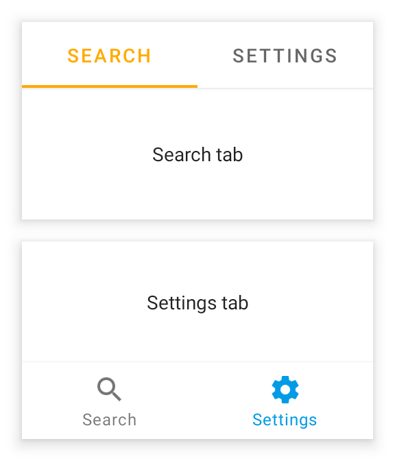

---
---
# Class "TabFolder"

<a href="https://developer.mozilla.org/en-US/docs/Web/JavaScript/Reference/Global_Objects/Object" title="View &quot;Object&quot; on MDN">Object</a> > <a href="NativeObject.html" title="NativeObject Class Reference">NativeObject</a> > <a href="Widget.html" title="Widget Class Reference">Widget</a> > <a href="Composite.html" title="Composite Class Reference">Composite</a> > <a href="#" >TabFolder</a>

A widget that can switch between [tabs](Tab). Only children of type `Tab` are supported. Since the TabFolder does not compute its own size, the width and height must be defined by the respective layout properties (e.g. either `width` or `left` and `right` must be specified).


<div class="tabris-image"><figure><div></div><figcaption>Android</figcaption></figure><figure><div></div><figcaption>iOS</figcaption></figure></div>

Type: | <code style="white-space: nowrap">TabFolder&lt;TabType&gt; extends <a href="Composite.html" title="Composite Class Reference">Composite</a>&lt;<a href="#generics" title="Generic Parameter&quot;TabType&quot;">TabType</a>&gt;</code>
Generics: | <span id="generics">TabType: *The common widget class of the children this TabFolder can contain. Must be a subclass of <code style="white-space: nowrap"><a href="Tab.html" title="Tab Class Reference">Tab</a></code> and defaults to <code style="white-space: nowrap"><a href="Tab.html" title="Tab Class Reference">Tab</a></code>.*<br/></span>
Constructor: | public
Singleton: | No
Namespace: |<a href="../modules.html#startup" >tabris</a>
Direct subclasses: | None
JSX Support: | Element: <code style="white-space: nowrap"><a href="#" >&lt;TabFolder/&gt;</a></code><br/>Parent Elements: <code style="white-space: nowrap"><a href="Canvas.html" title="Canvas Class Reference">&lt;Canvas/&gt;</a></code>, <code style="white-space: nowrap"><a href="Cell.html" title="Cell Class Reference">&lt;Cell/&gt;</a></code>, <code style="white-space: nowrap"><a href="Composite.html" title="Composite Class Reference">&lt;Composite/&gt;</a></code>, <code style="white-space: nowrap"><a href="Page.html" title="Page Class Reference">&lt;Page/&gt;</a></code>, <code style="white-space: nowrap"><a href="RefreshComposite.html" title="RefreshComposite Class Reference">&lt;RefreshComposite/&gt;</a></code>, <code style="white-space: nowrap"><a href="Row.html" title="Row Class Reference">&lt;Row/&gt;</a></code>, <code style="white-space: nowrap"><a href="ScrollView.html" title="ScrollView Class Reference">&lt;ScrollView/&gt;</a></code>, <code style="white-space: nowrap"><a href="Stack.html" title="Stack Class Reference">&lt;Stack/&gt;</a></code>, <code style="white-space: nowrap"><a href="Tab.html" title="Tab Class Reference">&lt;Tab/&gt;</a></code><br/>Child Elements: <code style="white-space: nowrap"><a href="Tab.html" title="Tab Class Reference">&lt;Tab/&gt;</a></code><br/>

## Examples
### JavaScript


```js
import {Tab, TabFolder, contentView} from 'tabris';

new TabFolder({left: 0, top: 0, right: 0, bottom: 0})
  .append(new Tab({title: 'Albums'}))
  .append(new Tab({title: 'Artists'}))
  .onSelect(({selection}) => console.log(`Tab changed to ${selection}`))
  .appendTo(contentView);
```


See also:
  
[<span class='language jsx'>JSX</span> Creating a `TabFolder` containing a set of tabs](https://github.com/eclipsesource/tabris-js/tree/v3.10.0/snippets/tabfolder.jsx) <span style="font-size: 75%;">[<a href="https://playground.tabris.com/?gitref=v3.10.0&snippet=tabfolder.jsx" style="color: cadetblue;">► Run in Playground</a>]</span>  
[<span class='language js'>JS</span> tabfolder-swipe-parallax.js](https://github.com/eclipsesource/tabris-js/tree/v3.10.0/snippets/tabfolder-swipe-parallax.js) <span style="font-size: 75%;">[<a href="https://playground.tabris.com/?gitref=v3.10.0&snippet=tabfolder-swipe-parallax.js" style="color: cadetblue;">► Run in Playground</a>]</span>  
[<span class='language jsx'>JSX</span> tabfolder-swipe.jsx](https://github.com/eclipsesource/tabris-js/tree/v3.10.0/snippets/tabfolder-swipe.jsx) <span style="font-size: 75%;">[<a href="https://playground.tabris.com/?gitref=v3.10.0&snippet=tabfolder-swipe.jsx" style="color: cadetblue;">► Run in Playground</a>]</span>

## Constructor

### new TabFolder(properties?)

Parameter|Type|Description
-|-|-
properties | <code style="white-space: nowrap"><a href="Widget.html#propertieswidget" title="Widget Class Type">Properties</a>&lt;<a href="#" >TabFolder</a>&gt;</code> | Sets all key-value pairs in the properties object as widget properties. *Optional.*

## Properties

### paging


Enables swiping through tabs.

Type: |<code style="white-space: nowrap"><a href="https://developer.mozilla.org/en-US/docs/Web/JavaScript/Data_structures#boolean_type" title="View &quot;boolean&quot; on MDN">boolean</a></code>
Settable: | <a href="../widget-basics.html#widget-properties" >Yes</a>
Change Event: | [`pagingChanged`](#pagingchanged)


### selectedTabIndicatorTintColor


The color used for the indicator of the selected tab. Only applies when the `tabBarLocation` is `top`. Available on Android and iOS 13+.

Type: |<code style="white-space: nowrap"><a href="Color.html#colorvalue" title="Color Class Type">ColorValue</a></code>
Settable: | <a href="../widget-basics.html#widget-properties" >Yes</a>
Change Event: | [`selectedTabIndicatorTintColorChanged`](#selectedtabindicatortintcolorchanged)


### selectedTabTintColor


The color used for the text and icon of a selected tab.

Type: |<code style="white-space: nowrap"><a href="Color.html#colorvalue" title="Color Class Type">ColorValue</a></code>
Settable: | <a href="../widget-basics.html#widget-properties" >Yes</a>
Change Event: | [`selectedTabTintColorChanged`](#selectedtabtintcolorchanged)


### selection


The currently selected tab.

Type: |<code style="white-space: nowrap"><a href="#generics" title="Generic Parameter&quot;TabType&quot;">TabType</a></code>
Settable: | <a href="../widget-basics.html#widget-properties" >Yes</a>
Change Event: | [`selectionChanged`](#selectionchanged)


### selectionIndex


The index of the currently selected tab.

Type: |<code style="white-space: nowrap"><a href="https://developer.mozilla.org/en-US/docs/Web/JavaScript/Data_structures#number_type" title="View &quot;number&quot; on MDN">number</a></code>
Settable: | <a href="../widget-basics.html#widget-properties" >Yes</a>
Change Event: | [`selectionIndexChanged`](#selectionindexchanged)


### tabBarBackground


The color used for the background of the bar containing the tabs.

Type: |<code style="white-space: nowrap"><a href="Color.html#colorvalue" title="Color Class Type">ColorValue</a></code>
Settable: | <a href="../widget-basics.html#widget-properties" >Yes</a>
Change Event: | [`tabBarBackgroundChanged`](#tabbarbackgroundchanged)


### tabBarElevation
<p class="platforms"><span class='android-tag' title='supported on Android'>Android</span></p>

The elevation of the tab bar. Depending on the `tabBarLocation` different defaults are applied.

Type: |<code style="white-space: nowrap"><a href="https://developer.mozilla.org/en-US/docs/Web/JavaScript/Data_structures#number_type" title="View &quot;number&quot; on MDN">number</a></code>
Settable: | <a href="../widget-basics.html#widget-properties" >Yes</a>
Change Event: | [`tabBarElevationChanged`](#tabbarelevationchanged)


### tabBarLocation


The placement of the tab titles. When set to `"hidden"`, the tab bar will not be visible. When set to `"auto"`, the position is platform dependent.

Type: |<code style="white-space: nowrap"><a href="https://developer.mozilla.org/en-US/docs/Web/JavaScript/Data_structures#string_type" title="View &quot;string&quot; on MDN">'top'</a> &#124; <a href="https://developer.mozilla.org/en-US/docs/Web/JavaScript/Data_structures#string_type" title="View &quot;string&quot; on MDN">'bottom'</a> &#124; <a href="https://developer.mozilla.org/en-US/docs/Web/JavaScript/Data_structures#string_type" title="View &quot;string&quot; on MDN">'hidden'</a> &#124; <a href="https://developer.mozilla.org/en-US/docs/Web/JavaScript/Data_structures#string_type" title="View &quot;string&quot; on MDN">'auto'</a></code>
Default: | <code style="white-space: nowrap"><a href="https://developer.mozilla.org/en-US/docs/Web/JavaScript/Data_structures#string_type" title="View &quot;string&quot; on MDN">'auto'</a></code>
Settable: | <a href="../widget-basics.html#widget-properties" >By Constructor or JSX</a>
Change Event: | Not supported


This property can only be set via constructor or JSX. Once set, it cannot change anymore.


### tabMode
<p class="platforms"><span class='android-tag' title='supported on Android'>Android</span></p>

Controls how the tabs make use of the available horizontal space. Setting the `tabMode` to `"fixed"` makes the tabs span the entire available space. In case of a very wide `TabFolder` the `"fixed"` mode centers the tabs. The mode `"scrollable"` left aligns the tabs and allows to scroll the tabs if there are more tabs than would fit in the available space. Available on Android only.

Type: |<code style="white-space: nowrap"><a href="https://developer.mozilla.org/en-US/docs/Web/JavaScript/Data_structures#string_type" title="View &quot;string&quot; on MDN">'fixed'</a> &#124; <a href="https://developer.mozilla.org/en-US/docs/Web/JavaScript/Data_structures#string_type" title="View &quot;string&quot; on MDN">'scrollable'</a></code>
Default: | <code style="white-space: nowrap"><a href="https://developer.mozilla.org/en-US/docs/Web/JavaScript/Data_structures#string_type" title="View &quot;string&quot; on MDN">'fixed'</a></code>
Settable: | <a href="../widget-basics.html#widget-properties" >By Constructor or JSX</a>
Change Event: | Not supported


This property can only be set via constructor or JSX. Once set, it cannot change anymore.


### tabTintColor


The color used for the text and icon of a tab.

When the `tabBarLocation` is `top` on iOS, this property affects the entire appearance of the bar. No other color properties have an effect in that configuration.

Type: |<code style="white-space: nowrap"><a href="Color.html#colorvalue" title="Color Class Type">ColorValue</a></code>
Settable: | <a href="../widget-basics.html#widget-properties" >Yes</a>
Change Event: | [`tabTintColorChanged`](#tabtintcolorchanged)


## Events

### select

Fired when the user taps on a tab. The event also fires when the same tab is tapped multiple times.

EventObject Type: <code style="white-space: nowrap">TabFolderSelectEvent&lt;<a href="#" >TabFolder</a>&gt;</code>

Property|Type|Description
-|-|-
selection | <code style="white-space: nowrap"><a href="Tab.html" title="Tab Class Reference">Tab</a></code> | The `Tap` selected by the user.

### scroll

Fired when `paging` is enabled and a tab is scrolled. The `event` parameter contains position information relative to the currently selected `Tab`. Eg.: scrolling a 500px wide tab 10% to the left sets `offset` to `50`. Scrolling 10% to the right sets `offset` to `-50`.

EventObject Type: <code style="white-space: nowrap">TabFolderScrollEvent&lt;<a href="#" >TabFolder</a>&gt;</code>

Property|Type|Description
-|-|-
offset | <code style="white-space: nowrap"><a href="https://developer.mozilla.org/en-US/docs/Web/JavaScript/Data_structures#number_type" title="View &quot;number&quot; on MDN">number</a></code> | Number of pixels the current tab has scrolled horizontally.
selection | <code style="white-space: nowrap"><a href="Tab.html" title="Tab Class Reference">Tab</a></code> | The current value of the `selection` property.

## Change Events

### pagingChanged

Fired when the [paging](#paging) property has changed.

EventObject Type: <code style="white-space: nowrap"><a href="ChangeListeners.html#propertychangedeventtargettype-valuetype" title="ChangeListeners Class Type">PropertyChangedEvent</a>&lt;<a href="#" >TabFolder</a>, <a href="https://developer.mozilla.org/en-US/docs/Web/JavaScript/Data_structures#boolean_type" title="View &quot;boolean&quot; on MDN">boolean</a>&gt;</code>

Property|Type|Description
-|-|-
value | <code style="white-space: nowrap"><a href="https://developer.mozilla.org/en-US/docs/Web/JavaScript/Data_structures#boolean_type" title="View &quot;boolean&quot; on MDN">boolean</a></code> | The new value of [paging](#paging).

### selectionChanged

Fired when the [selection](#selection) property has changed.

EventObject Type: <code style="white-space: nowrap"><a href="ChangeListeners.html#propertychangedeventtargettype-valuetype" title="ChangeListeners Class Type">PropertyChangedEvent</a>&lt;<a href="#" >TabFolder</a>, <a href="#generics" title="Generic Parameter&quot;TabType&quot;">TabType</a>&gt;</code>

Property|Type|Description
-|-|-
value | <code style="white-space: nowrap"><a href="#generics" title="Generic Parameter&quot;TabType&quot;">TabType</a></code> | The new value of [selection](#selection).

### selectionIndexChanged

Fired when the [selectionIndex](#selectionindex) property has changed.

EventObject Type: <code style="white-space: nowrap"><a href="ChangeListeners.html#propertychangedeventtargettype-valuetype" title="ChangeListeners Class Type">PropertyChangedEvent</a>&lt;<a href="#" >TabFolder</a>, <a href="https://developer.mozilla.org/en-US/docs/Web/JavaScript/Data_structures#number_type" title="View &quot;number&quot; on MDN">number</a>&gt;</code>

Property|Type|Description
-|-|-
value | <code style="white-space: nowrap"><a href="https://developer.mozilla.org/en-US/docs/Web/JavaScript/Data_structures#number_type" title="View &quot;number&quot; on MDN">number</a></code> | The new value of [selectionIndex](#selectionindex).

### tabTintColorChanged

Fired when the [tabTintColor](#tabtintcolor) property has changed.

EventObject Type: <code style="white-space: nowrap"><a href="ChangeListeners.html#propertychangedeventtargettype-valuetype" title="ChangeListeners Class Type">PropertyChangedEvent</a>&lt;<a href="#" >TabFolder</a>, <a href="Color.html#colorvalue" title="Color Class Type">ColorValue</a>&gt;</code>

Property|Type|Description
-|-|-
value | <code style="white-space: nowrap"><a href="Color.html#colorvalue" title="Color Class Type">ColorValue</a></code> | The new value of [tabTintColor](#tabtintcolor).

### selectedTabTintColorChanged

Fired when the [selectedTabTintColor](#selectedtabtintcolor) property has changed.

EventObject Type: <code style="white-space: nowrap"><a href="ChangeListeners.html#propertychangedeventtargettype-valuetype" title="ChangeListeners Class Type">PropertyChangedEvent</a>&lt;<a href="#" >TabFolder</a>, <a href="Color.html#colorvalue" title="Color Class Type">ColorValue</a>&gt;</code>

Property|Type|Description
-|-|-
value | <code style="white-space: nowrap"><a href="Color.html#colorvalue" title="Color Class Type">ColorValue</a></code> | The new value of [selectedTabTintColor](#selectedtabtintcolor).

### tabBarBackgroundChanged

Fired when the [tabBarBackground](#tabbarbackground) property has changed.

EventObject Type: <code style="white-space: nowrap"><a href="ChangeListeners.html#propertychangedeventtargettype-valuetype" title="ChangeListeners Class Type">PropertyChangedEvent</a>&lt;<a href="#" >TabFolder</a>, <a href="Color.html#colorvalue" title="Color Class Type">ColorValue</a>&gt;</code>

Property|Type|Description
-|-|-
value | <code style="white-space: nowrap"><a href="Color.html#colorvalue" title="Color Class Type">ColorValue</a></code> | The new value of [tabBarBackground](#tabbarbackground).

### selectedTabIndicatorTintColorChanged

Fired when the [selectedTabIndicatorTintColor](#selectedtabindicatortintcolor) property has changed.

EventObject Type: <code style="white-space: nowrap"><a href="ChangeListeners.html#propertychangedeventtargettype-valuetype" title="ChangeListeners Class Type">PropertyChangedEvent</a>&lt;<a href="#" >TabFolder</a>, <a href="Color.html#colorvalue" title="Color Class Type">ColorValue</a>&gt;</code>

Property|Type|Description
-|-|-
value | <code style="white-space: nowrap"><a href="Color.html#colorvalue" title="Color Class Type">ColorValue</a></code> | The new value of [selectedTabIndicatorTintColor](#selectedtabindicatortintcolor).

### tabBarElevationChanged

Fired when the [tabBarElevation](#tabbarelevation) property has changed.

EventObject Type: <code style="white-space: nowrap"><a href="ChangeListeners.html#propertychangedeventtargettype-valuetype" title="ChangeListeners Class Type">PropertyChangedEvent</a>&lt;<a href="#" >TabFolder</a>, <a href="https://developer.mozilla.org/en-US/docs/Web/JavaScript/Data_structures#number_type" title="View &quot;number&quot; on MDN">number</a>&gt;</code>

Property|Type|Description
-|-|-
value | <code style="white-space: nowrap"><a href="https://developer.mozilla.org/en-US/docs/Web/JavaScript/Data_structures#number_type" title="View &quot;number&quot; on MDN">number</a></code> | The new value of [tabBarElevation](#tabbarelevation).


