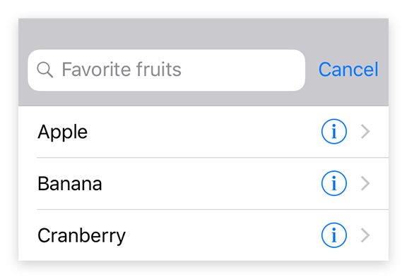

---
---
# Class "SearchAction"

<a href="https://developer.mozilla.org/en-US/docs/Web/JavaScript/Reference/Global_Objects/Object" title="View &quot;Object&quot; on MDN">Object</a> > <a href="NativeObject.html" title="NativeObject Class Reference">NativeObject</a> > <a href="Widget.html" title="Widget Class Reference">Widget</a> > <a href="Action.html" title="Action Class Reference">Action</a> > <a href="#" >SearchAction</a>

An action that displays a search text field with dynamic proposals when selected. Add a listener on *select* to implement the action. On *input*, you may set a list of *proposals*.


<div class="tabris-image"><figure><div></div><figcaption>Android</figcaption></figure><figure><div></div><figcaption>iOS</figcaption></figure></div>

Type: | <code style="white-space: nowrap">SearchAction extends <a href="Action.html" title="Action Class Reference">Action</a></code>
Constructor: | public
Singleton: | No
Namespace: |<a href="../modules.html#startup" >tabris</a>
Direct subclasses: | None
JSX Support: | Element: <code style="white-space: nowrap"><a href="SearchAction.html" title="SearchAction Class Reference">&lt;SearchAction/&gt;</a></code><br/>Parent Elements: <code style="white-space: nowrap"><a href="NavigationView.html" title="NavigationView Class Reference">&lt;NavigationView/&gt;</a></code><br/>Child Elements: *Not Supported*<br/>Text Content: *Not supported*

## Examples
### JavaScript


```js
import {SearchAction, NavigationView, contentView} from 'tabris';

const items = ['apple', 'banana', 'cherry'];

const navigationView = new NavigationView({layoutData: 'stretch'})
  .appendTo(contentView);

new SearchAction({title: 'Search', image: 'resources/search.png'})
  .onInput(event => items.filter(proposal => proposal.indexOf(event.query) !== -1))
  .onAccept(event => console.log(`Showing content for ${event.text}`))
  .appendTo(navigationView);
```


See also:
  
[<span class='language jsx'>JSX</span> Creating a `SearchAction`](https://playground.tabris.com/?gitref=vundefined&snippet=navigationview-searchaction.jsx)

## Constructor

### new SearchAction(properties?)

Parameter|Type|Description
-|-|-
properties | <code style="white-space: nowrap"><a href="../types.html#propertieswidget" title="Properties&lt;Widget&gt;">Properties</a>&lt;<a href="#" >SearchAction</a>&gt;</code> | Sets all key-value pairs in the properties object as widget properties. *Optional.*

## Methods

### open()


Invokes the search action, i.e. displays the UI to perform a search.

Returns: <code style="white-space: nowrap"><a href="https://developer.mozilla.org/en-US/docs/Web/JavaScript/Data_structures#Undefined_type" title="View &quot;undefined&quot; on MDN">undefined</a></code>


## Properties

### message


A hint text that is displayed when the search input is empty.

Type: |<code style="white-space: nowrap"><a href="https://developer.mozilla.org/en-US/docs/Web/JavaScript/Data_structures#String_type" title="View &quot;string&quot; on MDN">string</a></code>
Settable: | <a href="../widget-basics.html#widget-properties" >Yes</a>
Change Event: | [`messageChanged`](#messagechanged)


### proposals


The list of proposals to display.

Type: |<code style="white-space: nowrap"><a href="https://developer.mozilla.org/en-US/docs/Web/JavaScript/Data_structures#String_type" title="View &quot;string&quot; on MDN">string</a>[]</code>
Default: | <code style="white-space: nowrap"><a href="https://developer.mozilla.org/en-US/docs/Web/JavaScript/Data_structures#String_type" title="View &quot;string&quot; on MDN">[]</a></code>
Settable: | <a href="../widget-basics.html#widget-properties" >Yes</a>
Change Event: | [`proposalsChanged`](#proposalschanged)


### text


The text in the search input field.

Type: |<code style="white-space: nowrap"><a href="https://developer.mozilla.org/en-US/docs/Web/JavaScript/Data_structures#String_type" title="View &quot;string&quot; on MDN">string</a></code>
Settable: | <a href="../widget-basics.html#widget-properties" >Yes</a>
Change Event: | [`textChanged`](#textchanged)


## Events

### input

Fired when the user inputs text.

EventObject Type: <code style="white-space: nowrap">SearchActionInputEvent&lt;<a href="#" >SearchAction</a>&gt;</code>

Property|Type|Description
-|-|-
text | <code style="white-space: nowrap"><a href="https://developer.mozilla.org/en-US/docs/Web/JavaScript/Data_structures#String_type" title="View &quot;string&quot; on MDN">string</a></code> | The new value of *[text](#text)*.

### accept

Fired when a text input has been submitted by pressing the keyboard's search key.

EventObject Type: <code style="white-space: nowrap">SearchActionAcceptEvent&lt;<a href="#" >SearchAction</a>&gt;</code>

Property|Type|Description
-|-|-
text | <code style="white-space: nowrap"><a href="https://developer.mozilla.org/en-US/docs/Web/JavaScript/Data_structures#String_type" title="View &quot;string&quot; on MDN">string</a></code> | The current value of *[text](#text)*.

## Change Events

### proposalsChanged

Fired when the [proposals](#proposals) property has changed.

EventObject Type: <code style="white-space: nowrap"><a href="../types.html#propertychangedeventtargettype-valuetype" title="PropertyChangedEvent&lt;TargetType, ValueType&gt;">PropertyChangedEvent</a>&lt;<a href="#" >SearchAction</a>, <a href="https://developer.mozilla.org/en-US/docs/Web/JavaScript/Reference/Global_Objects/Array" title="View &quot;Array&quot; on MDN">Array</a>&gt;</code>

Property|Type|Description
-|-|-
value | <code style="white-space: nowrap"><a href="https://developer.mozilla.org/en-US/docs/Web/JavaScript/Data_structures#String_type" title="View &quot;string&quot; on MDN">string</a>[]</code> | The new value of [proposals](#proposals).

### textChanged

Fired when the [text](#text) property has changed.

EventObject Type: <code style="white-space: nowrap"><a href="../types.html#propertychangedeventtargettype-valuetype" title="PropertyChangedEvent&lt;TargetType, ValueType&gt;">PropertyChangedEvent</a>&lt;<a href="#" >SearchAction</a>, <a href="https://developer.mozilla.org/en-US/docs/Web/JavaScript/Data_structures#String_type" title="View &quot;string&quot; on MDN">string</a>&gt;</code>

Property|Type|Description
-|-|-
value | <code style="white-space: nowrap"><a href="https://developer.mozilla.org/en-US/docs/Web/JavaScript/Data_structures#String_type" title="View &quot;string&quot; on MDN">string</a></code> | The new value of [text](#text).

### messageChanged

Fired when the [message](#message) property has changed.

EventObject Type: <code style="white-space: nowrap"><a href="../types.html#propertychangedeventtargettype-valuetype" title="PropertyChangedEvent&lt;TargetType, ValueType&gt;">PropertyChangedEvent</a>&lt;<a href="#" >SearchAction</a>, <a href="https://developer.mozilla.org/en-US/docs/Web/JavaScript/Data_structures#String_type" title="View &quot;string&quot; on MDN">string</a>&gt;</code>

Property|Type|Description
-|-|-
value | <code style="white-space: nowrap"><a href="https://developer.mozilla.org/en-US/docs/Web/JavaScript/Data_structures#String_type" title="View &quot;string&quot; on MDN">string</a></code> | The new value of [message](#message).

