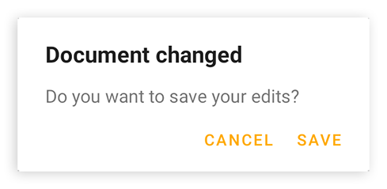
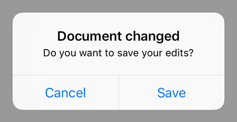

---
---
# Class "AlertDialog"

<a href="https://developer.mozilla.org/en-US/docs/Web/JavaScript/Reference/Global_Objects/Object" title="View &quot;Object&quot; on MDN">Object</a> > <a href="NativeObject.html" title="NativeObject Class Reference">NativeObject</a> > <a href="Popup.html" title="Popup Class Reference">Popup</a> > <a href="#" >AlertDialog</a>

An `AlertDialog` represents a native dialog pop-up showing a message and up to three buttons.  Is automatically disposed when closed.


<div class="tabris-image"><figure><div></div><figcaption>Android</figcaption></figure><figure><div></div><figcaption>iOS</figcaption></figure></div>

Type: | <code style="white-space: nowrap">AlertDialog extends <a href="Popup.html" title="Popup Class Reference">Popup</a></code>
Constructor: | public
Singleton: | No
Namespace: |<a href="../modules.html#startup" >tabris</a>
Direct subclasses: | None
JSX Support: | Element: <code style="white-space: nowrap"><a href="#" >&lt;AlertDialog/&gt;</a></code><br/>Parent Elements: *Not supported*<br/>Child Elements: *Not Supported*<br/>Element Content Properties: [<code style="white-space: nowrap">message</code>](#message)

## Examples
### JavaScript


```js
import {AlertDialog} from 'tabris';

new AlertDialog({
  title: 'Document saved',
  buttons: {ok: 'OK'}
}).open();
```


See also:
  
[<span class='language jsx'>JSX</span> Creating various types of alert dialogs](https://playground.tabris.com/?gitref=v3.3.0&snippet=alertdialog.jsx)

## Constructor

### new AlertDialog(properties?)

Parameter|Type|Description
-|-|-
properties | <code style="white-space: nowrap"><a href="../types.html#propertieswidget" title="Properties&lt;Widget&gt;">Properties</a>&lt;<a href="#" >AlertDialog</a>&gt;</code> | Sets all key-value pairs in the properties object as widget properties. *Optional.*

## Static Methods

### open(alertDialog)


Makes the given alert dialog visible. Meant to be used with inline-JSX. In TypeScript it also casts the given JSX element from `any` to an actual AlertDialog.


Parameter|Type|Description
-|-|-
alertDialog | <code style="white-space: nowrap"><a href="#" >AlertDialog</a></code> | The alert dialog to open


Returns: <code style="white-space: nowrap"><a href="#" >AlertDialog</a></code>

### open(message)


Creates and opens an alert dialog with one 'OK' button and the given message.


Parameter|Type|Description
-|-|-
message | <code style="white-space: nowrap"><a href="https://developer.mozilla.org/en-US/docs/Web/JavaScript/Data_structures#String_type" title="View &quot;string&quot; on MDN">string</a></code> | The message to display


Returns: <code style="white-space: nowrap"><a href="#" >AlertDialog</a></code>


## Properties

### buttons


An object with the texts of the buttons to display. There are up to three buttons: `ok`, `cancel` and `neutral`. If no text is given for a button it will not be displayed. Example: `{ok: 'Yes', cancel: 'No'}` shows 'Yes' and 'No', but no 'neutral' button.

Type: |<code style="white-space: nowrap">{<br/>&nbsp;&nbsp;ok: <a href="https://developer.mozilla.org/en-US/docs/Web/JavaScript/Data_structures#String_type" title="View &quot;string&quot; on MDN">string</a>, // optional<br/>&nbsp;&nbsp;cancel: <a href="https://developer.mozilla.org/en-US/docs/Web/JavaScript/Data_structures#String_type" title="View &quot;string&quot; on MDN">string</a>, // optional<br/>&nbsp;&nbsp;neutral: <a href="https://developer.mozilla.org/en-US/docs/Web/JavaScript/Data_structures#String_type" title="View &quot;string&quot; on MDN">string</a> // optional<br/>}</code>
Settable: | <a href="../widget-basics.html#widget-properties" >Yes</a>
Change Event: | [`buttonsChanged`](#buttonschanged)


### message


The message to display inside the dialog.

Type: |<code style="white-space: nowrap"><a href="https://developer.mozilla.org/en-US/docs/Web/JavaScript/Data_structures#String_type" title="View &quot;string&quot; on MDN">string</a></code>
Settable: | <a href="../widget-basics.html#widget-properties" >Yes</a>
Change Event: | [`messageChanged`](#messagechanged)
JSX Content Type: | [Text](../JSX.md)


When using AlertDialog as an JSX element the elements Text content is mapped to this property.

### textInputs


A composite that may contain `TextInput` widgets to be displayed alongside the `title` and `message`. The text values inserted by the user can be read in the dialogs `close` event via its `texts` property. Eg.: `dialog.on('close', (e) => e.texts[0])`

In an AlertDialog JSX element the TextInput widgets may be given as child elements.

Type: |<code style="white-space: nowrap"><a href="ContentView.html" title="ContentView Object Reference">ContentView</a>&lt;<a href="TextInput.html" title="TextInput Class Reference">TextInput</a>&gt;</code>
Settable: | <a href="../widget-basics.html#widget-properties" >No</a>
Change Event: | Not supported


This property can only be set via constructor or JSX. Once set, it cannot change anymore.


### title


The title of the dialog.

Type: |<code style="white-space: nowrap"><a href="https://developer.mozilla.org/en-US/docs/Web/JavaScript/Data_structures#String_type" title="View &quot;string&quot; on MDN">string</a></code>
Settable: | <a href="../widget-basics.html#widget-properties" >Yes</a>
Change Event: | [`titleChanged`](#titlechanged)


## Events

### close

Fired when the dialog was closed for any reason.

EventObject Type: <code style="white-space: nowrap">AlertDialogCloseEvent&lt;<a href="#" >AlertDialog</a>&gt;</code>

Property|Type|Description
-|-|-
button | <code style="white-space: nowrap"><a href="https://developer.mozilla.org/en-US/docs/Web/JavaScript/Data_structures#String_type" title="View &quot;string&quot; on MDN">'ok'</a><br/> &#124; <a href="https://developer.mozilla.org/en-US/docs/Web/JavaScript/Data_structures#String_type" title="View &quot;string&quot; on MDN">'cancel'</a><br/> &#124; <a href="https://developer.mozilla.org/en-US/docs/Web/JavaScript/Data_structures#String_type" title="View &quot;string&quot; on MDN">'neutral'</a><br/> &#124; <a href="https://developer.mozilla.org/en-US/docs/Web/JavaScript/Data_structures#Null_type" title="View &quot;null&quot; on MDN">null</a></code> | The type of button that was used to close the dialog. Can also be null, e.g. when the global back button was pressed.
texts | <code style="white-space: nowrap"><a href="https://developer.mozilla.org/en-US/docs/Web/JavaScript/Data_structures#String_type" title="View &quot;string&quot; on MDN">string</a>[]</code> | An array containing the corresponding `text` values of all `textInputs` elements.

### closeOk

Fired when the dialog was closed by pressing the 'ok' button.

EventObject Type: <code style="white-space: nowrap"><a href="EventObject.html" title="EventObject Class Reference">EventObject</a>&lt;<a href="#" >AlertDialog</a>&gt;</code>

This event has no additional parameter.
### closeCancel

Fired when the dialog was closed by pressing the 'cancel' button.

EventObject Type: <code style="white-space: nowrap"><a href="EventObject.html" title="EventObject Class Reference">EventObject</a>&lt;<a href="#" >AlertDialog</a>&gt;</code>

This event has no additional parameter.
### closeNeutral

Fired when the dialog was closed by pressing the 'neutral' button.

EventObject Type: <code style="white-space: nowrap"><a href="EventObject.html" title="EventObject Class Reference">EventObject</a>&lt;<a href="#" >AlertDialog</a>&gt;</code>

This event has no additional parameter.
## Change Events

### titleChanged

Fired when the [title](#title) property has changed.

EventObject Type: <code style="white-space: nowrap"><a href="../types.html#propertychangedeventtargettype-valuetype" title="PropertyChangedEvent&lt;TargetType, ValueType&gt;">PropertyChangedEvent</a>&lt;<a href="#" >AlertDialog</a>, <a href="https://developer.mozilla.org/en-US/docs/Web/JavaScript/Data_structures#String_type" title="View &quot;string&quot; on MDN">string</a>&gt;</code>

Property|Type|Description
-|-|-
value | <code style="white-space: nowrap"><a href="https://developer.mozilla.org/en-US/docs/Web/JavaScript/Data_structures#String_type" title="View &quot;string&quot; on MDN">string</a></code> | The new value of [title](#title).

### messageChanged

Fired when the [message](#message) property has changed.

EventObject Type: <code style="white-space: nowrap"><a href="../types.html#propertychangedeventtargettype-valuetype" title="PropertyChangedEvent&lt;TargetType, ValueType&gt;">PropertyChangedEvent</a>&lt;<a href="#" >AlertDialog</a>, <a href="https://developer.mozilla.org/en-US/docs/Web/JavaScript/Data_structures#String_type" title="View &quot;string&quot; on MDN">string</a>&gt;</code>

Property|Type|Description
-|-|-
value | <code style="white-space: nowrap"><a href="https://developer.mozilla.org/en-US/docs/Web/JavaScript/Data_structures#String_type" title="View &quot;string&quot; on MDN">string</a></code> | The new value of [message](#message).

### buttonsChanged

Fired when the [buttons](#buttons) property has changed.

EventObject Type: <code style="white-space: nowrap"><a href="../types.html#propertychangedeventtargettype-valuetype" title="PropertyChangedEvent&lt;TargetType, ValueType&gt;">PropertyChangedEvent</a>&lt;<a href="#" >AlertDialog</a>, <a href="https://developer.mozilla.org/en-US/docs/Web/JavaScript/Reference/Global_Objects/Object" title="View &quot;Object&quot; on MDN">Object</a>&gt;</code>

Property|Type|Description
-|-|-
value | <code style="white-space: nowrap">{<br/>&nbsp;&nbsp;ok: <a href="https://developer.mozilla.org/en-US/docs/Web/JavaScript/Data_structures#String_type" title="View &quot;string&quot; on MDN">string</a>, // optional<br/>&nbsp;&nbsp;cancel: <a href="https://developer.mozilla.org/en-US/docs/Web/JavaScript/Data_structures#String_type" title="View &quot;string&quot; on MDN">string</a>, // optional<br/>&nbsp;&nbsp;neutral: <a href="https://developer.mozilla.org/en-US/docs/Web/JavaScript/Data_structures#String_type" title="View &quot;string&quot; on MDN">string</a> // optional<br/>}</code> | The new value of [buttons](#buttons).

