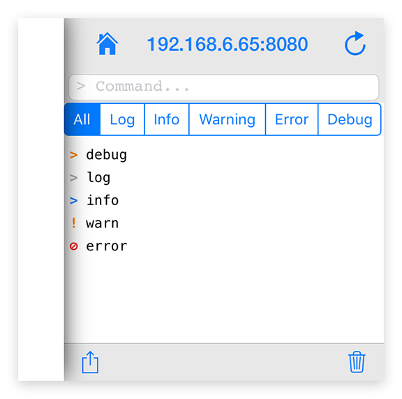

---
---
# Global object "console"

<a href="https://developer.mozilla.org/en-US/docs/Web/JavaScript/Reference/Global_Objects/Object" title="View &quot;Object&quot; on MDN">Object</a> > <a href="#" >Console</a>

The console object provides access to the [debugging console](../debug.md).


<div class="tabris-image"><figure><div></div><figcaption>Android</figcaption></figure><figure><div></div><figcaption>iOS</figcaption></figure></div>

Type: | <code style="white-space: nowrap">Console extends <a href="https://developer.mozilla.org/en-US/docs/Web/JavaScript/Reference/Global_Objects/Object" title="View &quot;Object&quot; on MDN">Object</a></code>
Constructor: | private
Singleton: | `console`
Namespace: |<a href="../modules.html#startup" >global</a>
Direct subclasses: | None
JSX Support: | No


## Examples
### JavaScript


```js
console.log('message');
console.error('error');
console.trace();
console.dirxml({});
```


See also:
  
[<span class='language jsx'>JSX</span> Logging to the `console` with various log levels](https://playground.tabris.com/?gitref=v3.5.0&snippet=console.jsx)

## Methods

### assert(expression, ...values)


Outputs an error message to the console if the first argument is false.


Parameter|Type|Description
-|-|-
expression | <code style="white-space: nowrap"><a href="https://developer.mozilla.org/en-US/docs/Web/JavaScript/Data_structures#Boolean_type" title="View &quot;boolean&quot; on MDN">boolean</a></code> | Any boolean expression. If the assertion is false, the error message is written to the console.
...values | <code style="white-space: nowrap"><a title="Literally any JavaScript value">any</a>[]</code> | A list of JavaScript values to output.


Returns: <code style="white-space: nowrap"><a href="https://developer.mozilla.org/en-US/docs/Web/JavaScript/Data_structures#Undefined_type" title="View &quot;undefined&quot; on MDN">undefined</a></code>

### count(label?)


Logs the number of times that this particular call to count() has been called.


Parameter|Type|Description
-|-|-
label | <code style="white-space: nowrap"><a href="https://developer.mozilla.org/en-US/docs/Web/JavaScript/Data_structures#String_type" title="View &quot;string&quot; on MDN">string</a></code> | If supplied, count() outputs the number of times it has been called with that label. *Optional.*


Returns: <code style="white-space: nowrap"><a href="https://developer.mozilla.org/en-US/docs/Web/JavaScript/Data_structures#Undefined_type" title="View &quot;undefined&quot; on MDN">undefined</a></code>

### countReset(label?)


Resets the counter.


Parameter|Type|Description
-|-|-
label | <code style="white-space: nowrap"><a href="https://developer.mozilla.org/en-US/docs/Web/JavaScript/Data_structures#String_type" title="View &quot;string&quot; on MDN">string</a></code> | If label supplied, this function resets the count associated with that particular label. *Optional.*


Returns: <code style="white-space: nowrap"><a href="https://developer.mozilla.org/en-US/docs/Web/JavaScript/Data_structures#Undefined_type" title="View &quot;undefined&quot; on MDN">undefined</a></code>

### debug(...values)


Outputs a debug message to the console.


Parameter|Type|Description
-|-|-
...values | <code style="white-space: nowrap"><a title="Literally any JavaScript value">any</a>[]</code> | A list of JavaScript values to output.


Returns: <code style="white-space: nowrap"><a href="https://developer.mozilla.org/en-US/docs/Web/JavaScript/Data_structures#Undefined_type" title="View &quot;undefined&quot; on MDN">undefined</a></code>

### dirxml(object)


XML tree representation of a given object, if available. Supported types include all widgets and `localStorage`. 

*The output is NOT JSX, it is a human-readable summary that displays XML-conforming string representations of some select property values.


Parameter|Type|Description
-|-|-
object | <code style="white-space: nowrap"><a title="Literally any JavaScript value">any</a></code> | A JavaScript object


Returns: <code style="white-space: nowrap"><a href="https://developer.mozilla.org/en-US/docs/Web/JavaScript/Data_structures#Undefined_type" title="View &quot;undefined&quot; on MDN">undefined</a></code>

### error(...values)


Outputs an error message to the console.


Parameter|Type|Description
-|-|-
...values | <code style="white-space: nowrap"><a title="Literally any JavaScript value">any</a>[]</code> | A list of JavaScript values to output.


Returns: <code style="white-space: nowrap"><a href="https://developer.mozilla.org/en-US/docs/Web/JavaScript/Data_structures#Undefined_type" title="View &quot;undefined&quot; on MDN">undefined</a></code>

### group(...values)


Creates a new inline group in the console output. This indents following console messages by an additional spaces, until console.groupEnd() is called.


Parameter|Type|Description
-|-|-
...values | <code style="white-space: nowrap"><a title="Literally any JavaScript value">any</a>[]</code> | A list of JavaScript values to output.


Returns: <code style="white-space: nowrap"><a href="https://developer.mozilla.org/en-US/docs/Web/JavaScript/Data_structures#Undefined_type" title="View &quot;undefined&quot; on MDN">undefined</a></code>

### groupEnd()


Exits the current inline group in the console.

Returns: <code style="white-space: nowrap"><a href="https://developer.mozilla.org/en-US/docs/Web/JavaScript/Data_structures#Undefined_type" title="View &quot;undefined&quot; on MDN">undefined</a></code>

### groupEnd()


Exits the current inline group in the console.

Returns: <code style="white-space: nowrap"><a href="https://developer.mozilla.org/en-US/docs/Web/JavaScript/Data_structures#Undefined_type" title="View &quot;undefined&quot; on MDN">undefined</a></code>

### info(...values)


Outputs an info message to the console.


Parameter|Type|Description
-|-|-
...values | <code style="white-space: nowrap"><a title="Literally any JavaScript value">any</a>[]</code> | A list of JavaScript values to output.


Returns: <code style="white-space: nowrap"><a href="https://developer.mozilla.org/en-US/docs/Web/JavaScript/Data_structures#Undefined_type" title="View &quot;undefined&quot; on MDN">undefined</a></code>

### log(...values)


Outputs a message to the console.


Parameter|Type|Description
-|-|-
...values | <code style="white-space: nowrap"><a title="Literally any JavaScript value">any</a>[]</code> | A list of JavaScript values to output


Returns: <code style="white-space: nowrap"><a href="https://developer.mozilla.org/en-US/docs/Web/JavaScript/Data_structures#Undefined_type" title="View &quot;undefined&quot; on MDN">undefined</a></code>

### trace()


Prints a stack trace in a platform-independent format. Framework internals are omitted.

Source maps are supported when side-loading code via the tabris CLI.

Returns: <code style="white-space: nowrap"><a href="https://developer.mozilla.org/en-US/docs/Web/JavaScript/Data_structures#Undefined_type" title="View &quot;undefined&quot; on MDN">undefined</a></code>

### warn(...values)


Outputs a warning message to the console.


Parameter|Type|Description
-|-|-
...values | <code style="white-space: nowrap"><a title="Literally any JavaScript value">any</a>[]</code> | A list of JavaScript values to output.


Returns: <code style="white-space: nowrap"><a href="https://developer.mozilla.org/en-US/docs/Web/JavaScript/Data_structures#Undefined_type" title="View &quot;undefined&quot; on MDN">undefined</a></code>

