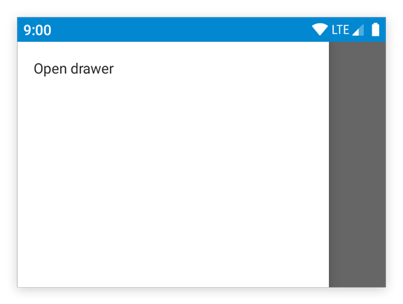

---
---
# Object "drawer"

<a href="https://developer.mozilla.org/en-US/docs/Web/JavaScript/Reference/Global_Objects/Object" title="View &quot;Object&quot; on MDN">Object</a> > <a href="NativeObject.html" title="NativeObject Class Reference">NativeObject</a> > <a href="Widget.html" title="Widget Class Reference">Widget</a> > <a href="Composite.html" title="Composite Class Reference">Composite</a> > <a href="ContentView.html" title="ContentView Object Reference">ContentView</a> > <a href="#" >Drawer</a>

A drawer that can be swiped in from the left edge of the screen. There's only a single instance that can be accessed via `tabris.drawer`. The drawer is locked by default. To use it in an application, set the property `enabled` to `true`. The drawer can contain any kind of widgets.


<div class="tabris-image"><figure><div></div><figcaption>Android</figcaption></figure><figure><div></div><figcaption>iOS</figcaption></figure></div>

Type: | <code style="white-space: nowrap">Drawer extends <a href="ContentView.html" title="ContentView Object Reference">ContentView</a></code>
Constructor: | private
Singleton: | `drawer`
Namespace: |<a href="../modules.html#startup" >tabris</a>
Direct subclasses: | None
JSX Support: | No


## Examples
### JavaScript


```js
import {TextView, drawer} from 'tabris';

drawer
  .set({enabled: true})
  .append(new TextView({text: 'Drawer content'}));
```


See also:
  
[<span class='language jsx'>JSX</span> Simple example of using a `Drawer`](https://playground.tabris.com/?gitref=v3.5.0&snippet=drawer.jsx)  
[<span class='language tsx'>TSX</span> Using a `Drawer` for app navigation](https://playground.tabris.com/?gitref=v3.5.0&snippet=drawer-pages.tsx)

## Methods

### close()


Closes the drawer.

Returns: <code style="white-space: nowrap"><a href="#" title="This object">this</a></code>

### open()


Opens the drawer. It may be useful to call this method on first startup, so that users notice the drawer and its contents.

Returns: <code style="white-space: nowrap"><a href="#" title="This object">this</a></code>


## Properties

### enabled


Controls whether the drawer can be opened and closed. When set to `false`, the drawer cannot be opened and calls to `drawer.open()` will be ignored.

Type: |<code style="white-space: nowrap"><a href="https://developer.mozilla.org/en-US/docs/Web/JavaScript/Data_structures#Boolean_type" title="View &quot;boolean&quot; on MDN">boolean</a></code>
Default: | <code style="white-space: nowrap"><a href="https://developer.mozilla.org/en-US/docs/Web/JavaScript/Data_structures#String_type" title="View &quot;string&quot; on MDN">false</a></code>
Settable: | <a href="../widget-basics.html#widget-properties" >Yes</a>
Change Event: | [`enabledChanged`](#enabledchanged)


## Events

### open

Fired when the drawer is opened and has reached its resting position.

EventObject Type: <code style="white-space: nowrap"><a href="EventObject.html" title="EventObject Class Reference">EventObject</a>&lt;<a href="#" >Drawer</a>&gt;</code>

This event has no additional parameter.
### close

Fired when the drawer is closed and has reached its resting position.

EventObject Type: <code style="white-space: nowrap"><a href="EventObject.html" title="EventObject Class Reference">EventObject</a>&lt;<a href="#" >Drawer</a>&gt;</code>

This event has no additional parameter.
## Change Events

### enabledChanged

Fired when the [enabled](#enabled) property has changed.

EventObject Type: <code style="white-space: nowrap"><a href="../types.html#propertychangedeventtargettype-valuetype" title="PropertyChangedEvent&lt;TargetType, ValueType&gt;">PropertyChangedEvent</a>&lt;<a href="#" >Drawer</a>, <a href="https://developer.mozilla.org/en-US/docs/Web/JavaScript/Data_structures#Boolean_type" title="View &quot;boolean&quot; on MDN">boolean</a>&gt;</code>

Property|Type|Description
-|-|-
value | <code style="white-space: nowrap"><a href="https://developer.mozilla.org/en-US/docs/Web/JavaScript/Data_structures#Boolean_type" title="View &quot;boolean&quot; on MDN">boolean</a></code> | The new value of [enabled](#enabled).

