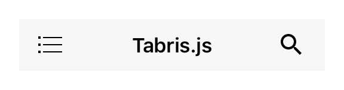

---
---
# Class "NavigationView"

<a href="https://developer.mozilla.org/en-US/docs/Web/JavaScript/Reference/Global_Objects/Object" title="View &quot;Object&quot; on MDN">Object</a> > <a href="NativeObject.html" title="NativeObject Class Reference">NativeObject</a> > <a href="Widget.html" title="Widget Class Reference">Widget</a> > <a href="Composite.html" title="Composite Class Reference">Composite</a> > <a href="#" >NavigationView</a>

A widget that displays a stack of [pages](Page) with a toolbar that allows to navigate back. The toolbar also displays the current page's title and the highest priority [actions](Action) that are added to the NavigationView. Only children of type `Page`, `Action` and `SearchAction` are supported. Since the NavigationView does not compute its own size, the width and height must be defined by the respective layout properties (e.g. either `width` or `left` and `right` must be specified).


<div class="tabris-image"><figure><div></div><figcaption>Android</figcaption></figure><figure><div></div><figcaption>iOS</figcaption></figure></div>

Type: | <code style="white-space: nowrap">NavigationView&lt;PageType, ActionType&gt;<br/>extends <a href="Composite.html" title="Composite Class Reference">Composite</a>&lt;<a href="#generics" title="Generic Parameter&quot;PageType&quot;">PageType</a> &#124; <a href="#generics" title="Generic Parameter&quot;ActionType&quot;">ActionType</a>&gt;</code>
Generics: | <span id="generics">PageType: *The common widget class of the pages this NavigationView can contain. Must be a subclass of <code style="white-space: nowrap"><a href="Page.html" title="Page Class Reference">Page</a></code> and defaults to <code style="white-space: nowrap"><a href="Page.html" title="Page Class Reference">Page</a></code>.*<br/>ActionType: *The common widget class of the actions this NavigationView can contain. Must be a subclass of <code style="white-space: nowrap"><a href="Action.html" title="Action Class Reference">Action</a></code> and defaults to <code style="white-space: nowrap"><a href="Action.html" title="Action Class Reference">Action</a></code>.*<br/></span>
Constructor: | public
Singleton: | No
Namespace: |<a href="../modules.html#startup" >tabris</a>
Direct subclasses: | None
JSX Support: | Element: <code style="white-space: nowrap"><a href="#" >&lt;NavigationView/&gt;</a></code><br/>Parent Elements: <code style="white-space: nowrap"><a href="Canvas.html" title="Canvas Class Reference">&lt;Canvas/&gt;</a></code>, <code style="white-space: nowrap"><a href="Cell.html" title="Cell Class Reference">&lt;Cell/&gt;</a></code>, <code style="white-space: nowrap"><a href="Composite.html" title="Composite Class Reference">&lt;Composite/&gt;</a></code>, <code style="white-space: nowrap"><a href="Page.html" title="Page Class Reference">&lt;Page/&gt;</a></code>, <code style="white-space: nowrap"><a href="RefreshComposite.html" title="RefreshComposite Class Reference">&lt;RefreshComposite/&gt;</a></code>, <code style="white-space: nowrap"><a href="Row.html" title="Row Class Reference">&lt;Row/&gt;</a></code>, <code style="white-space: nowrap"><a href="ScrollView.html" title="ScrollView Class Reference">&lt;ScrollView/&gt;</a></code>, <code style="white-space: nowrap"><a href="Stack.html" title="Stack Class Reference">&lt;Stack/&gt;</a></code>, <code style="white-space: nowrap"><a href="Tab.html" title="Tab Class Reference">&lt;Tab/&gt;</a></code><br/>Child Elements: <code style="white-space: nowrap"><a href="Page.html" title="Page Class Reference">&lt;Page/&gt;</a></code>, <code style="white-space: nowrap"><a href="Action.html" title="Action Class Reference">&lt;Action/&gt;</a></code>, <code style="white-space: nowrap"><a href="SearchAction.html" title="SearchAction Class Reference">&lt;SearchAction/&gt;</a></code><br/>

## Examples
### JavaScript


```js
import {NavigationView, Page, contentView} from 'tabris';

new NavigationView({layoutData: 'stretch'})
  .append(new Page({title: 'Albums'}))
  .appendTo(contentView);
```


See also:
  
[<span class='language jsx'>JSX</span> Creating a simple `NavigationView` with pages](https://playground.tabris.com/?gitref=v3.5.0&snippet=navigationview-page-stacked.jsx)  
[<span class='language jsx'>JSX</span> Demonstrating a `NavigationView` with various interactive properties](https://playground.tabris.com/?gitref=v3.5.0&snippet=navigationview-properties.jsx)  
[<span class='language js'>JS</span> Using multiple `NavigationViews` in `TabFolder` `Tabs`](https://playground.tabris.com/?gitref=v3.5.0&snippet=navigationview-tabfolder.js)  
[<span class='language jsx'>JSX</span> navigationview-action-placement.jsx](https://playground.tabris.com/?gitref=v3.5.0&snippet=navigationview-action-placement.jsx)  
[<span class='language jsx'>JSX</span> navigationview-action.jsx](https://playground.tabris.com/?gitref=v3.5.0&snippet=navigationview-action.jsx)  
[<span class='language jsx'>JSX</span> navigationview-searchaction.jsx](https://playground.tabris.com/?gitref=v3.5.0&snippet=navigationview-searchaction.jsx)

## Constructor

### new NavigationView(properties?)

Parameter|Type|Description
-|-|-
properties | <code style="white-space: nowrap"><a href="../types.html#propertieswidget" title="Properties&lt;Widget&gt;">Properties</a>&lt;<a href="#" >NavigationView</a>&gt;</code> | Sets all key-value pairs in the properties object as widget properties. *Optional.*

## Methods

### pages(selector?)


Returns the ordered list of pages on the page stack, with the bottommost page as the first and the topmost page as the last element. Same as children(), but only returns children that are of type `Page`.


Parameter|Type|Description
-|-|-
selector | <code style="white-space: nowrap"><a href="../selector.html" title="More about selectors">Selector</a></code> | A selector expression or a predicate function to filter the results. *Optional.*


Returns: <code style="white-space: nowrap"><a href="WidgetCollection.html" title="WidgetCollection Class Reference">WidgetCollection</a></code>


## Properties

### actionColor


The color used for action icons.

Type: |<code style="white-space: nowrap"><a href="../types.html#colorvalue" title="ColorValue Type Reference">ColorValue</a></code>
Settable: | <a href="../widget-basics.html#widget-properties" >Yes</a>
Change Event: | [`actionColorChanged`](#actioncolorchanged)


### actionTextColor
<p class="platforms"><span class='android-tag' title='supported on Android'>Android</span></p>

The color used for action texts. Only applied on Android, IOS uses the `actionColor` to colorize the action text.

Type: |<code style="white-space: nowrap"><a href="../types.html#colorvalue" title="ColorValue Type Reference">ColorValue</a></code>
Settable: | <a href="../widget-basics.html#widget-properties" >Yes</a>
Change Event: | [`actionTextColorChanged`](#actiontextcolorchanged)


### drawerActionVisible


Whether to display the so-called "Burger menu" to open the drawer.

Type: |<code style="white-space: nowrap"><a href="https://developer.mozilla.org/en-US/docs/Web/JavaScript/Data_structures#Boolean_type" title="View &quot;boolean&quot; on MDN">boolean</a></code>
Default: | <code style="white-space: nowrap"><a href="https://developer.mozilla.org/en-US/docs/Web/JavaScript/Data_structures#Boolean_type" title="View &quot;boolean&quot; on MDN">false</a></code>
Settable: | <a href="../widget-basics.html#widget-properties" >Yes</a>
Change Event: | [`drawerActionVisibleChanged`](#draweractionvisiblechanged)


### pageAnimation


Controls what animation to use when animating a page transition.

Type: |<code style="white-space: nowrap"><a href="https://developer.mozilla.org/en-US/docs/Web/JavaScript/Data_structures#String_type" title="View &quot;string&quot; on MDN">'default'</a> &#124; <a href="https://developer.mozilla.org/en-US/docs/Web/JavaScript/Data_structures#String_type" title="View &quot;string&quot; on MDN">'none'</a></code>
Default: | <code style="white-space: nowrap"><a href="https://developer.mozilla.org/en-US/docs/Web/JavaScript/Data_structures#String_type" title="View &quot;string&quot; on MDN">'default'</a></code>
Settable: | <a href="../widget-basics.html#widget-properties" >Yes</a>
Change Event: | [`pageAnimationChanged`](#pageanimationchanged)


### titleTextColor


The text color used for page titles.

Type: |<code style="white-space: nowrap"><a href="../types.html#colorvalue" title="ColorValue Type Reference">ColorValue</a></code>
Settable: | <a href="../widget-basics.html#widget-properties" >Yes</a>
Change Event: | [`titleTextColorChanged`](#titletextcolorchanged)


### toolbarColor


The background color of the toolbar.

Type: |<code style="white-space: nowrap"><a href="../types.html#colorvalue" title="ColorValue Type Reference">ColorValue</a></code>
Settable: | <a href="../widget-basics.html#widget-properties" >Yes</a>
Change Event: | [`toolbarColorChanged`](#toolbarcolorchanged)


### toolbarHeight


The height of the toolbar. Is 0 if not visible.

Type: |<code style="white-space: nowrap"><a href="https://developer.mozilla.org/en-US/docs/Web/JavaScript/Data_structures#Number_type" title="View &quot;number&quot; on MDN">number</a></code>
Settable: | <a href="../widget-basics.html#widget-properties" >Yes</a>
Change Event: | [`toolbarHeightChanged`](#toolbarheightchanged)


### toolbarVisible


Whether the toolbar is visible.

Type: |<code style="white-space: nowrap"><a href="https://developer.mozilla.org/en-US/docs/Web/JavaScript/Data_structures#Boolean_type" title="View &quot;boolean&quot; on MDN">boolean</a></code>
Default: | <code style="white-space: nowrap"><a href="https://developer.mozilla.org/en-US/docs/Web/JavaScript/Data_structures#Boolean_type" title="View &quot;boolean&quot; on MDN">true</a></code>
Settable: | <a href="../widget-basics.html#widget-properties" >Yes</a>
Change Event: | [`toolbarVisibleChanged`](#toolbarvisiblechanged)


## Change Events

### drawerActionVisibleChanged

Fired when the [drawerActionVisible](#draweractionvisible) property has changed.

EventObject Type: <code style="white-space: nowrap"><a href="../types.html#propertychangedeventtargettype-valuetype" title="PropertyChangedEvent&lt;TargetType, ValueType&gt;">PropertyChangedEvent</a>&lt;<a href="#" >NavigationView</a>, <a href="https://developer.mozilla.org/en-US/docs/Web/JavaScript/Data_structures#Boolean_type" title="View &quot;boolean&quot; on MDN">boolean</a>&gt;</code>

Property|Type|Description
-|-|-
value | <code style="white-space: nowrap"><a href="https://developer.mozilla.org/en-US/docs/Web/JavaScript/Data_structures#Boolean_type" title="View &quot;boolean&quot; on MDN">boolean</a></code> | The new value of [drawerActionVisible](#draweractionvisible).

### toolbarVisibleChanged

Fired when the [toolbarVisible](#toolbarvisible) property has changed.

EventObject Type: <code style="white-space: nowrap"><a href="../types.html#propertychangedeventtargettype-valuetype" title="PropertyChangedEvent&lt;TargetType, ValueType&gt;">PropertyChangedEvent</a>&lt;<a href="#" >NavigationView</a>, <a href="https://developer.mozilla.org/en-US/docs/Web/JavaScript/Data_structures#Boolean_type" title="View &quot;boolean&quot; on MDN">boolean</a>&gt;</code>

Property|Type|Description
-|-|-
value | <code style="white-space: nowrap"><a href="https://developer.mozilla.org/en-US/docs/Web/JavaScript/Data_structures#Boolean_type" title="View &quot;boolean&quot; on MDN">boolean</a></code> | The new value of [toolbarVisible](#toolbarvisible).

### toolbarColorChanged

Fired when the [toolbarColor](#toolbarcolor) property has changed.

EventObject Type: <code style="white-space: nowrap"><a href="../types.html#propertychangedeventtargettype-valuetype" title="PropertyChangedEvent&lt;TargetType, ValueType&gt;">PropertyChangedEvent</a>&lt;<a href="#" >NavigationView</a>, <a href="../types.html#colorvalue" title="ColorValue Type Reference">ColorValue</a>&gt;</code>

Property|Type|Description
-|-|-
value | <code style="white-space: nowrap"><a href="../types.html#colorvalue" title="ColorValue Type Reference">ColorValue</a></code> | The new value of [toolbarColor](#toolbarcolor).

### toolbarHeightChanged

Fired when the height of the toolbar changes, e.g. if it changes visibility.

EventObject Type: <code style="white-space: nowrap"><a href="../types.html#propertychangedeventtargettype-valuetype" title="PropertyChangedEvent&lt;TargetType, ValueType&gt;">PropertyChangedEvent</a>&lt;<a href="#" >NavigationView</a>, <a href="https://developer.mozilla.org/en-US/docs/Web/JavaScript/Data_structures#Number_type" title="View &quot;number&quot; on MDN">number</a>&gt;</code>

Property|Type|Description
-|-|-
value | <code style="white-space: nowrap"><a href="https://developer.mozilla.org/en-US/docs/Web/JavaScript/Data_structures#Number_type" title="View &quot;number&quot; on MDN">number</a></code> | The new value of [toolbarHeight](#toolbarheight).

### titleTextColorChanged

Fired when the [titleTextColor](#titletextcolor) property has changed.

EventObject Type: <code style="white-space: nowrap"><a href="../types.html#propertychangedeventtargettype-valuetype" title="PropertyChangedEvent&lt;TargetType, ValueType&gt;">PropertyChangedEvent</a>&lt;<a href="#" >NavigationView</a>, <a href="../types.html#colorvalue" title="ColorValue Type Reference">ColorValue</a>&gt;</code>

Property|Type|Description
-|-|-
value | <code style="white-space: nowrap"><a href="../types.html#colorvalue" title="ColorValue Type Reference">ColorValue</a></code> | The new value of [titleTextColor](#titletextcolor).

### actionColorChanged

Fired when the [actionColor](#actioncolor) property has changed.

EventObject Type: <code style="white-space: nowrap"><a href="../types.html#propertychangedeventtargettype-valuetype" title="PropertyChangedEvent&lt;TargetType, ValueType&gt;">PropertyChangedEvent</a>&lt;<a href="#" >NavigationView</a>, <a href="../types.html#colorvalue" title="ColorValue Type Reference">ColorValue</a>&gt;</code>

Property|Type|Description
-|-|-
value | <code style="white-space: nowrap"><a href="../types.html#colorvalue" title="ColorValue Type Reference">ColorValue</a></code> | The new value of [actionColor](#actioncolor).

### actionTextColorChanged

Fired when the [actionTextColor](#actiontextcolor) property has changed.

EventObject Type: <code style="white-space: nowrap"><a href="../types.html#propertychangedeventtargettype-valuetype" title="PropertyChangedEvent&lt;TargetType, ValueType&gt;">PropertyChangedEvent</a>&lt;<a href="#" >NavigationView</a>, <a href="../types.html#colorvalue" title="ColorValue Type Reference">ColorValue</a>&gt;</code>

Property|Type|Description
-|-|-
value | <code style="white-space: nowrap"><a href="../types.html#colorvalue" title="ColorValue Type Reference">ColorValue</a></code> | The new value of [actionTextColor](#actiontextcolor).

### pageAnimationChanged

Fired when the [pageAnimation](#pageanimation) property has changed.

EventObject Type: <code style="white-space: nowrap"><a href="../types.html#propertychangedeventtargettype-valuetype" title="PropertyChangedEvent&lt;TargetType, ValueType&gt;">PropertyChangedEvent</a>&lt;<a href="#" >NavigationView</a>, <a href="https://developer.mozilla.org/en-US/docs/Web/JavaScript/Data_structures#String_type" title="View &quot;string&quot; on MDN">string</a>&gt;</code>

Property|Type|Description
-|-|-
value | <code style="white-space: nowrap"><a href="https://developer.mozilla.org/en-US/docs/Web/JavaScript/Data_structures#String_type" title="View &quot;string&quot; on MDN">string</a></code> | The new value of [pageAnimation](#pageanimation).

