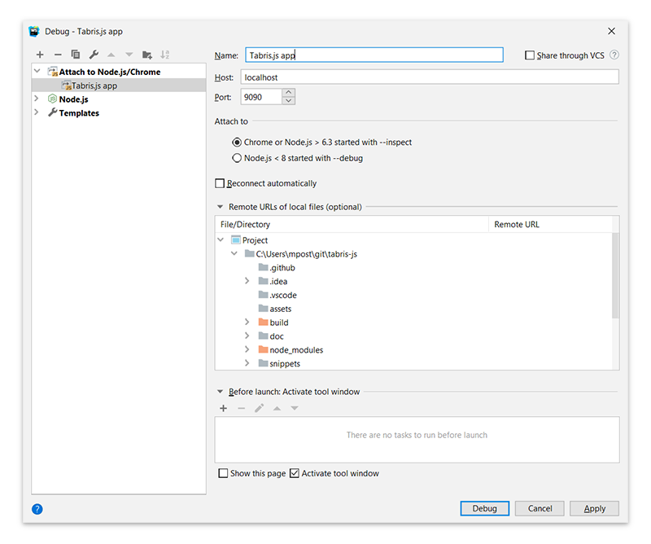

---
---
# Debugging Tabris.js

Tabris.js provides a global [`console`](./api/console.md) object with various useful logging functions including `console.trace()`. The [developer console](./developer-app.md#the-developer-tools) also allows entering javascript commands at runtime, as does the CLI using the `-i` switch, e.g. `tabris serve -i`. Since the tabris module exports are available as a global object the application state can be inspected. For example:

Print the app version:
```
console.log(tabris.app.version);
```

The CLI also provides [various keyboard shortcuts](./tabris-cli.md#keyboard-shortcuts) to interact with the connect app.

## Android

The Tabris.js Android client executes the application logic on the v8 javascript engine. This allows to use the v8 inspector protocol to debug a Tabris.js application with any compatible client.

### Setup

#### Developer machine

* Debugging is supported on all operating systems
* Compatible clients: [Chrome DevTools](https://developers.google.com/web/tools/chrome-devtools/), [Visual Studio Code](https://code.visualstudio.com/), [WebStorm](https://www.jetbrains.com/webstorm/) and more

#### Android device

* An installed Tabris.js app that has been built in debug mode, [either locally](./build.md#local-build) or via the [Tabris.js build service](./build.md#build-service).  The Tabris.js developer app from the app stores is not debuggable since the app is built in release mode.
* _OPTIONAL:_ When debugging on the Android emulator, its port has to be forwarded to the local machines port. Since the default debug port of a Tabris.js app is `9090` the port can be forwarded via the adb command: `adb forward tcp:9090 tcp:9090`

### How to debug

When launching a Tabris.js Android app, its debugger port is automatically opened on port `9090`. The app will start as usual and a debug client can connect to the app at any point in time. If you want to debug the app during startup you can activate the option _"Wait for debugger"_ in the on-device DevTools menu. This will delay app startup until a debug client is connected.


The debugger may not always break at a top level breakpoint, even when waiting for the debugger. To force the connected debugger to stop in the top level execution flow, the `debugger;` statement can be used:

```js
debugger; // the debugger will stop here

// more app code
```

#### Chrome DevTools

To connect the Chrome DevTools to a Tabris.js app on the default port `9090`, the following URL should be entered:

[`devtools://devtools/bundled/inspector.html?experiments=true&v8only=true&ws=<device-ip>:9090`](devtools://devtools/bundled/inspector.html?experiments=true&v8only=true&ws=<device-ip>:9090)

Exchange `<device-ip>` with the IP of your Android device.

#### Visual Studio Code

Visual Studio Code requires a launch configuration to connect to the Android device. It has to be inserted into the file `.vscode/launch.json`. When a Tabris.js app is created with the [tabris-cli](https://github.com/eclipsesource/tabris-js-cli) `init` command, the configuration is already in place.

```json
{
  "version": "0.2.0",
  "inputs": [
    {
      "id": "debugAddress",
      "type": "promptString",
      "default": "localhost",
      "description": "IP address of Android device"
    }
  ],
  "configurations": [
    {
      "name": "Debug Tabris.js on Android",
      "type": "node",
      "protocol": "inspector",
      "request": "attach",
      "port": 9090,
      "address": "${input:debugAddress}",
      "stopOnEntry": false,
      "cwd": "${workspaceFolder}",
      "trace": true,
      "sourceMaps": true,
      "restart": true,
      "skipFiles": [
        "node_modules/**/*.js"
      ]
    }
  ]
}

```

To debug your Tabris.js application on an Android device first click the debug icon on the Visual Studio Code activity bar. This opens the debug side bar where the launch configuration "Debug Tabris on Android" can be started. A UI prompt will ask for the device's IP address.

### WebStorm

Debugging on WebStorm is done with a Node.js launch configuration. Select _"Run -> Debug..."_ from the main menu and selection _"Edit Configurations..."_ from the popup. In the following dialog add a new configuration _"Attach to Node.js/Chrome"_ with the device IP address and the default debug port `9090`.

Select the _"Debug"_ button and WebStorm will connect to the Tabris.js debugger.



## iOS

### Setup

#### Developer machine

* Requires macOS
* Safari Browser, with the developer Menu enabled under "Safari -> Preferences -> Advanced".

#### iOS device

* An installed Tabris.js app that has been built in debug mode, [either locally](./build.md#local-build) or via the [Tabris.js build service](./build.md#build-service).
* Web Inspector enabled in "Settings -> Safari -> Advanced"

### How to debug

* Connect your iOS device via USB directly to the developer machine.
* Start the Tabris.js app.
* In Safari go to "Develop -> \{name-of-your-device} -> \{name-of-your-app} -> JSContext" (If there are multiple entries, kill and restart the entire app)
* Go to the "Resources" tab and set a breakpoint.
