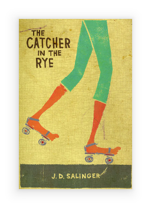

---
---
# Class "ImageView"

<a href="https://developer.mozilla.org/en-US/docs/Web/JavaScript/Reference/Global_Objects/Object" title="View &quot;Object&quot; on MDN">Object</a> > <a href="NativeObject.html" title="NativeObject Class Reference">NativeObject</a> > <a href="Widget.html" title="Widget Class Reference">Widget</a> > <a href="#" >ImageView</a>

A widget to display an image.


<div class="tabris-image"><figure><div></div><figcaption>Android</figcaption></figure><figure><div></div><figcaption>iOS</figcaption></figure></div>

Type: | <code style="white-space: nowrap">ImageView extends <a href="Widget.html" title="Widget Class Reference">Widget</a></code>
Constructor: | public
Singleton: | No
Namespace: |<a href="../modules.html#startup" >tabris</a>
Direct subclasses: | None
JSX Support: | Element: <code style="white-space: nowrap"><a href="#" >&lt;ImageView/&gt;</a></code><br/>Parent Elements: <code style="white-space: nowrap"><a href="Canvas.html" title="Canvas Class Reference">&lt;Canvas/&gt;</a></code>, <code style="white-space: nowrap"><a href="Cell.html" title="Cell Class Reference">&lt;Cell/&gt;</a></code>, <code style="white-space: nowrap"><a href="Composite.html" title="Composite Class Reference">&lt;Composite/&gt;</a></code>, <code style="white-space: nowrap"><a href="Page.html" title="Page Class Reference">&lt;Page/&gt;</a></code>, <code style="white-space: nowrap"><a href="RefreshComposite.html" title="RefreshComposite Class Reference">&lt;RefreshComposite/&gt;</a></code>, <code style="white-space: nowrap"><a href="Row.html" title="Row Class Reference">&lt;Row/&gt;</a></code>, <code style="white-space: nowrap"><a href="ScrollView.html" title="ScrollView Class Reference">&lt;ScrollView/&gt;</a></code>, <code style="white-space: nowrap"><a href="Stack.html" title="Stack Class Reference">&lt;Stack/&gt;</a></code>, <code style="white-space: nowrap"><a href="Tab.html" title="Tab Class Reference">&lt;Tab/&gt;</a></code><br/>Child Elements: *Not Supported*<br/>

## Examples
### JavaScript


```js
import {ImageView, contentView} from 'tabris';

new ImageView({image: 'resources/image.png'})
  .appendTo(contentView);
```


See also:
  
[<span class='language jsx'>JSX</span> Using an `ImageView` as a button](https://playground.tabris.com/?gitref=v3.7.0&snippet=imageview-as-a-button.jsx)  
[<span class='language jsx'>JSX</span> Creating `ImageView`s with various scale modes](https://playground.tabris.com/?gitref=v3.7.0&snippet=imageview-scalemode.jsx)  
[<span class='language jsx'>JSX</span> Creating an `ImageView` with support for pinch-to-zoom](https://playground.tabris.com/?gitref=v3.7.0&snippet=imageview-zoom.jsx)  
[<span class='language jsx'>JSX</span> Creating an `ImageView` with a tint color applied](https://playground.tabris.com/?gitref=v3.7.0&snippet=imageview-tintcolor.jsx)  
[<span class='language jsx'>JSX</span> Creating an `ImageView` with a load event callback](https://playground.tabris.com/?gitref=v3.7.0&snippet=imageview-load.jsx)  
[<span class='language jsx'>JSX</span> Using an `ImageView` to show a Base64 encoded image](https://playground.tabris.com/?gitref=v3.7.0&snippet=imageview-base64.jsx)  
[<span class='language jsx'>JSX</span> imageview-blob.jsx](https://playground.tabris.com/?gitref=v3.7.0&snippet=imageview-blob.jsx)  
[<span class='language tsx'>TSX</span> imageview-gallery.tsx](https://playground.tabris.com/?gitref=v3.7.0&snippet=imageview-gallery.tsx)  
[<span class='language jsx'>JSX</span> imageview-imagebitmap.jsx](https://playground.tabris.com/?gitref=v3.7.0&snippet=imageview-imagebitmap.jsx)  
[<span class='language jsx'>JSX</span> imageview-scalemode-auto.jsx](https://playground.tabris.com/?gitref=v3.7.0&snippet=imageview-scalemode-auto.jsx)  
[<span class='language jsx'>JSX</span> imageview.jsx](https://playground.tabris.com/?gitref=v3.7.0&snippet=imageview.jsx)

## Constructor

### new ImageView(properties?)

Parameter|Type|Description
-|-|-
properties | <code style="white-space: nowrap"><a href="Widget.html#propertieswidget" title="Widget Class Type">Properties</a>&lt;<a href="#" >ImageView</a>&gt;</code> | Sets all key-value pairs in the properties object as widget properties. *Optional.*

## Properties

### image


The image to display. Providing the `width` and `height` attributes on the image will resize it internally. When no dimensions are given the image will be loaded with its original size. Since the full size image might occupy a lot of memory, it's recommended to provide exact dimensions.

Type: |<code style="white-space: nowrap"><a href="Image.html#imagevalue" title="Image Class Type">ImageValue</a></code>
Settable: | <a href="../widget-basics.html#widget-properties" >Yes</a>
Change Event: | [`imageChanged`](#imagechanged)


### maxZoomLevel


The highest amount the image can be zoomed in to. Setting the `maxZoomLevel` to a level smaller than the current `zoomLevel` changes the `zoomLevel` to be the same as the new `maxZoomLevel`.

Type: |<code style="white-space: nowrap"><a href="https://developer.mozilla.org/en-US/docs/Web/JavaScript/Data_structures#Number_type" title="View &quot;number&quot; on MDN">number</a></code>
Default: | <code style="white-space: nowrap"><a href="https://developer.mozilla.org/en-US/docs/Web/JavaScript/Data_structures#Number_type" title="View &quot;number&quot; on MDN">3</a></code>
Settable: | <a href="../widget-basics.html#widget-properties" >Yes</a>
Change Event: | [`maxZoomLevelChanged`](#maxzoomlevelchanged)


### minZoomLevel


The lowest amount the image can be zoomed out to. Setting the `minZoomLevel` to a level larger than the current `zoomLevel` changes the `zoomLevel` to be the same as the new `minZoomLevel`. 

Type: |<code style="white-space: nowrap"><a href="https://developer.mozilla.org/en-US/docs/Web/JavaScript/Data_structures#Number_type" title="View &quot;number&quot; on MDN">number</a></code>
Default: | <code style="white-space: nowrap"><a href="https://developer.mozilla.org/en-US/docs/Web/JavaScript/Data_structures#Number_type" title="View &quot;number&quot; on MDN">1</a></code>
Settable: | <a href="../widget-basics.html#widget-properties" >Yes</a>
Change Event: | [`minZoomLevelChanged`](#minzoomlevelchanged)


### scaleMode


How to scale the image.

- `fit` will scale the image proportionally to fit into the view, possible leaving some empty space at the edges. That is, the image will be displayed as large as possible while being fully contained in the view.
- `fill` will scale the image proportionally to fill the entire view, possibly cutting off parts of the image. That is, the image will be displayed as small as possible while covering the entire view.
- `auto` will scale *down* the image to *fit* into the view if it is too large, but it won't scale up a smaller image.
- `stretch` will resize the image to the actual bounds of the image view.
- `none` will not resize the image at all. The image will be displayed in its original size.

Type: |<code style="white-space: nowrap"><a href="https://developer.mozilla.org/en-US/docs/Web/JavaScript/Data_structures#String_type" title="View &quot;string&quot; on MDN">'auto'</a> &#124; <a href="https://developer.mozilla.org/en-US/docs/Web/JavaScript/Data_structures#String_type" title="View &quot;string&quot; on MDN">'fit'</a> &#124; <a href="https://developer.mozilla.org/en-US/docs/Web/JavaScript/Data_structures#String_type" title="View &quot;string&quot; on MDN">'fill'</a> &#124; <a href="https://developer.mozilla.org/en-US/docs/Web/JavaScript/Data_structures#String_type" title="View &quot;string&quot; on MDN">'stretch'</a> &#124; <a href="https://developer.mozilla.org/en-US/docs/Web/JavaScript/Data_structures#String_type" title="View &quot;string&quot; on MDN">'none'</a></code>
Default: | <code style="white-space: nowrap"><a href="https://developer.mozilla.org/en-US/docs/Web/JavaScript/Data_structures#String_type" title="View &quot;string&quot; on MDN">'auto'</a></code>
Settable: | <a href="../widget-basics.html#widget-properties" >Yes</a>
Change Event: | [`scaleModeChanged`](#scalemodechanged)


See also:
  
[<span class='language jsx'>JSX</span> imageview-scalemode-auto.jsx](https://playground.tabris.com/?gitref=v3.7.0&snippet=imageview-scalemode-auto.jsx)  
[<span class='language jsx'>JSX</span> imageview-scalemode.jsx](https://playground.tabris.com/?gitref=v3.7.0&snippet=imageview-scalemode.jsx)


### tintColor


A color to change the image appearance. All opaque parts of the image will be tinted with the given color. Set to `initial` to remove the effect.

Type: |<code style="white-space: nowrap"><a href="Color.html#colorvalue" title="Color Class Type">ColorValue</a></code>
Settable: | <a href="../widget-basics.html#widget-properties" >Yes</a>
Change Event: | [`tintColorChanged`](#tintcolorchanged)


See also:
  
[<span class='language jsx'>JSX</span> imageview-tintcolor.jsx](https://playground.tabris.com/?gitref=v3.7.0&snippet=imageview-tintcolor.jsx)


### zoomEnabled


Enables the pinch-to-zoom gesture on the `ImageView` and makes the properties `zoomLevel`, `minZoomLevel` and `maxZoomLevel` available. Setting `zoomEnabled` to `false` also resets the `zoomLevel`, `minZoomLevel`, `maxZoomLevel` to their respective defaults.

Type: |<code style="white-space: nowrap"><a href="https://developer.mozilla.org/en-US/docs/Web/JavaScript/Data_structures#Boolean_type" title="View &quot;boolean&quot; on MDN">boolean</a></code>
Default: | <code style="white-space: nowrap"><a href="https://developer.mozilla.org/en-US/docs/Web/JavaScript/Data_structures#Boolean_type" title="View &quot;boolean&quot; on MDN">false</a></code>
Settable: | <a href="../widget-basics.html#widget-properties" >Yes</a>
Change Event: | [`zoomEnabledChanged`](#zoomenabledchanged)


### zoomLevel


The amount that the image is zoomed in or out. The default position without any zooming has the value 1.0.

Type: |<code style="white-space: nowrap"><a href="https://developer.mozilla.org/en-US/docs/Web/JavaScript/Data_structures#Number_type" title="View &quot;number&quot; on MDN">number</a></code>
Default: | <code style="white-space: nowrap"><a href="https://developer.mozilla.org/en-US/docs/Web/JavaScript/Data_structures#Number_type" title="View &quot;number&quot; on MDN">1</a></code>
Settable: | <a href="../widget-basics.html#widget-properties" >Yes</a>
Change Event: | [`zoomLevelChanged`](#zoomlevelchanged)


## Events

### load

Fired when the image loading has finished.

EventObject Type: <code style="white-space: nowrap">ImageViewLoadEvent&lt;<a href="#" >ImageView</a>&gt;</code>

Property|Type|Description
-|-|-
error | <code style="white-space: nowrap"><a href="https://developer.mozilla.org/en-US/docs/Web/JavaScript/Data_structures#Boolean_type" title="View &quot;boolean&quot; on MDN">boolean</a></code> | Contains the final status of the loading process


See also:
  
[<span class='language jsx'>JSX</span> imageview-load.jsx](https://playground.tabris.com/?gitref=v3.7.0&snippet=imageview-load.jsx)
### zoom

Fired when the user zooms the image in or out. The `zoom` event indicates a change to the `zoomLevel` property.

EventObject Type: <code style="white-space: nowrap">ImageViewZoomEvent&lt;<a href="#" >ImageView</a>&gt;</code>

Property|Type|Description
-|-|-
zoomLevel | <code style="white-space: nowrap"><a href="https://developer.mozilla.org/en-US/docs/Web/JavaScript/Data_structures#Number_type" title="View &quot;number&quot; on MDN">number</a></code> | The new value of *[zoomLevel](#zoomlevel)*.


See also:
  
[<span class='language jsx'>JSX</span> imageview-zoom.jsx](https://playground.tabris.com/?gitref=v3.7.0&snippet=imageview-zoom.jsx)
## Change Events

### imageChanged

Fired when the [image](#image) property has changed.

EventObject Type: <code style="white-space: nowrap"><a href="ChangeListeners.html#propertychangedeventtargettype-valuetype" title="ChangeListeners Class Type">PropertyChangedEvent</a>&lt;<a href="#" >ImageView</a>, <a href="Image.html#imagevalue" title="Image Class Type">ImageValue</a>&gt;</code>

Property|Type|Description
-|-|-
value | <code style="white-space: nowrap"><a href="Image.html#imagevalue" title="Image Class Type">ImageValue</a></code> | The new value of [image](#image).

### scaleModeChanged

Fired when the [scaleMode](#scalemode) property has changed.

EventObject Type: <code style="white-space: nowrap"><a href="ChangeListeners.html#propertychangedeventtargettype-valuetype" title="ChangeListeners Class Type">PropertyChangedEvent</a>&lt;<a href="#" >ImageView</a>, <a href="https://developer.mozilla.org/en-US/docs/Web/JavaScript/Data_structures#String_type" title="View &quot;string&quot; on MDN">string</a>&gt;</code>

Property|Type|Description
-|-|-
value | <code style="white-space: nowrap"><a href="https://developer.mozilla.org/en-US/docs/Web/JavaScript/Data_structures#String_type" title="View &quot;string&quot; on MDN">string</a></code> | The new value of [scaleMode](#scalemode).

### tintColorChanged

Fired when the [tintColor](#tintcolor) property has changed.

EventObject Type: <code style="white-space: nowrap"><a href="ChangeListeners.html#propertychangedeventtargettype-valuetype" title="ChangeListeners Class Type">PropertyChangedEvent</a>&lt;<a href="#" >ImageView</a>, <a href="Color.html#colorvalue" title="Color Class Type">ColorValue</a>&gt;</code>

Property|Type|Description
-|-|-
value | <code style="white-space: nowrap"><a href="Color.html#colorvalue" title="Color Class Type">ColorValue</a></code> | The new value of [tintColor](#tintcolor).

### zoomEnabledChanged

Fired when the [zoomEnabled](#zoomenabled) property has changed.

EventObject Type: <code style="white-space: nowrap"><a href="ChangeListeners.html#propertychangedeventtargettype-valuetype" title="ChangeListeners Class Type">PropertyChangedEvent</a>&lt;<a href="#" >ImageView</a>, <a href="https://developer.mozilla.org/en-US/docs/Web/JavaScript/Data_structures#Boolean_type" title="View &quot;boolean&quot; on MDN">boolean</a>&gt;</code>

Property|Type|Description
-|-|-
value | <code style="white-space: nowrap"><a href="https://developer.mozilla.org/en-US/docs/Web/JavaScript/Data_structures#Boolean_type" title="View &quot;boolean&quot; on MDN">boolean</a></code> | The new value of [zoomEnabled](#zoomenabled).

### zoomLevelChanged

Fired when the [zoomLevel](#zoomlevel) property has changed.

EventObject Type: <code style="white-space: nowrap"><a href="ChangeListeners.html#propertychangedeventtargettype-valuetype" title="ChangeListeners Class Type">PropertyChangedEvent</a>&lt;<a href="#" >ImageView</a>, <a href="https://developer.mozilla.org/en-US/docs/Web/JavaScript/Data_structures#Number_type" title="View &quot;number&quot; on MDN">number</a>&gt;</code>

Property|Type|Description
-|-|-
value | <code style="white-space: nowrap"><a href="https://developer.mozilla.org/en-US/docs/Web/JavaScript/Data_structures#Number_type" title="View &quot;number&quot; on MDN">number</a></code> | The new value of [zoomLevel](#zoomlevel).

### minZoomLevelChanged

Fired when the [minZoomLevel](#minzoomlevel) property has changed.

EventObject Type: <code style="white-space: nowrap"><a href="ChangeListeners.html#propertychangedeventtargettype-valuetype" title="ChangeListeners Class Type">PropertyChangedEvent</a>&lt;<a href="#" >ImageView</a>, <a href="https://developer.mozilla.org/en-US/docs/Web/JavaScript/Data_structures#Number_type" title="View &quot;number&quot; on MDN">number</a>&gt;</code>

Property|Type|Description
-|-|-
value | <code style="white-space: nowrap"><a href="https://developer.mozilla.org/en-US/docs/Web/JavaScript/Data_structures#Number_type" title="View &quot;number&quot; on MDN">number</a></code> | The new value of [minZoomLevel](#minzoomlevel).

### maxZoomLevelChanged

Fired when the [maxZoomLevel](#maxzoomlevel) property has changed.

EventObject Type: <code style="white-space: nowrap"><a href="ChangeListeners.html#propertychangedeventtargettype-valuetype" title="ChangeListeners Class Type">PropertyChangedEvent</a>&lt;<a href="#" >ImageView</a>, <a href="https://developer.mozilla.org/en-US/docs/Web/JavaScript/Data_structures#Number_type" title="View &quot;number&quot; on MDN">number</a>&gt;</code>

Property|Type|Description
-|-|-
value | <code style="white-space: nowrap"><a href="https://developer.mozilla.org/en-US/docs/Web/JavaScript/Data_structures#Number_type" title="View &quot;number&quot; on MDN">number</a></code> | The new value of [maxZoomLevel](#maxzoomlevel).


