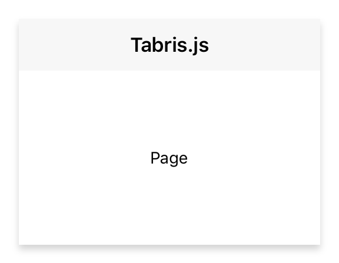

---
---
# Class "Page"

<a href="https://developer.mozilla.org/en-US/docs/Web/JavaScript/Reference/Global_Objects/Object" title="View &quot;Object&quot; on MDN">Object</a> > <a href="NativeObject.html" title="NativeObject Class Reference">NativeObject</a> > <a href="Widget.html" title="Widget Class Reference">Widget</a> > <a href="Composite.html" title="Composite Class Reference">Composite</a> > <a href="#" >Page</a>

A container representing a single page of a NavigationView widget.


<div class="tabris-image"><figure><div></div><figcaption>Android</figcaption></figure><figure><div></div><figcaption>iOS</figcaption></figure></div>

Type: | <code style="white-space: nowrap">Page extends <a href="Composite.html" title="Composite Class Reference">Composite</a></code>
Constructor: | public
Singleton: | No
Namespace: |<a href="../modules.html#startup" >tabris</a>
Direct subclasses: | None
JSX Support: | Element: <code style="white-space: nowrap"><a href="#" >&lt;Page/&gt;</a></code><br/>Parent Elements: <code style="white-space: nowrap"><a href="NavigationView.html" title="NavigationView Class Reference">&lt;NavigationView/&gt;</a></code><br/>Child Elements: *Any standalone widget element*<br/>

## Examples
### JavaScript


```js
import {NavigationView, Page, contentView} from 'tabris';

new NavigationView({layoutData: 'stretch'})
  .append(new Page({title: 'Albums'}))
  .appendTo(contentView);
```


See also:
  
[<span class='language jsx'>JSX</span> Creating a stack of pages](https://playground.tabris.com/?gitref=v3.7.0&snippet=navigationview-page-stacked.jsx)

## Constructor

### new Page(properties?)

Parameter|Type|Description
-|-|-
properties | <code style="white-space: nowrap"><a href="Widget.html#propertieswidget" title="Widget Class Type">Properties</a>&lt;<a href="#" >Page</a>&gt;</code> | Sets all key-value pairs in the properties object as widget properties. *Optional.*

## Methods

### insertBefore(widget)


Inserts this widget directly before the given `Page`.


Parameter|Type|Description
-|-|-
widget | <code style="white-space: nowrap"><a href="#" >Page</a></code> | 


Returns: <code style="white-space: nowrap"><a href="#" title="This object">this</a></code>


## Properties

### autoDispose


Defines whether this page will be automatically disposed when popped from the NavigationView, e.g. using native back navigation.

Type: |<code style="white-space: nowrap"><a href="https://developer.mozilla.org/en-US/docs/Web/JavaScript/Data_structures#Boolean_type" title="View &quot;boolean&quot; on MDN">boolean</a></code>
Default: | <code style="white-space: nowrap"><a href="https://developer.mozilla.org/en-US/docs/Web/JavaScript/Data_structures#String_type" title="View &quot;string&quot; on MDN">true</a></code>
Settable: | <a href="../widget-basics.html#widget-properties" >Yes</a>
Change Event: | [`autoDisposeChanged`](#autodisposechanged)


### image


An image to be displayed in the navigation bar

Type: |<code style="white-space: nowrap"><a href="Image.html#imagevalue" title="Image Class Type">ImageValue</a></code>
Settable: | <a href="../widget-basics.html#widget-properties" >Yes</a>
Change Event: | [`imageChanged`](#imagechanged)


### title


The page title to be displayed in the navigation bar.

Type: |<code style="white-space: nowrap"><a href="https://developer.mozilla.org/en-US/docs/Web/JavaScript/Data_structures#String_type" title="View &quot;string&quot; on MDN">string</a></code>
Settable: | <a href="../widget-basics.html#widget-properties" >Yes</a>
Change Event: | [`titleChanged`](#titlechanged)


## Events

### appear

Fired when the page is about to become visible, i.e. it has become the active page.

EventObject Type: <code style="white-space: nowrap"><a href="EventObject.html" title="EventObject Class Reference">EventObject</a>&lt;<a href="#" >Page</a>&gt;</code>

This event has no additional parameter.
### disappear

Fired when the page is no longer visible, i.e. another page has become the active page.

EventObject Type: <code style="white-space: nowrap"><a href="EventObject.html" title="EventObject Class Reference">EventObject</a>&lt;<a href="#" >Page</a>&gt;</code>

This event has no additional parameter.
## Change Events

### imageChanged

Fired when the [image](#image) property has changed.

EventObject Type: <code style="white-space: nowrap"><a href="ChangeListeners.html#propertychangedeventtargettype-valuetype" title="ChangeListeners Class Type">PropertyChangedEvent</a>&lt;<a href="#" >Page</a>, <a href="Image.html#imagevalue" title="Image Class Type">ImageValue</a>&gt;</code>

Property|Type|Description
-|-|-
value | <code style="white-space: nowrap"><a href="Image.html#imagevalue" title="Image Class Type">ImageValue</a></code> | The new value of [image](#image).

### titleChanged

Fired when the [title](#title) property has changed.

EventObject Type: <code style="white-space: nowrap"><a href="ChangeListeners.html#propertychangedeventtargettype-valuetype" title="ChangeListeners Class Type">PropertyChangedEvent</a>&lt;<a href="#" >Page</a>, <a href="https://developer.mozilla.org/en-US/docs/Web/JavaScript/Data_structures#String_type" title="View &quot;string&quot; on MDN">string</a>&gt;</code>

Property|Type|Description
-|-|-
value | <code style="white-space: nowrap"><a href="https://developer.mozilla.org/en-US/docs/Web/JavaScript/Data_structures#String_type" title="View &quot;string&quot; on MDN">string</a></code> | The new value of [title](#title).

### autoDisposeChanged

Fired when the [autoDispose](#autodispose) property has changed.

EventObject Type: <code style="white-space: nowrap"><a href="ChangeListeners.html#propertychangedeventtargettype-valuetype" title="ChangeListeners Class Type">PropertyChangedEvent</a>&lt;<a href="#" >Page</a>, <a href="https://developer.mozilla.org/en-US/docs/Web/JavaScript/Data_structures#Boolean_type" title="View &quot;boolean&quot; on MDN">boolean</a>&gt;</code>

Property|Type|Description
-|-|-
value | <code style="white-space: nowrap"><a href="https://developer.mozilla.org/en-US/docs/Web/JavaScript/Data_structures#Boolean_type" title="View &quot;boolean&quot; on MDN">boolean</a></code> | The new value of [autoDispose](#autodispose).


