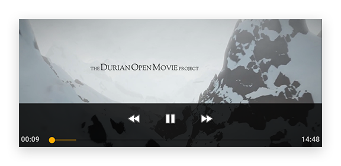
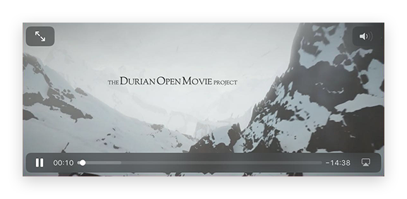
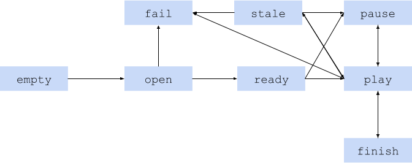

---
---
# Class "Video"

<a href="https://developer.mozilla.org/en-US/docs/Web/JavaScript/Reference/Global_Objects/Object" title="View &quot;Object&quot; on MDN">Object</a> > <a href="NativeObject.html" title="NativeObject Class Reference">NativeObject</a> > <a href="Widget.html" title="Widget Class Reference">Widget</a> > <a href="#" >Video</a>

A widget that plays a video from an URL.


<div class="tabris-image"><figure><div></div><figcaption>Android</figcaption></figure><figure><div></div><figcaption>iOS</figcaption></figure></div>

Type: | <code style="white-space: nowrap">Video extends <a href="Widget.html" title="Widget Class Reference">Widget</a></code>
Constructor: | public
Singleton: | No
Namespace: |<a href="../modules.html#startup" >tabris</a>
Direct subclasses: | None
JSX Support: | Element: <code style="white-space: nowrap"><a href="#" >&lt;Video/&gt;</a></code><br/>Parent Elements: <code style="white-space: nowrap"><a href="Canvas.html" title="Canvas Class Reference">&lt;Canvas/&gt;</a></code>, <code style="white-space: nowrap"><a href="Cell.html" title="Cell Class Reference">&lt;Cell/&gt;</a></code>, <code style="white-space: nowrap"><a href="Composite.html" title="Composite Class Reference">&lt;Composite/&gt;</a></code>, <code style="white-space: nowrap"><a href="Page.html" title="Page Class Reference">&lt;Page/&gt;</a></code>, <code style="white-space: nowrap"><a href="RefreshComposite.html" title="RefreshComposite Class Reference">&lt;RefreshComposite/&gt;</a></code>, <code style="white-space: nowrap"><a href="Row.html" title="Row Class Reference">&lt;Row/&gt;</a></code>, <code style="white-space: nowrap"><a href="ScrollView.html" title="ScrollView Class Reference">&lt;ScrollView/&gt;</a></code>, <code style="white-space: nowrap"><a href="Stack.html" title="Stack Class Reference">&lt;Stack/&gt;</a></code>, <code style="white-space: nowrap"><a href="Tab.html" title="Tab Class Reference">&lt;Tab/&gt;</a></code><br/>Child Elements: *Not Supported*<br/>

## Examples
### JavaScript


```js
import {Video, contentView} from 'tabris';

new Video({
  width: 160, height: 90,
  url: 'resources/video.mp4'
}).appendTo(contentView);
```


See also:
  
[<span class='language js'>JS</span> Creating a `Video` widget](https://playground.tabris.com/?gitref=v3.7.0&snippet=video.js)

## Constructor

### new Video(properties?)

Parameter|Type|Description
-|-|-
properties | <code style="white-space: nowrap"><a href="Widget.html#propertieswidget" title="Widget Class Type">Properties</a>&lt;<a href="#" >Video</a>&gt;</code> | Sets all key-value pairs in the properties object as widget properties. *Optional.*

## Methods

### pause()


Pauses the video. *[state](#state)* changes to `pause` and `speed` to `0`. Has no effect when *[state](#state)* is not `play`.

Returns: <code style="white-space: nowrap"><a href="https://developer.mozilla.org/en-US/docs/Web/JavaScript/Data_structures#Undefined_type" title="View &quot;undefined&quot; on MDN">undefined</a></code>

### play(speed?)


Starts playing the video, *[state](#state)* changes to `play`. Has no effect unless the current state is either `pause` or `ready`.


Parameter|Type|Description
-|-|-
speed | <code style="white-space: nowrap"><a href="https://developer.mozilla.org/en-US/docs/Web/JavaScript/Data_structures#Number_type" title="View &quot;number&quot; on MDN">number</a></code> | Desired playback speed. If the given speed is not supported by the platform or video, the actual playback speed will be `1` - i.e. the natural speed of the video. *Optional.*


Returns: <code style="white-space: nowrap"><a href="https://developer.mozilla.org/en-US/docs/Web/JavaScript/Data_structures#Undefined_type" title="View &quot;undefined&quot; on MDN">undefined</a></code>

### seek(position)


Attempts to change the `position` to the given time index. Success depends on the currently loaded video. Has no effect if the current *[state](#state)* is `empty` or `fail`.


Parameter|Type|Description
-|-|-
position | <code style="white-space: nowrap"><a href="https://developer.mozilla.org/en-US/docs/Web/JavaScript/Data_structures#Number_type" title="View &quot;number&quot; on MDN">number</a></code> | Desired position in milliseconds.


Returns: <code style="white-space: nowrap"><a href="https://developer.mozilla.org/en-US/docs/Web/JavaScript/Data_structures#Undefined_type" title="View &quot;undefined&quot; on MDN">undefined</a></code>


## Properties

### autoPlay


If set to `true`, starts playing the video as soon as the state changes from `open` to `ready`.

Type: |<code style="white-space: nowrap"><a href="https://developer.mozilla.org/en-US/docs/Web/JavaScript/Data_structures#Boolean_type" title="View &quot;boolean&quot; on MDN">boolean</a></code>
Default: | <code style="white-space: nowrap"><a href="https://developer.mozilla.org/en-US/docs/Web/JavaScript/Data_structures#String_type" title="View &quot;string&quot; on MDN">true</a></code>
Settable: | <a href="../widget-basics.html#widget-properties" >Yes</a>
Change Event: | [`autoPlayChanged`](#autoplaychanged)


### controlsVisible


If set to `true`, overlays the video with a native UI for controlling playback.

Type: |<code style="white-space: nowrap"><a href="https://developer.mozilla.org/en-US/docs/Web/JavaScript/Data_structures#Boolean_type" title="View &quot;boolean&quot; on MDN">boolean</a></code>
Default: | <code style="white-space: nowrap"><a href="https://developer.mozilla.org/en-US/docs/Web/JavaScript/Data_structures#String_type" title="View &quot;string&quot; on MDN">true</a></code>
Settable: | <a href="../widget-basics.html#widget-properties" >Yes</a>
Change Event: | [`controlsVisibleChanged`](#controlsvisiblechanged)


### duration


Returns the full length of the current video in milliseconds.

Type: |<code style="white-space: nowrap"><a href="https://developer.mozilla.org/en-US/docs/Web/JavaScript/Data_structures#Number_type" title="View &quot;number&quot; on MDN">number</a></code>
Settable: | <a href="../widget-basics.html#widget-properties" >No</a>
Change Event: | [`durationChanged`](#durationchanged)


### position


Returns the current playback position in milliseconds. This property does not trigger any change events.

Type: |<code style="white-space: nowrap"><a href="https://developer.mozilla.org/en-US/docs/Web/JavaScript/Data_structures#Number_type" title="View &quot;number&quot; on MDN">number</a></code>
Settable: | <a href="../widget-basics.html#widget-properties" >No</a>
Change Event: | [`positionChanged`](#positionchanged)


### speed


Returns the current playback speed. The value `1` represents the natural speed of the video. When the *[state](#state)* of the widget is not `play` this property always has the value `0`.

Type: |<code style="white-space: nowrap"><a href="https://developer.mozilla.org/en-US/docs/Web/JavaScript/Data_structures#Number_type" title="View &quot;number&quot; on MDN">number</a></code>
Settable: | <a href="../widget-basics.html#widget-properties" >No</a>
Change Event: | [`speedChanged`](#speedchanged)


### state


The current video playback state of the widget.



- `'empty'` -  No `url` has been set.
- `'open'` - The `url` has been set to a valid value but the widget is not yet ready to play.
- `'ready'` - The widget has loaded enough content to be ready to play, but is not yet playing.
- `'play'` - A video is currently playing.
- `'stale'` - The video is paused because it is buffering more content and will resume playback once it has enough content.
- `'pause'` - Playback is paused because of user input or `pause()` has been called.
- `'finish'` - Playback stopped at the end of the video.
- `'fail'` - An error occurred preventing video playback.

Type: |<code style="white-space: nowrap"><a href="https://developer.mozilla.org/en-US/docs/Web/JavaScript/Data_structures#String_type" title="View &quot;string&quot; on MDN">'empty'</a> &#124; <a href="https://developer.mozilla.org/en-US/docs/Web/JavaScript/Data_structures#String_type" title="View &quot;string&quot; on MDN">'open'</a> &#124; <a href="https://developer.mozilla.org/en-US/docs/Web/JavaScript/Data_structures#String_type" title="View &quot;string&quot; on MDN">'ready'</a> &#124; <a href="https://developer.mozilla.org/en-US/docs/Web/JavaScript/Data_structures#String_type" title="View &quot;string&quot; on MDN">'play'</a> &#124; <a href="https://developer.mozilla.org/en-US/docs/Web/JavaScript/Data_structures#String_type" title="View &quot;string&quot; on MDN">'stale'</a> &#124; <a href="https://developer.mozilla.org/en-US/docs/Web/JavaScript/Data_structures#String_type" title="View &quot;string&quot; on MDN">'pause'</a> &#124; <a href="https://developer.mozilla.org/en-US/docs/Web/JavaScript/Data_structures#String_type" title="View &quot;string&quot; on MDN">'finish'</a> &#124; <a href="https://developer.mozilla.org/en-US/docs/Web/JavaScript/Data_structures#String_type" title="View &quot;string&quot; on MDN">'fail'</a></code>
Default: | <code style="white-space: nowrap"><a href="https://developer.mozilla.org/en-US/docs/Web/JavaScript/Data_structures#String_type" title="View &quot;string&quot; on MDN">'empty'</a></code>
Settable: | <a href="../widget-basics.html#widget-properties" >No</a>
Change Event: | [`stateChanged`](#statechanged)


### url


The URL of the video to play. Setting this property to any non-empty string changes the *[state](#state)* to `open` and the video starts loading. Setting this property to an empty string unloads the current video and the *[state](#state)* returns to `empty`.

Type: |<code style="white-space: nowrap"><a href="https://developer.mozilla.org/en-US/docs/Web/JavaScript/Data_structures#String_type" title="View &quot;string&quot; on MDN">string</a></code>
Settable: | <a href="../widget-basics.html#widget-properties" >Yes</a>
Change Event: | [`urlChanged`](#urlchanged)


## Change Events

### urlChanged

Fired when the [url](#url) property has changed.

EventObject Type: <code style="white-space: nowrap"><a href="ChangeListeners.html#propertychangedeventtargettype-valuetype" title="ChangeListeners Class Type">PropertyChangedEvent</a>&lt;<a href="#" >Video</a>, <a href="https://developer.mozilla.org/en-US/docs/Web/JavaScript/Data_structures#String_type" title="View &quot;string&quot; on MDN">string</a>&gt;</code>

Property|Type|Description
-|-|-
value | <code style="white-space: nowrap"><a href="https://developer.mozilla.org/en-US/docs/Web/JavaScript/Data_structures#String_type" title="View &quot;string&quot; on MDN">string</a></code> | The new value of [url](#url).

### controlsVisibleChanged

Fired when the [controlsVisible](#controlsvisible) property has changed.

EventObject Type: <code style="white-space: nowrap"><a href="ChangeListeners.html#propertychangedeventtargettype-valuetype" title="ChangeListeners Class Type">PropertyChangedEvent</a>&lt;<a href="#" >Video</a>, <a href="https://developer.mozilla.org/en-US/docs/Web/JavaScript/Data_structures#Boolean_type" title="View &quot;boolean&quot; on MDN">boolean</a>&gt;</code>

Property|Type|Description
-|-|-
value | <code style="white-space: nowrap"><a href="https://developer.mozilla.org/en-US/docs/Web/JavaScript/Data_structures#Boolean_type" title="View &quot;boolean&quot; on MDN">boolean</a></code> | The new value of [controlsVisible](#controlsvisible).

### autoPlayChanged

Fired when the [autoPlay](#autoplay) property has changed.

EventObject Type: <code style="white-space: nowrap"><a href="ChangeListeners.html#propertychangedeventtargettype-valuetype" title="ChangeListeners Class Type">PropertyChangedEvent</a>&lt;<a href="#" >Video</a>, <a href="https://developer.mozilla.org/en-US/docs/Web/JavaScript/Data_structures#Boolean_type" title="View &quot;boolean&quot; on MDN">boolean</a>&gt;</code>

Property|Type|Description
-|-|-
value | <code style="white-space: nowrap"><a href="https://developer.mozilla.org/en-US/docs/Web/JavaScript/Data_structures#Boolean_type" title="View &quot;boolean&quot; on MDN">boolean</a></code> | The new value of [autoPlay](#autoplay).

### speedChanged

Fired when the [speed](#speed) property has changed.

EventObject Type: <code style="white-space: nowrap"><a href="ChangeListeners.html#propertychangedeventtargettype-valuetype" title="ChangeListeners Class Type">PropertyChangedEvent</a>&lt;<a href="#" >Video</a>, <a href="https://developer.mozilla.org/en-US/docs/Web/JavaScript/Data_structures#Number_type" title="View &quot;number&quot; on MDN">number</a>&gt;</code>

Property|Type|Description
-|-|-
value | <code style="white-space: nowrap"><a href="https://developer.mozilla.org/en-US/docs/Web/JavaScript/Data_structures#Number_type" title="View &quot;number&quot; on MDN">number</a></code> | The new value of [speed](#speed).

### positionChanged

Fired when the [position](#position) property has changed.

EventObject Type: <code style="white-space: nowrap"><a href="ChangeListeners.html#propertychangedeventtargettype-valuetype" title="ChangeListeners Class Type">PropertyChangedEvent</a>&lt;<a href="#" >Video</a>, <a href="https://developer.mozilla.org/en-US/docs/Web/JavaScript/Data_structures#Number_type" title="View &quot;number&quot; on MDN">number</a>&gt;</code>

Property|Type|Description
-|-|-
value | <code style="white-space: nowrap"><a href="https://developer.mozilla.org/en-US/docs/Web/JavaScript/Data_structures#Number_type" title="View &quot;number&quot; on MDN">number</a></code> | The new value of [position](#position).

### durationChanged

Fired when the [duration](#duration) property has changed.

EventObject Type: <code style="white-space: nowrap"><a href="ChangeListeners.html#propertychangedeventtargettype-valuetype" title="ChangeListeners Class Type">PropertyChangedEvent</a>&lt;<a href="#" >Video</a>, <a href="https://developer.mozilla.org/en-US/docs/Web/JavaScript/Data_structures#Number_type" title="View &quot;number&quot; on MDN">number</a>&gt;</code>

Property|Type|Description
-|-|-
value | <code style="white-space: nowrap"><a href="https://developer.mozilla.org/en-US/docs/Web/JavaScript/Data_structures#Number_type" title="View &quot;number&quot; on MDN">number</a></code> | The new value of [duration](#duration).

### stateChanged

Fired when the [state](#state) property has changed.

EventObject Type: <code style="white-space: nowrap"><a href="ChangeListeners.html#propertychangedeventtargettype-valuetype" title="ChangeListeners Class Type">PropertyChangedEvent</a>&lt;<a href="#" >Video</a>, <a href="https://developer.mozilla.org/en-US/docs/Web/JavaScript/Data_structures#String_type" title="View &quot;string&quot; on MDN">string</a>&gt;</code>

Property|Type|Description
-|-|-
value | <code style="white-space: nowrap"><a href="https://developer.mozilla.org/en-US/docs/Web/JavaScript/Data_structures#String_type" title="View &quot;string&quot; on MDN">string</a></code> | The new value of [state](#state).


