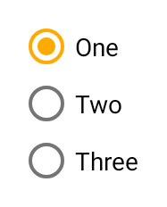

---
---
# Class "RadioButton"

<a href="https://developer.mozilla.org/en-US/docs/Web/JavaScript/Reference/Global_Objects/Object" title="View &quot;Object&quot; on MDN">Object</a> > <a href="NativeObject.html" title="NativeObject Class Reference">NativeObject</a> > <a href="Widget.html" title="Widget Class Reference">Widget</a> > <a href="#" >RadioButton</a>

A radio button. Selecting a radio button de-selects all its siblings (i.e. all radio buttons within the same parent).


<div class="tabris-image"><figure><div></div><figcaption>Android</figcaption></figure><figure><div></div><figcaption>iOS</figcaption></figure></div>

Type: | <code style="white-space: nowrap">RadioButton extends <a href="Widget.html" title="Widget Class Reference">Widget</a></code>
Constructor: | public
Singleton: | No
Namespace: |<a href="../modules.html#startup" >tabris</a>
Direct subclasses: | None
JSX Support: | Element: <code style="white-space: nowrap"><a href="#" >&lt;RadioButton/&gt;</a></code><br/>Parent Elements: <code style="white-space: nowrap"><a href="Canvas.html" title="Canvas Class Reference">&lt;Canvas/&gt;</a></code>, <code style="white-space: nowrap"><a href="Cell.html" title="Cell Class Reference">&lt;Cell/&gt;</a></code>, <code style="white-space: nowrap"><a href="Composite.html" title="Composite Class Reference">&lt;Composite/&gt;</a></code>, <code style="white-space: nowrap"><a href="Page.html" title="Page Class Reference">&lt;Page/&gt;</a></code>, <code style="white-space: nowrap"><a href="RefreshComposite.html" title="RefreshComposite Class Reference">&lt;RefreshComposite/&gt;</a></code>, <code style="white-space: nowrap"><a href="Row.html" title="Row Class Reference">&lt;Row/&gt;</a></code>, <code style="white-space: nowrap"><a href="ScrollView.html" title="ScrollView Class Reference">&lt;ScrollView/&gt;</a></code>, <code style="white-space: nowrap"><a href="Stack.html" title="Stack Class Reference">&lt;Stack/&gt;</a></code>, <code style="white-space: nowrap"><a href="Tab.html" title="Tab Class Reference">&lt;Tab/&gt;</a></code><br/>Child Elements: *Not Supported*<br/>Element content sets: [<code style="white-space: nowrap">text</code>](#text)

## Examples
### JavaScript


```js
import {RadioButton, contentView} from 'tabris';

new RadioButton({text: 'One', checked: true})
  .onSelect(event => console.log(`Checked: ${event.checked}`))
  .appendTo(contentView);

new RadioButton({text: 'Two'})
  .onSelect(event => console.log(`Checked: ${event.checked}`))
  .appendTo(contentView);
```


See also:
  
[<span class='language jsx'>JSX</span> Creating a set of `RadioButtons`](https://github.com/eclipsesource/tabris-js/tree/v3.8.0/snippets/radiobutton.jsx) <span style="font-size: 75%;">[<a href="https://playground.tabris.com/?gitref=v3.8.0&snippet=radiobutton.jsx" style="color: cadetblue;">► Run in Playground</a>]</span>

## Constructor

### new RadioButton(properties?)

Parameter|Type|Description
-|-|-
properties | <code style="white-space: nowrap"><a href="Widget.html#propertieswidget" title="Widget Class Type">Properties</a>&lt;<a href="#" >RadioButton</a>&gt;</code> | Sets all key-value pairs in the properties object as widget properties. *Optional.*

## Properties

### checked


The checked state of the radio button.

Type: |<code style="white-space: nowrap"><a href="https://developer.mozilla.org/en-US/docs/Web/JavaScript/Data_structures#boolean_type" title="View &quot;boolean&quot; on MDN">boolean</a></code>
Default: | <code style="white-space: nowrap"><a href="https://developer.mozilla.org/en-US/docs/Web/JavaScript/Data_structures#string_type" title="View &quot;string&quot; on MDN">false</a></code>
Settable: | <a href="../widget-basics.html#widget-properties" >Yes</a>
Change Event: | [`checkedChanged`](#checkedchanged)


### checkedTintColor


The color of the selectable area in checked state. Will fall back to `tintColor` if not set.

Type: |<code style="white-space: nowrap"><a href="Color.html#colorvalue" title="Color Class Type">ColorValue</a></code>
Settable: | <a href="../widget-basics.html#widget-properties" >Yes</a>
Change Event: | [`checkedTintColorChanged`](#checkedtintcolorchanged)


### font


The font used for the text.

Type: |<code style="white-space: nowrap"><a href="Font.html#fontvalue" title="Font Class Type">FontValue</a></code>
Settable: | <a href="../widget-basics.html#widget-properties" >Yes</a>
Change Event: | [`fontChanged`](#fontchanged)


### text


The label text of the radio button.

Type: |<code style="white-space: nowrap"><a href="https://developer.mozilla.org/en-US/docs/Web/JavaScript/Data_structures#string_type" title="View &quot;string&quot; on MDN">string</a></code>
Settable: | <a href="../widget-basics.html#widget-properties" >Yes</a>
Change Event: | [`textChanged`](#textchanged)
JSX Content Type: | [Text](../declarative-ui.md#jsx-specifics)


When using RadioButton as an JSX element the elements Text content is mapped to this property.

### textColor


The color of the text.

Type: |<code style="white-space: nowrap"><a href="Color.html#colorvalue" title="Color Class Type">ColorValue</a></code>
Settable: | <a href="../widget-basics.html#widget-properties" >Yes</a>
Change Event: | [`textColorChanged`](#textcolorchanged)


### tintColor


The color of the selectable area.

Type: |<code style="white-space: nowrap"><a href="Color.html#colorvalue" title="Color Class Type">ColorValue</a></code>
Settable: | <a href="../widget-basics.html#widget-properties" >Yes</a>
Change Event: | [`tintColorChanged`](#tintcolorchanged)


## Events

### select

Fired when the radio button is selected or deselected by the user.

EventObject Type: <code style="white-space: nowrap">RadioButtonSelectEvent&lt;<a href="#" >RadioButton</a>&gt;</code>

Property|Type|Description
-|-|-
checked | <code style="white-space: nowrap"><a href="https://developer.mozilla.org/en-US/docs/Web/JavaScript/Data_structures#boolean_type" title="View &quot;boolean&quot; on MDN">boolean</a></code> | The new value of *[checked](#checked)*.

## Change Events

### checkedChanged

Fired when the [checked](#checked) property has changed.

EventObject Type: <code style="white-space: nowrap"><a href="ChangeListeners.html#propertychangedeventtargettype-valuetype" title="ChangeListeners Class Type">PropertyChangedEvent</a>&lt;<a href="#" >RadioButton</a>, <a href="https://developer.mozilla.org/en-US/docs/Web/JavaScript/Data_structures#boolean_type" title="View &quot;boolean&quot; on MDN">boolean</a>&gt;</code>

Property|Type|Description
-|-|-
value | <code style="white-space: nowrap"><a href="https://developer.mozilla.org/en-US/docs/Web/JavaScript/Data_structures#boolean_type" title="View &quot;boolean&quot; on MDN">boolean</a></code> | The new value of [checked](#checked).

### textChanged

Fired when the [text](#text) property has changed.

EventObject Type: <code style="white-space: nowrap"><a href="ChangeListeners.html#propertychangedeventtargettype-valuetype" title="ChangeListeners Class Type">PropertyChangedEvent</a>&lt;<a href="#" >RadioButton</a>, <a href="https://developer.mozilla.org/en-US/docs/Web/JavaScript/Data_structures#string_type" title="View &quot;string&quot; on MDN">string</a>&gt;</code>

Property|Type|Description
-|-|-
value | <code style="white-space: nowrap"><a href="https://developer.mozilla.org/en-US/docs/Web/JavaScript/Data_structures#string_type" title="View &quot;string&quot; on MDN">string</a></code> | The new value of [text](#text).

### textColorChanged

Fired when the [textColor](#textcolor) property has changed.

EventObject Type: <code style="white-space: nowrap"><a href="ChangeListeners.html#propertychangedeventtargettype-valuetype" title="ChangeListeners Class Type">PropertyChangedEvent</a>&lt;<a href="#" >RadioButton</a>, <a href="Color.html#colorvalue" title="Color Class Type">ColorValue</a>&gt;</code>

Property|Type|Description
-|-|-
value | <code style="white-space: nowrap"><a href="Color.html#colorvalue" title="Color Class Type">ColorValue</a></code> | The new value of [textColor](#textcolor).

### tintColorChanged

Fired when the [tintColor](#tintcolor) property has changed.

EventObject Type: <code style="white-space: nowrap"><a href="ChangeListeners.html#propertychangedeventtargettype-valuetype" title="ChangeListeners Class Type">PropertyChangedEvent</a>&lt;<a href="#" >RadioButton</a>, <a href="Color.html#colorvalue" title="Color Class Type">ColorValue</a>&gt;</code>

Property|Type|Description
-|-|-
value | <code style="white-space: nowrap"><a href="Color.html#colorvalue" title="Color Class Type">ColorValue</a></code> | The new value of [tintColor](#tintcolor).

### checkedTintColorChanged

Fired when the [checkedTintColor](#checkedtintcolor) property has changed.

EventObject Type: <code style="white-space: nowrap"><a href="ChangeListeners.html#propertychangedeventtargettype-valuetype" title="ChangeListeners Class Type">PropertyChangedEvent</a>&lt;<a href="#" >RadioButton</a>, <a href="Color.html#colorvalue" title="Color Class Type">ColorValue</a>&gt;</code>

Property|Type|Description
-|-|-
value | <code style="white-space: nowrap"><a href="Color.html#colorvalue" title="Color Class Type">ColorValue</a></code> | The new value of [checkedTintColor](#checkedtintcolor).

### fontChanged

Fired when the [font](#font) property has changed.

EventObject Type: <code style="white-space: nowrap"><a href="ChangeListeners.html#propertychangedeventtargettype-valuetype" title="ChangeListeners Class Type">PropertyChangedEvent</a>&lt;<a href="#" >RadioButton</a>, <a href="Font.html#fontvalue" title="Font Class Type">FontValue</a>&gt;</code>

Property|Type|Description
-|-|-
value | <code style="white-space: nowrap"><a href="Font.html#fontvalue" title="Font Class Type">FontValue</a></code> | The new value of [font](#font).


